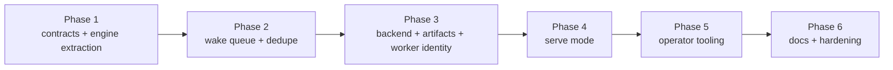

# rupu Autoflow Plan 2 — Portable Runtime and Serve Mode

> **For agentic workers:** REQUIRED SUB-SKILL: Use superpowers:subagent-driven-development (recommended) or superpowers:executing-plans to implement this plan task-by-task. Steps use checkbox (`- [ ]`) syntax for tracking.

**Goal:** Build the runtime portability layer on top of autoflow v1 so `rupu` gains an always-on local worker mode, a canonical run envelope, a normalized wake queue, a backend abstraction, and operator-grade inspection / repair commands without introducing a second workflow engine.

**Spec:** [docs/superpowers/specs/2026-05-09-rupu-autoflow-plan-2-portable-runtime-design.md](../specs/2026-05-09-rupu-autoflow-plan-2-portable-runtime-design.md)

**Why this plan exists:** Autoflow v1 solved persistent issue ownership. Plan 2 makes that runtime portable enough for a future `rupu.cloud` control plane while remaining valuable as a pure CLI product now.

**Locked decisions from design review:**
- One workflow engine; no second orchestration DSL.
- `rupu autoflow tick` remains the source-of-truth reconciliation cycle.
- `rupu autoflow serve` wraps the same reconciliation engine rather than inventing new state semantics.
- Every executable run path is represented as a versioned `RunEnvelope`.
- Every wake source is normalized into a durable `WakeRecord` queue.
- The local worktree runtime becomes a `local_worktree` backend, not the architecture itself.
- Runs emit `ArtifactManifest` records so outputs stop depending on local path knowledge alone.
- Plan 2 stays CLI-only; cloud execution and registration are future consumers of the contracts, not deliverables of this plan.

**Architecture:**
- Add a reusable runtime layer for `RunEnvelope`, `WakeRecord`, `ArtifactManifest`, `WorkerRecord`, and the reconciliation loop.
- Refactor current autoflow tick logic out of the CLI monolith into a shared service.
- Add a durable wake queue with replay / dedupe support.
- Add an execution backend abstraction with `local_worktree` as the first concrete backend.
- Add `rupu autoflow serve` plus queue / explain / doctor / repair operator commands.
- Persist worker identity and backend metadata into run / claim state.

**Suggested crate / module shape:**
```
crates/rupu-runtime/src/lib.rs                — NEW runtime contract + loop crate (or equivalent module split)
crates/rupu-runtime/src/envelope.rs           — NEW RunEnvelope + serde types
crates/rupu-runtime/src/wake.rs               — NEW WakeRecord + dedupe metadata
crates/rupu-runtime/src/artifacts.rs          — NEW ArtifactManifest + artifact refs
crates/rupu-runtime/src/worker.rs             — NEW WorkerRecord + heartbeat state
crates/rupu-runtime/src/backend.rs            — NEW ExecutionBackend trait
crates/rupu-runtime/src/local_worktree.rs     — NEW local backend impl
crates/rupu-runtime/src/reconcile.rs          — NEW tick / serve shared engine
crates/rupu-cli/src/cmd/autoflow.rs           — shrink to CLI surface + adapters
crates/rupu-cli/src/cmd/webhook.rs            — enqueue WakeRecord, not ad hoc hints
crates/rupu-cli/src/cmd/cron.rs               — enqueue WakeRecord for polled events / retries as needed
crates/rupu-orchestrator/src/runner.rs        — consume RunEnvelope execution context
crates/rupu-orchestrator/src/runs.rs          — persist worker / backend / artifact metadata
crates/rupu-workspace/src/autoflow_claim.rs   — extend claim metadata for wakes / artifacts / worker linkage
crates/rupu-workspace/src/autoflow_claim_store.rs
crates/rupu-workspace/src/autoflow_worktree.rs
```

**Phase model:** Each phase should land as a separate PR on its own worktree branch.



---

## Phase 1 — Runtime contracts and engine extraction

**Outcome:** the current autoflow runtime is no longer trapped inside `cmd/autoflow.rs`, and every run can be represented as a durable envelope.

- [ ] Create a new runtime home for shared runtime types (`crates/rupu-runtime` or a clearly isolated equivalent if a new crate proves unnecessary).
- [ ] Define `RunEnvelope` with:
  - `version`
  - `run_id`
  - `workflow` identity + fingerprint
  - `repo` binding
  - `trigger` / `wake` metadata
  - `inputs`
  - `context` targets (`issue_ref`, `pr_ref`, `event` ref)
  - `autoflow` linkage (`name`, `claim_id`, `priority`)
  - `execution` request (`backend`, `permission_mode`, `workspace_strategy`, `strict_templates`)
  - `contracts`
  - `correlation` ids (`parent_run_id`, `dispatch_group_id`)
  - `worker` request metadata
- [ ] Add serde round-trip tests and versioning tests for `RunEnvelope`.
- [ ] Extract the current autoflow reconciliation logic from `crates/rupu-cli/src/cmd/autoflow.rs` into a shared engine module that can be called by both `tick` and future `serve`.
- [ ] Refactor `rupu autoflow tick` to become a thin CLI wrapper around that engine.
- [ ] Persist the envelope next to each run record so operator tooling can inspect the exact execution request later.

**Verify:**
- `cargo test -p rupu-runtime` (or equivalent module tests)
- `cargo test -p rupu-cli --lib autoflow::tests`
- `cargo test -p rupu-orchestrator`

---

## Phase 2 — Durable wake queue and replay defense

**Outcome:** every wake source feeds one normalized queue, and replay defense is handled at the queue layer rather than per-ingress hacks.

- [ ] Define `WakeRecord` with:
  - `version`
  - `wake_id`
  - `source`
  - `repo_ref`
  - `entity` (`issue`, `pr`, `repo`)
  - `event` (`id`, `delivery_id`, `dedupe_key`)
  - `payload_ref`
  - `received_at`
  - `not_before`
- [ ] Add a durable queue store under `~/.rupu/autoflows/wakes/` with directories for queued payloads and processed dedupe markers.
- [ ] Replace webhook wake-hint files with `WakeRecord` enqueue operations.
- [ ] Update cron-poll / event-trigger paths so eligible events can also be normalized as wakes when appropriate.
- [ ] Add queue operations:
  - enqueue
  - list due
  - mark processed
  - reject duplicate by `dedupe_key`
  - requeue with `not_before`
- [ ] Add replay-protection tests for repeated webhook deliveries.
- [ ] Add manual requeue support as a queue write, not a special side path.

**Verify:**
- `cargo test -p rupu-runtime wake`
- `cargo test -p rupu-cli --test cli_autoflow`
- `cargo test -p rupu-webhook`

---

## Phase 3 — Execution backend abstraction, artifact manifests, worker identity

**Outcome:** local worktree execution becomes a concrete backend; runs gain portable artifact metadata and worker provenance.

- [ ] Define `ExecutionBackend` and `PreparedRun` / `RunResult` contracts.
- [ ] Implement `local_worktree` backend by wrapping the current autoflow worktree path, explicit workflow execution context, and claim-aware execution path.
- [ ] Define `ArtifactManifest` and artifact reference types.
- [ ] Persist artifact manifests in run state and link them from claims where useful.
- [ ] Extend run records with:
  - backend id
  - worker id
  - artifact manifest path
  - source wake id
- [ ] Define `WorkerRecord` for local workers and persist heartbeat / capability metadata.
- [ ] Ensure `rupu workflow run` and `rupu autoflow run` can both produce envelopes and artifact manifests, even if only autoflow consumes some fields today.

**Verify:**
- `cargo test -p rupu-runtime backend artifacts worker`
- `cargo test -p rupu-workspace`
- `cargo test -p rupu-cli --lib autoflow::tests`

---

## Phase 4 — `rupu autoflow serve`

**Outcome:** users can run one always-on local worker without losing the `tick` contract.

- [ ] Add `rupu autoflow serve` with:
  - optional `--repo <repo-ref>` filter
  - optional `--worker <name>` override
  - configurable idle sleep / poll cadence
  - clean signal handling
- [ ] Reuse the exact same reconciliation engine as `tick`.
- [ ] Implement a local serve lock / heartbeat so operators can tell whether a worker is actively running.
- [ ] Ensure `serve` continuously:
  - ingests due wakes
  - reconciles due claims
  - executes envelopes
  - enqueues follow-up wakes for retry / child dispatch / approval resume
- [ ] Add tests proving `tick` and `serve` produce the same claim transitions for the same queued wakes.
- [ ] Add user docs for macOS `launchd`, Linux `systemd --user`, and Windows Task Scheduler or direct long-running use.

**Verify:**
- `cargo test -p rupu-cli --lib autoflow::tests`
- targeted integration tests for `serve` loop exit / wake drain / restart safety

---

## Phase 5 — Operator tooling: wakes, explain, doctor, repair, requeue

**Outcome:** operators can understand and recover the system without manually spelunking directories.

- [ ] Add `rupu autoflow wakes [--repo <repo-ref>]` to show queued and recently processed wakes.
- [ ] Add `rupu autoflow explain <issue-ref>` to print:
  - current claim state
  - winning autoflow / contenders
  - last run id
  - source wake
  - next retry or approval gate
  - pending dispatch or queued wake
- [ ] Add `rupu autoflow doctor [--repo <repo-ref>]` to check:
  - stale locks
  - missing preferred repo binding
  - missing worktree path
  - invalid pending wake payloads
  - unresolved artifact links
  - claim/run mismatch
- [ ] Add `rupu autoflow repair <issue-ref>` for safe, bounded remediation such as:
  - rebuild missing worktree
  - drop invalid queued wake
  - release or requeue a claim after confirmation
- [ ] Add `rupu autoflow requeue <issue-ref> [--event <event-id>] [--not-before <duration>]`.
- [ ] Add CLI tests for each operator path and docs with realistic examples.

**Verify:**
- `cargo test -p rupu-cli --test cli_autoflow`
- `cargo test -p rupu-cli --lib autoflow::tests`

---

## Phase 6 — Docs, hardening, and cloud-ready contract export

**Outcome:** the runtime model is documented as the bridge to Slice D / Slice E, and the local CLI remains the reference implementation.

- [ ] Update user docs:
  - `docs/using-rupu.md`
  - `docs/workflow-format.md`
  - `docs/development-flows.md`
  - `examples/README.md`
- [ ] Add a deployment-modes section that clearly separates:
  - laptop / local-first polling
  - dedicated always-on worker machine
  - tunneled workstation for advanced users
  - future cloud relay / hybrid dispatch
- [ ] Add sample operator flows for:
  - solo local always-on use
  - dedicated team worker machine
  - tunneled workstation behind a separate edge or tunnel service
  - future hybrid cloud/local dispatch
- [ ] Add explicit mermaid diagrams to the user docs where they help explain the runtime.
- [ ] Export or document the JSON shapes of `RunEnvelope`, `WakeRecord`, `ArtifactManifest`, and `WorkerRecord` so Slice E can consume them later.
- [ ] Update `TODO.md` so the remaining backlog becomes truly post-Plan-2, not still “serve / dedupe / doctor”.
- [ ] Run full targeted validation:
  - `cargo test -p rupu-runtime -p rupu-workspace -p rupu-orchestrator -p rupu-cli -p rupu-webhook`
  - `cargo fmt --check`
  - `cargo clippy --workspace --all-targets -- -D warnings`

---

## Acceptance criteria

Plan 2 is done if:

- [ ] `rupu autoflow serve` ships and clearly reuses the `tick` engine
- [ ] a run envelope is persisted for workflow and autoflow execution paths
- [ ] webhook, retry, manual, and follow-up dispatches share one wake queue model
- [ ] webhook replay protection is enforced by queue dedupe
- [ ] the local worktree runtime is a backend implementation, not the only runtime shape
- [ ] runs emit artifact manifests and record worker/backend provenance
- [ ] operators can inspect wakes and explain / doctor / requeue stuck work
- [ ] the resulting contracts are explicit enough that a future `rupu.cloud` service could dispatch both cloud workers and registered local workers without replacing the workflow engine
