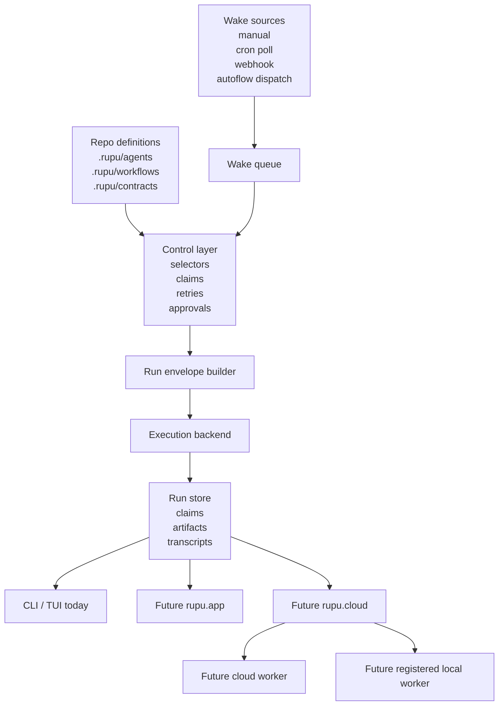
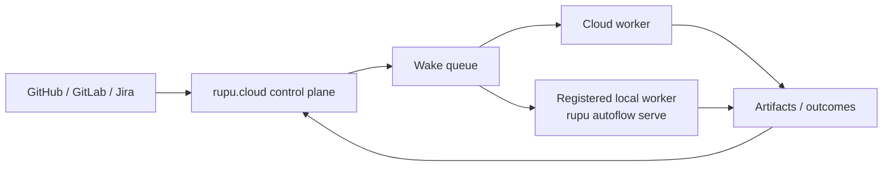
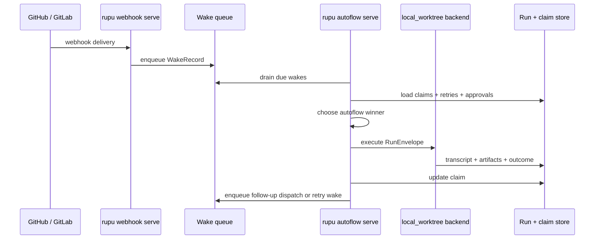

# rupu Autoflow Plan 2 — Portable Runtime, Local Worker Serve Mode, and Cloud-Ready Contracts

**Date:** 2026-05-09
**Status:** Design (ready for implementation planning)
**Companion docs:** [Autoflow v1 design](./2026-05-08-rupu-autoflow-design.md), [Autoflow Plan 1](../plans/2026-05-08-rupu-autoflow-plan-1-foundation-runtime-and-cli.md), [Workflow triggers design](./2026-05-07-rupu-workflow-triggers-design.md), [Slice C design](./2026-05-05-rupu-slice-c-tui-design.md), [Architecture reference](../../spec.md)

---

## 1. What this is

Plan 2 moves `rupu` from a **local-only autonomous workflow runner** to a **portable runtime model** that still ships as a CLI-first product.

The key decision is:

- `rupu` remains one agent / workflow system
- the workflow engine remains the execution core
- the CLI remains the product surface for now
- the runtime stops assuming that every run is born, scheduled, executed, and observed inside one local process

This plan adds the runtime contracts that let the same system support:

- `rupu workflow run` as an explicit one-shot run
- `rupu autoflow tick` as a scheduled reconciliation pass
- `rupu autoflow serve` as a long-running local worker
- future `rupu.cloud` dispatch to **cloud workers**
- future `rupu.cloud` dispatch to **registered local workers**

Plan 2 is therefore not “more workflow syntax.”
It is the runtime portability layer between the local CLI of today and the hybrid local/cloud control plane of the future.

---

## 2. Why Plan 2 exists now

Autoflow v1 already solved the right user-facing problems:

- one YAML language
- persistent issue claims
- managed worktrees
- validated workflow contracts
- repo tracking
- webhook and polled-event wakeups

That was the right first cut.

The remaining weakness is internal shape:

- wakeups come from multiple partially separate sources
- execution is still strongly tied to local filesystem assumptions
- artifacts are mostly local paths rather than portable references
- the runtime has no explicit worker identity model
- there is no always-on local worker mode yet
- there is no canonical job envelope that a future cloud service could dispatch unchanged

If we do not fix those boundaries now, `rupu.cloud` will either:

- duplicate the autoflow runner, or
- force a rewrite of the current local runtime

Plan 2 avoids that.

---

## 3. Design outcome

After Plan 2, `rupu` should look like this:

1. users still author **agents**, **workflows**, and **contracts** in repos
2. the control layer still decides **what should run next**
3. the execution layer receives a **portable run envelope**
4. a specific **backend** runs that envelope
5. the run emits a **portable artifact manifest** and structured outcome
6. a local `serve` process can act like a durable worker now
7. a future cloud control plane can dispatch the same envelope to local or cloud workers later

This preserves one workflow engine and one orchestration language.

---

## 4. How this fits the overall rupu picture

`rupu` should be understood as five layers:

- **Definition layer** — agents, workflows, contracts, repo config
- **Control layer** — triggers, autoflow selection, claims, retries, approvals, dispatch decisions
- **Execution layer** — workspace materialization, tool-running workflow engine, transcripts, outcomes
- **State layer** — runs, claims, repo registry, wake queue, artifacts, cursors, worker records
- **Presentation layer** — CLI, TUI, future app, future SaaS UI

Plan 1 strengthened local control and state for autonomous issue ownership.
Plan 2 makes the execution and state contracts portable so future surfaces do not require a second runtime.

### 4.1 Overall architecture



### 4.2 Local-first, cloud-ready

This design deliberately keeps the local CLI as the reference implementation.

That means:

- the first backend is still local worktree execution
- the first queue is still local durable storage
- the first worker is still the user's machine
- `rupu autoflow serve` is the first always-on worker

But every new runtime record introduced in Plan 2 must be serializable and stable enough that Slice E can reuse it later.

---

## 5. Goals

1. Add `rupu autoflow serve` without inventing a second reconciliation engine.
2. Introduce a canonical **run envelope** that can represent workflow runs regardless of caller.
3. Introduce a canonical **wake record** so webhook, polled, manual, and follow-up dispatches share one queue model.
4. Introduce a portable **artifact manifest** instead of treating local file paths as the whole output story.
5. Introduce a first-class **worker identity** model for local and future remote execution.
6. Extract a formal **execution backend** boundary so local execution becomes one implementation, not the architecture.
7. Improve operator ergonomics with queue inspection, repair, and explainability.
8. Keep the product fully useful as a CLI even if the cloud companion never ships.
9. Keep all new runtime contracts future-portable to `rupu.cloud`.

---

## 6. Non-goals

Plan 2 does **not** include:

- hosted multi-tenant SaaS accounts
- cloud worker execution
- a remote API service
- billing, auth, or team management
- a second workflow DSL
- changing agent or workflow authoring syntax beyond what v1 already introduced
- replacing worktrees with container or VM sandboxes
- a UI rewrite

Cloud execution is a future consumer of Plan 2 contracts, not a deliverable of Plan 2.

---

## 7. Core design decisions

### 7.1 One workflow engine, many callers

The same workflow engine must handle:

- direct manual run
- cron-triggered run
- webhook-triggered run
- autoflow tick run
- autoflow serve run
- future cloud-dispatched run

The caller changes.
The engine does not.

### 7.2 One run envelope per executable job

Every executable run must become a durable, serializable record before execution starts.

That record is the **run envelope**.

### 7.3 One wake model

Every reason a workflow may need evaluation should become a normalized **wake record**.

Examples:

- “GitHub issue opened”
- “GitHub PR merged”
- “retry timer expired”
- “child autoflow dispatch requested”
- “operator manually requeued issue 42”

### 7.4 One execution backend boundary

Execution should be modeled as a backend contract. For Plan 2 the important point is not multiple backends shipping immediately; it is making the boundary real now.

### 7.5 One artifact manifest

A run's outputs must be referencable without assuming the reader is on the same machine or in the same directory.

### 7.6 One worker identity model

Runs must know which worker executed them, even when that worker is just the local CLI.

### 7.7 `tick` remains the truth; `serve` wraps it

`serve` must not invent new state semantics.
It should reuse the same reconciliation logic as `tick`, but run it continuously.

---

## 8. User-facing flows

These examples matter because Plan 2 should be desirable from the operator's point of view, not just architecturally tidy.

### 8.1 Solo developer, fully local

A single developer wants one repo to self-manage issues on a local workstation.

```sh
rupu repos attach github:Section9Labs/rupu ~/Code/Oracle/rupu
rupu webhook serve --addr 0.0.0.0:8080 &
rupu autoflow serve --repo github:Section9Labs/rupu
```

From there the operator uses:

```sh
rupu autoflow status --repo github:Section9Labs/rupu
rupu autoflow claims --repo github:Section9Labs/rupu
rupu autoflow wakes --repo github:Section9Labs/rupu
rupu autoflow doctor --repo github:Section9Labs/rupu
```

What this feels like:

- issues arrive
- webhook or poll wakes the local queue
- `serve` picks them up quickly
- claims persist across restarts
- worktrees remain inspectable locally
- the user can intervene without losing automation state

### 8.2 Team repo on one dedicated machine

A team wants one always-on Mac mini or Linux box to act as the repo worker.

```sh
rupu repos attach github:Section9Labs/rupu /srv/rupu
rupu webhook serve --addr 0.0.0.0:8080 &
rupu autoflow serve --repo github:Section9Labs/rupu --worker team-mini-01
```

The operator inspects:

```sh
rupu autoflow claims --repo github:Section9Labs/rupu
rupu autoflow show issue-supervisor-dispatch --repo github:Section9Labs/rupu
rupu autoflow explain github:Section9Labs/rupu/issues/123
```

This is still CLI-only. It is already useful without any SaaS.

### 8.3 Future hybrid control plane

Later, the same repo may be controlled by `rupu.cloud`.
Some jobs run in cloud sandboxes; some jobs run on a registered local worker because they need private network or local assets.



The key point is that **the workflow definition and run envelope do not change**. Only the dispatcher and backend change.

---

## 9. Runtime contracts

## 9.1 Run envelope

The run envelope is the canonical job description.

Illustrative shape:

```yaml
version: 1
run_id: run_01JXYZ...
kind: workflow_run
workflow:
  name: phase-delivery-cycle
  source_path: .rupu/workflows/phase-delivery-cycle.yaml
  fingerprint: sha256:9f4f...
repo:
  ref: github:Section9Labs/rupu
  preferred_checkout: /Users/matt/Code/Oracle/rupu
trigger:
  source: autoflow
  wake_id: wake_01JXYZ...
  event_id: github.pull_request.merged
inputs:
  phase: phase-2
context:
  issue_ref: github:Section9Labs/rupu/issues/123
  pr_ref: github:Section9Labs/rupu/pulls/456
autoflow:
  name: issue-supervisor-dispatch
  claim_id: claim_01JXYZ...
  priority: 100
execution:
  backend: local_worktree
  permission_mode: bypass
  workspace_strategy: managed_worktree
  strict_templates: true
contracts:
  output_schema: autoflow_outcome_v1
correlation:
  parent_run_id: run_01JABC...
  dispatch_group_id: dispatch_01JXYZ...
worker:
  requested_worker: local
```

Required properties:

- serializable to JSON
- stable version field
- independent of the calling command
- explicit enough to be stored, queued, exported, and replayed

### 9.2 Wake record

A wake record represents a reason to reconcile or run.

Illustrative shape:

```yaml
version: 1
wake_id: wake_01JXYZ...
source: webhook
repo_ref: github:Section9Labs/rupu
entity:
  kind: issue
  ref: github:Section9Labs/rupu/issues/123
event:
  id: github.pull_request.merged
  delivery_id: gh-delivery-123
  dedupe_key: github:pull_request:merged:123:gh-delivery-123
payload_ref: ~/.rupu/autoflows/wakes/payloads/wake_01JXYZ.json
received_at: 2026-05-09T16:22:00Z
not_before: 2026-05-09T16:22:00Z
```

Wake sources in Plan 2:

- `manual`
- `cron_poll`
- `webhook`
- `autoflow_dispatch`
- `retry`
- `approval_resume`
- `repair`

### 9.3 Artifact manifest

Every run should emit a machine-readable artifact manifest.

Illustrative shape:

```yaml
version: 1
run_id: run_01JXYZ...
artifacts:
  - id: art_01
    type: transcript
    name: transcript
    producer: runtime
    local_path: ~/.rupu/runs/run_01JXYZ/transcript.jsonl
  - id: art_02
    type: plan_doc
    name: issue-plan
    producer: step.write_plan
    local_path: /Users/matt/.rupu/autoflows/worktrees/.../docs/plans/issue-123.md
  - id: art_03
    type: pull_request
    name: phase-pr
    producer: step.open_pr
    uri: https://github.com/Section9Labs/rupu/pull/456
  - id: art_04
    type: summary
    name: autoflow-outcome
    producer: step.finalize
    inline_json:
      status: await_human
      summary: Draft PR opened and phase review completed
```

This allows future remote storage without changing workflow semantics.

### 9.4 Worker record

A worker record identifies the runtime actor.

Illustrative shape:

```yaml
version: 1
worker_id: worker_local_team-mini-01
kind: local_serve
name: team-mini-01
host: team-mini-01.local
capabilities:
  backends: [local_worktree]
  scm_hosts: [github]
  permission_modes: [readonly, bypass]
registered_at: 2026-05-09T16:00:00Z
last_seen_at: 2026-05-09T16:22:00Z
```

Plan 2 only needs local worker identity, but the record shape must not prevent future remote registration.

### 9.5 Execution backend contract

Conceptually:

```rust
trait ExecutionBackend {
    fn id(&self) -> &'static str;
    fn can_execute(&self, envelope: &RunEnvelope) -> bool;
    async fn prepare(&self, envelope: &RunEnvelope) -> Result<PreparedRun>;
    async fn execute(&self, prepared: PreparedRun) -> Result<RunResult>;
    async fn collect_artifacts(&self, result: &RunResult) -> Result<ArtifactManifest>;
    async fn cleanup(&self, prepared: PreparedRun, result: &RunResult) -> Result<()>;
}
```

Planned backends:

- `local_worktree` — ships in Plan 2
- `local_temp` — optional later
- `cloud_sandbox` — future Slice E
- `registered_local_worker` — future Slice E dispatcher target, not a separate workflow engine

---

## 10. Local runtime design

### 10.1 `tick` versus `serve`

`tick` remains the idempotent unit of work.

- read due wakes and due claims
- reconcile ownership and next action
- build run envelopes
- execute eligible runs
- persist outcomes and follow-up wakes

`serve` is a long-running loop around that unit:

- ingest wake sources
- run the same reconciliation cycle
- sleep until the next due wake or poll interval
- handle process signals cleanly

### 10.2 `serve` flow



### 10.3 Durable wake queue

Plan 2 should normalize all wake sources into one durable queue.

Properties:

- file-backed and cross-platform
- explicit `dedupe_key`
- retains original payload reference
- supports replay defense for webhook deliveries
- supports manual operator requeue
- supports child dispatch scheduling for next-cycle execution

### 10.4 Replay and dedupe

Webhook replay protection should stop being a narrow webhook concern and become part of the generic wake queue.

The queue should remember processed dedupe keys long enough to reject repeats without re-running workflows.

### 10.5 Explainability and repair

Operators need to answer:

- why did this issue not run?
- why is this claim blocked?
- which wake source caused this run?
- what follow-up dispatch is queued?
- is this worktree broken or just paused?

That implies new commands:

- `rupu autoflow wakes`
- `rupu autoflow explain <issue-ref>`
- `rupu autoflow doctor [--repo ...]`
- `rupu autoflow repair <issue-ref>`
- `rupu autoflow requeue <issue-ref>`

---

## 11. Local state layout

Plan 2 extends the current state model rather than replacing it.

Illustrative layout:

```text
~/.rupu/
  repos/
  runs/
  workspaces/
  autoflows/
    claims/
    worktrees/
    wakes/
      queued/
      payloads/
      processed/
    workers/
    serve/
```

Notes:

- `claims/` and `worktrees/` stay the ownership root introduced in Plan 1
- `wakes/` becomes the normalized queue root
- `workers/` stores local worker identity and heartbeat data
- `serve/` stores PID / lock / heartbeat data for the long-running process

---

## 12. Command-line surface

Plan 2 should keep the current CLI and extend it with operator-grade runtime commands.

### 12.1 Commands that should ship in Plan 2

```sh
rupu autoflow serve [--repo <repo-ref>] [--worker <name>]
rupu autoflow wakes [--repo <repo-ref>]
rupu autoflow explain <issue-ref>
rupu autoflow doctor [--repo <repo-ref>]
rupu autoflow repair <issue-ref>
rupu autoflow requeue <issue-ref> [--event <event-id>]
```

### 12.2 Commands that remain future-facing

These should influence the contract design now but do not need to ship in Plan 2:

```sh
rupu worker register
rupu worker list
rupu run export <run-id>
rupu run import <envelope.json>
rupu cloud login
```

---

## 13. User examples

### 13.1 Run a repo in always-on local mode

```sh
rupu repos attach github:Section9Labs/rupu ~/Code/Oracle/rupu
rupu webhook serve --addr 0.0.0.0:8080 &
rupu autoflow serve --repo github:Section9Labs/rupu --worker matt-studio
```

### 13.2 Diagnose why an issue did not advance

```sh
rupu autoflow explain github:Section9Labs/rupu/issues/123
rupu autoflow wakes --repo github:Section9Labs/rupu
rupu autoflow doctor --repo github:Section9Labs/rupu
```

Expected operator story:

- explain shows the claim state, last run, winner, wake source, and next retry or approval boundary
- wakes shows queued and recently processed events
- doctor points at stale locks, broken worktrees, missing repo bindings, or contract validation failures

### 13.3 Requeue after a manual external fix

```sh
rupu autoflow requeue github:Section9Labs/rupu/issues/123 \
  --event github.pull_request.merged
```

This should create a normal wake record, not a special hidden fast path.

---

## 14. Integration with Slice D and Slice E

### 14.1 Slice D — local app / richer local UI

A future local UI should not need its own orchestration logic. It should read the same:

- run envelopes
- wake records
- artifact manifests
- worker records
- claim state

Plan 2 makes that possible.

### 14.2 Slice E — `rupu.cloud`

`rupu.cloud` should eventually own:

- webhook relay
- central visibility
- team-facing run history
- dispatcher / scheduler
- optional cloud execution
- dispatch to registered local workers

It should **not** own a second workflow engine.

Plan 2 is the contract work that makes that realistic.

---

## 15. Acceptance criteria

This design is correct if:

1. `rupu autoflow serve` can be built without inventing a second reconciliation engine
2. every workflow run path can be represented as a versioned run envelope
3. webhook, poll, manual, retry, and dispatch wakes can be represented as one wake model
4. the current local worktree runner becomes an execution backend rather than the entire architecture
5. runs can emit a portable artifact manifest instead of relying only on local path knowledge
6. the local CLI remains fully useful with no SaaS present
7. the same contracts could later be consumed by `rupu.cloud` for both cloud workers and registered local workers
8. the design does not require a second workflow DSL or a second run engine

---

## 16. Post-Plan-2 follow-ons

These should remain out of scope for this plan but are now enabled by it:

- remote API / control plane implementation
- real cloud worker backend
- local worker registration to cloud
- object-storage-backed artifact transport
- team auth and access control
- browser UI over live queue / claim / run state
