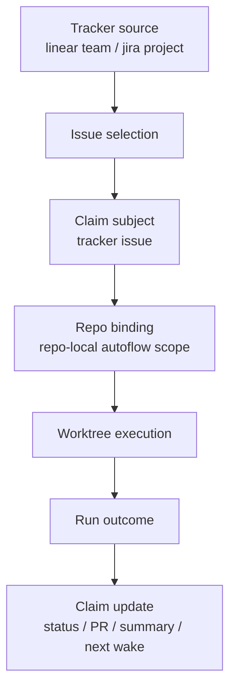
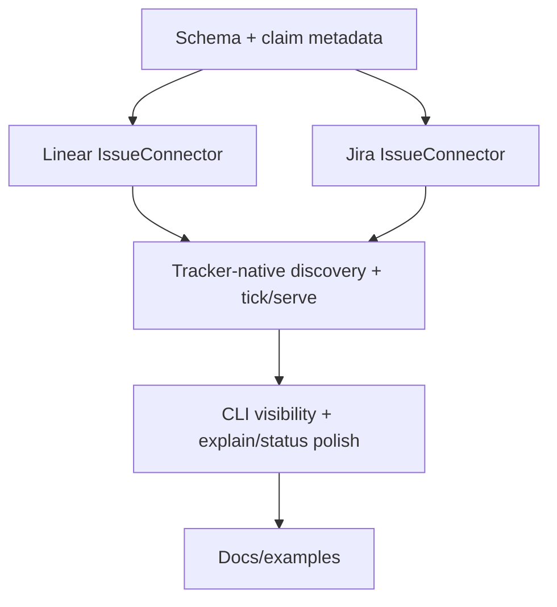

# rupu Tracker-Native Autoflow Ownership Design

**Date:** 2026-05-10
**Status:** Design
**Companion docs:** [Autoflow v1 design](./2026-05-08-rupu-autoflow-design.md), [Autoflow Plan 2](./2026-05-09-rupu-autoflow-plan-2-portable-runtime-design.md), [Native tracker state events design](./2026-05-10-rupu-native-tracker-state-events-design.md), [Workflow triggers design](./2026-05-07-rupu-workflow-triggers-design.md)

---

## 1. What this is

`rupu` can now consume **Linear** and **Jira** state changes as normalized event triggers.

What it still cannot do is **own** a Linear or Jira issue over time.

Today, a tracker event can start a workflow run, but the persistent autonomous layer still assumes:

- the owned entity is a repo-backed issue
- claim identity implies repo identity
- the autonomous loop is anchored to a repo issue namespace

This design adds **tracker-native autoflow ownership** so a repo-local autoflow can persistently own a **Linear** or **Jira** issue while still executing work inside a managed repo worktree.

---

## 2. Why this is the next step

The current product shape is uneven:

- **trigger layer:** Linear and Jira are supported
- **autonomous ownership layer:** GitHub and GitLab repo issues are supported
- **execution layer:** repo worktrees are supported

That means we can react to:

- `issue.entered_workflow_state.ready_for_review`
- `issue.priority_changed`
- `issue.sprint_changed`

but we cannot yet say:

- claim this Linear issue
- keep claim state attached to it
- re-run work after later tracker changes
- show tracker progress in `autoflow status`
- keep the repo worktree and PR tied to that tracker issue until complete

That is the main remaining product gap.

---

## 3. What we have already shipped

The current shipped baseline is:

- repo-backed autoflow ownership for GitHub and GitLab issues
- persistent worktree execution for autoflows
- portable run envelopes and worker metadata
- wake queue unifying polled, webhook, and follow-up wakes
- Linear webhook ingress
- Linear polling via `poll_sources = ["linear:<team-id>"]`
- Jira webhook ingress
- Jira polling via `poll_sources = ["jira:<site>/<project>"]` or `jira:<project>` with `[scm.jira].base_url`
- auth providers for `linear` and `jira`

So the missing work is **not** tracker connectivity. It is autonomous ownership semantics.

---

## 4. Product outcome

After this work, users should be able to run a repo-local autoflow that says, in effect:

- watch this **Linear team** or **Jira project**
- select issues that match this policy
- claim one tracker issue at a time
- bind that claim to this repo
- execute repo work in a managed worktree
- keep the claim alive until the tracker issue is done

### 4.1 Example workflow YAML

```yaml
name: linear-delivery

autoflow:
  enabled: true
  entity: issue
  source: linear:72b2a2dc-6f4f-4423-9d34-24b5bd10634a
  priority: 100
  selector:
    states: [open]
    labels_any: [backend]
  wake_on:
    - issue.entered_workflow_state.ready_for_dev
    - issue.priority_changed
  claim:
    key: issue
    ttl: 3h
  workspace:
    strategy: worktree
    branch: "linear/{{ issue.ref | lower | replace('-', '/') }}"
  outcome:
    output: result

contracts:
  outputs:
    result:
      schema: autoflow_outcome_v1
      from_step: finalize

steps:
  - id: implement
    agent: implementer
    prompt: |
      Work the Linear issue {{ issue.ref }} in this repo.

  - id: finalize
    agent: issue-commenter
    contract:
      emits: autoflow_outcome_v1
      format: json
    prompt: |
      Return only JSON.
```

### 4.2 Operator flow

```sh
rupu auth login --provider linear --mode api-key
rupu repos attach github:Section9Labs/rupu ~/Code/Oracle/rupu
rupu autoflow serve --repo github:Section9Labs/rupu
rupu autoflow claims --repo github:Section9Labs/rupu
rupu autoflow explain linear:72b2a2dc-6f4f-4423-9d34-24b5bd10634a/issues/123
```

No new GUI is required for this phase. Background execution remains the model; CLI inspection gets richer.

---

## 5. Design principles

1. **One workflow language.** No second DSL.
2. **Repo execution remains repo-bound.** Tracker-native ownership does not remove worktrees.
3. **Subject ownership is separate from repo binding.** The claim belongs to the tracker issue; execution belongs to the repo.
4. **Reuse existing stores where possible.** Extend claim and wake models instead of replacing them.
5. **No UI-first dependency.** Improve CLI visibility now; future SaaS can render the same state later.

---

## 6. Core design shift

The current claim record effectively assumes:

- `issue_ref` == ownership subject
- `issue_ref` can imply `repo_ref`

Tracker-native ownership breaks that assumption.

A **Linear** or **Jira** issue is the ownership subject, but the repo is only the execution target.

So the runtime must separate:

- **subject** — the tracker issue being autonomously owned
- **binding** — the repo/workflow/worktree used to work on it

### 6.1 Ownership model



This is the correct split:

- tracker issue = identity and lifecycle
- repo = execution environment

---

## 7. Proposed schema changes

### 7.1 `autoflow.source`

Add an optional field to workflow YAML:

```yaml
autoflow:
  source: linear:<team-id>
```

or:

```yaml
autoflow:
  source: jira:<site>/<project>
```

Semantics:

- omitted: current repo-backed behavior; source is inferred from repo scope
- set: discovery and wake matching happen against the explicit tracker/project source

### 7.2 Repo binding stays repo-local in v1

Tracker-native ownership in this phase is still **repo-attached**.

That means the runtime must resolve one repo binding for the autoflow from one of:

1. repo-local workflow scope
2. `[autoflow].repo` in config
3. future explicit CLI override when needed

A tracker-native autoflow without a resolved repo binding is invalid in this phase.

### 7.3 No new `entity` kind yet

`entity: issue` stays valid.

The entity is still an issue. The only change is that the issue may come from:

- repo-backed GitHub/GitLab issue listing
- tracker-native Linear/Jira issue listing

So we do **not** need `entity: tracker_issue`.

---

## 8. Claim model changes

The current `AutoflowClaimRecord` already has the right high-level shape, but it needs more explicit tracker metadata.

### 8.1 Keep `issue_ref`

Do **not** replace `issue_ref`.

The owned entity is still an issue, and the generic `IssueRef` model already covers:

- GitHub
- GitLab
- Linear
- Jira

This avoids an unnecessary migration.

### 8.2 Extend claim metadata

Add fields such as:

- `source_ref` — the source that produced discovery and wakes
- `issue_display_ref` — human-facing ref like `ENG-123`
- `issue_title` — latest known subject title
- `issue_url` — vendor URL when available
- `issue_state_name` — latest workflow-state name when available
- `issue_tracker` — explicit copy of tracker vendor for rendering/filtering

Keep:

- `repo_ref`
- `worktree_path`
- `branch`
- `pr_url`
- `last_run_id`

This gives CLI and future SaaS enough state to explain ownership without rehydrating everything on every render.

### 8.3 Stop deriving repo from issue ref

Current repo-backed logic can infer repo from `issue_ref`.
Tracker-native claims cannot.

So the runtime must stop treating `issue_ref -> repo_ref` as a guaranteed transform.
`repo_ref` becomes an explicit binding field, not an inferred one.

---

## 9. Discovery model changes

### 9.1 Repo-backed path stays unchanged

If `autoflow.source` is omitted:

- repo-backed issue discovery remains the current path
- GitHub/GitLab behavior should be unchanged

### 9.2 Tracker-native path

If `autoflow.source` is set:

- parse the source as `EventSourceRef::TrackerProject`
- use the tracker's `IssueConnector` to list issues for that project
- apply the same selector semantics as current autoflow issue selection

This means tracker-native ownership depends on real `IssueConnector` support for Linear and Jira, not just event connectors.

---

## 10. Connector requirements

### 10.1 Linear

Add a full `IssueConnector` implementation for Linear that supports:

- `list_issues`
- `get_issue`
- `comment_issue`
- `create_issue`
- `update_issue_state`

Even if autoflow only needs `list/get` first, the trait should be implemented completely so the rest of the issue tool surface stays coherent.

### 10.2 Jira

Add a full `IssueConnector` implementation for Jira Cloud that supports the same trait.

This is important because tracker-native ownership should not fork the issue access model.

### 10.3 Why not use event snapshots as the source of truth?

Because autonomous ownership needs:

- current issue state
- explicit selection on demand
- recovery after missed events
- deterministic reconciliation

That is issue-connector work, not event-only work.

---

## 11. Wake and reconciliation behavior

The wake queue remains the same.

What changes is how a wake is resolved.

### 11.1 Current behavior

- repo event wake -> repo issue -> claim

### 11.2 New behavior

- tracker event wake -> tracker issue -> matching tracker-native autoflow -> claim bound to repo

### 11.3 Reconciliation

`rupu autoflow tick` and `rupu autoflow serve` must:

- load tracker-native workflows
- resolve their `source`
- fetch issues from the corresponding `IssueConnector`
- merge queue hints with selector results
- claim / update / release issues the same way repo-backed autoflows do today

The runtime should still be idempotent. Wakes remain hints, not the only truth source.

---

## 12. Worktree behavior

Repo worktree management stays the same.

Tracker-native ownership still executes inside a repo worktree because code changes happen in repos, not in tracker systems.

### 12.1 Branch naming

Tracker-native workflows should be allowed to template branch names from tracker fields, for example:

- `linear/{{ issue.ref }}`
- `jira/{{ issue.ref }}`

That is enough for v1. We do not need tracker-specific workspace strategies.

---

## 13. CLI visibility changes

No new UI is required for this phase, but the CLI needs richer tracker-aware output.

### 13.1 `rupu autoflow claims`

Show additional columns / fields:

- `Subject`
- `Source`
- `TrackerState`
- `Repo`
- `Workflow`
- `Branch`
- `PR`
- `Status`

### 13.2 `rupu autoflow explain`

Add tracker-aware detail:

- issue display ref and title
- tracker source and vendor
- last known tracker workflow state
- repo binding
- worktree path
- most recent run / outcome summary

### 13.3 `rupu autoflow status`

Summaries should count tracker-native claims naturally alongside repo-backed ones.

This is enough visibility for CLI users. A future SaaS dashboard can render the same state later.

---

## 14. Effect on current flows

### 14.1 What stays unchanged

- repo-backed GitHub/GitLab autoflows
- event-triggered workflows
- worktree execution model
- run envelopes
- wake queue
- approvals and outcome contracts

### 14.2 What becomes possible

- Linear issue enters `Ready for Dev` -> persistent autoflow ownership begins
- Jira ticket changes sprint or workflow state -> same issue stays claimed across multiple runs
- operator can inspect tracker-native claim progress from the CLI

### 14.3 What still does not happen

- one tracker issue controlling multiple repos automatically
- tracker-native work without a repo binding
- cloud control plane / SaaS dashboard
- GitHub Projects-native ownership

---

## 15. User examples

### 15.1 Linear team-backed repo autoflow

```toml
# <repo>/.rupu/config.toml
[autoflow]
enabled = true
repo = "github:Section9Labs/rupu"
```

```yaml
# <repo>/.rupu/workflows/linear-ready.yaml
name: linear-ready

autoflow:
  enabled: true
  source: linear:72b2a2dc-6f4f-4423-9d34-24b5bd10634a
  selector:
    states: [open]
  wake_on:
    - issue.entered_workflow_state.ready_for_dev
```

Operator flow:

```sh
rupu auth login --provider linear --mode api-key
rupu autoflow serve --repo github:Section9Labs/rupu
rupu autoflow claims --repo github:Section9Labs/rupu
```

### 15.2 Jira project-backed repo autoflow

```toml
[scm.jira]
base_url = "https://acme.atlassian.net"

[autoflow]
repo = "github:acme/platform"
```

```yaml
autoflow:
  enabled: true
  source: jira:ENG
  wake_on:
    - issue.entered_workflow_state.ready_for_review
    - issue.priority_changed
```

---

## 16. Recommended implementation order



This order matters:

- schema first so the runtime shape is explicit
- issue connectors before ownership because reconciliation needs them
- runtime integration before output polish

---

## 17. Non-goals

This phase does **not**:

- add a new visual UI
- redesign the TUI
- add cloud execution
- add multi-repo tracker ownership
- replace repo-backed autoflows
- solve GitHub Projects-native ownership

---

## 18. Acceptance criteria

- a workflow can declare `autoflow.source: linear:<team-id>` or `jira:<site>/<project>`
- `rupu autoflow tick` can discover and claim Linear/Jira issues persistently
- claim records preserve tracker-native subject metadata plus repo binding
- worktree execution still functions exactly as before
- `rupu autoflow claims/status/explain` show tracker-native progress clearly
- repo-backed autoflow behavior does not regress
