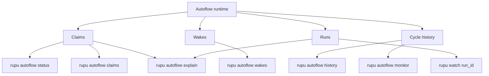

# rupu Autoflow Observability Design

**Date:** 2026-05-11
**Status:** Design
**Companion docs:** [Autoflow v1 design](./2026-05-08-rupu-autoflow-design.md), [Autoflow Plan 2](./2026-05-09-rupu-autoflow-plan-2-portable-runtime-design.md), [Tracker-native ownership design](./2026-05-10-rupu-tracker-native-autoflow-ownership-design.md), [Workflow triggers design](./2026-05-07-rupu-workflow-triggers-design.md), [Slice C design](./2026-05-05-rupu-slice-c-tui-design.md)

---

## 1. What this is

`rupu` now has a capable autoflow runtime:

- `tick`
- `serve`
- durable claims
- durable wakes
- portable run envelopes
- repo-backed and tracker-native ownership

But the operator-facing experience is still too thin.

Today:

- `rupu autoflow tick` prints a one-line batch summary
- `rupu autoflow serve` prints a one-line stop summary
- the deeper state is spread across `status`, `claims`, `wakes`, and `explain`

That is enough for debugging by hand, but not enough for operating an always-on autonomous system.

This design adds an **autoflow observability layer**:

- durable cycle/event history
- a live `rupu autoflow monitor`
- durable operator history / tail views
- tighter handoff into the existing run/watch UI

The first slice is **not** `monitor`.

The first slice is a **durable cycle/event log** that records what `tick` and `serve` actually did. `monitor` comes second and reads that state.

---

## 2. Why this is the next step

The current product is ahead of its operator UX.

We have already shipped:

- `rupu autoflow serve`
- `rupu autoflow status`
- `rupu autoflow claims`
- `rupu autoflow wakes`
- `rupu autoflow explain`
- `rupu autoflow doctor`
- `rupu autoflow repair`
- `rupu autoflow requeue`
- tracker-native Linear / Jira ownership
- GitHub Projects native state mapping

But the main background loop still answers only:

- how many cycles ran
- how many were skipped
- how many failed

It does **not** answer:

- which wake was consumed
- which issue was claimed
- why a candidate was skipped
- which run was launched
- what the last worker cycle actually did
- how the system got into its current state

That is the gap this design closes.

---

## 3. Design principles

1. **Reuse the run UI, do not duplicate it.**
   Autoflow should provide the control-plane overview; `rupu watch <run_id>` remains the execution drilldown.

2. **Persist before presenting.**
   A live monitor without durable cycle history becomes terminal noise and is not suitable for `serve`.

3. **One state model, many presentations.**
   The same records should drive:
   - table output
   - `--format json`
   - `--format csv`
   - future TUI
   - future SaaS dashboard

4. **No runtime fork.**
   `tick` and `serve` keep the same execution semantics. Observability is additive.

5. **Make operator questions first-class.**
   The UI should answer:
   - what is active
   - what is blocked
   - what is waiting
   - what just happened
   - what should I inspect next

---

## 4. Current state

### 4.1 What we already show well

- `rupu autoflow claims` shows workflow ownership, tracker/source, state, repo, branch, PR, summary, contenders
- `rupu autoflow status` shows counts plus contested issues
- `rupu autoflow wakes` shows queued and processed wakes
- `rupu autoflow explain` shows claim state, lock, last run, source wake, pending dispatch, queued wakes

### 4.2 What we do not show well

- no durable per-cycle record for `tick` or `serve`
- no live worker-oriented dashboard
- no compact recent activity stream
- no answer to “what happened in the last 20 cycles?”
- no easy bridge from claim overview into `rupu watch <run_id>`

---

## 5. Product outcome

After this work, an operator should be able to:

- leave `rupu autoflow serve` running in the background
- inspect current system state with `rupu autoflow monitor`
- inspect recent reconciler activity with `rupu autoflow history`
- inspect one issue deeply with `rupu autoflow explain`
- jump into the active run with `rupu watch <run_id>`

### 5.1 Example operator flow

```sh
rupu autoflow serve --repo github:your-org/your-repo --worker laptop-01
rupu autoflow monitor --repo github:your-org/your-repo
rupu autoflow history --repo github:your-org/your-repo
rupu autoflow explain linear:eng-team/issues/42 --repo github:your-org/your-repo
rupu watch run_01JX8GJ4AH6ERKQ4W9FW2N0WQ9
```

### 5.2 Example recovery flow

```sh
rupu autoflow monitor --repo github:your-org/your-repo
rupu autoflow history linear:eng-team/issues/42 --repo github:your-org/your-repo
rupu autoflow explain linear:eng-team/issues/42 --repo github:your-org/your-repo
rupu autoflow repair linear:eng-team/issues/42
rupu autoflow requeue linear:eng-team/issues/42 --event autoflow.operator.retry --not-before 1m
```

---

## 6. Core design

### 6.1 Split autoflow UI from run UI



Autoflow UI is a **control-plane UI**:

- workers
- claim state
- wake state
- cycle activity
- retries / dispatch / cleanup

Run UI remains the **execution UI**:

- steps
- transcripts
- tools
- approvals
- sub-agents

### 6.2 Why `monitor` cannot come first

If `monitor` is built directly from in-memory worker activity or ad hoc stdout:

- it works poorly for `tick`
- it is not durable for `serve`
- it cannot explain past failures
- it cannot support JSON/CSV/history cleanly
- future SaaS cannot reuse it

So the right order is:

1. persist cycle/event history
2. build `monitor` on top of it

---

## 7. New state model

### 7.1 Autoflow cycle record

Each reconciliation pass should emit one `AutoflowCycleRecord`.

Suggested fields:

```json
{
  "cycle_id": "afc_01JX8...",
  "worker_id": "laptop-01",
  "worker_kind": "autoflow_serve",
  "started_at": "2026-05-11T10:12:03Z",
  "finished_at": "2026-05-11T10:12:05Z",
  "repo_ref": "github:your-org/your-repo",
  "source_ref": "linear:eng-team",
  "workflow_count": 4,
  "polled_event_count": 2,
  "webhook_event_count": 1,
  "ran_cycles": 1,
  "skipped_cycles": 2,
  "failed_cycles": 0,
  "cleaned_claims": 0,
  "events": [
    {
      "kind": "wake_consumed",
      "wake_id": "wake_01JX8...",
      "issue_ref": "linear:eng-team/issues/42",
      "event_id": "issue.entered_workflow_state.ready_for_review"
    },
    {
      "kind": "claim_acquired",
      "issue_ref": "linear:eng-team/issues/42",
      "workflow": "tracker-controller"
    },
    {
      "kind": "run_launched",
      "run_id": "run_01JX8...",
      "workflow": "tracker-controller"
    }
  ]
}
```

### 7.2 Autoflow event kinds

Minimum event kinds:

- `wake_consumed`
- `wake_skipped`
- `candidate_matched`
- `candidate_skipped`
- `claim_acquired`
- `claim_reused`
- `claim_released`
- `claim_takeover`
- `run_launched`
- `run_resumed`
- `run_completed`
- `run_failed`
- `awaiting_human`
- `awaiting_external`
- `retry_scheduled`
- `dispatch_queued`
- `cleanup_performed`
- `repair_applied`

These should be additive, versioned, and tolerant of older readers.

### 7.3 Storage layout

Suggested local layout:

```text
~/.rupu/autoflows/history/
  cycles/
    2026-05-11/
      afc_01JX8....json
      afc_01JX9....json
  index/
    latest-by-worker.json
    latest-by-repo.json
```

This keeps append-only records simple while allowing lightweight indexes later.

---

## 8. Command surface

### 8.1 New command: `rupu autoflow monitor`

Purpose:

- live operator view of workers, claims, wakes, and recent activity

Suggested modes:

```sh
rupu autoflow monitor
rupu autoflow monitor --repo github:your-org/your-repo
rupu autoflow monitor --worker laptop-01
rupu autoflow monitor --watch
rupu --format json autoflow monitor --repo github:your-org/your-repo
```

Default sections:

- **Workers**
  - worker
  - last heartbeat
  - last cycle
  - active repo/source scope
- **Claims**
  - issue
  - source
  - state
  - workflow
  - status
  - branch
  - last run
  - next action
- **Recent Activity**
  - newest cycle events
- **Wakes**
  - queued
  - processed recently
  - due/blocked

### 8.2 New command: `rupu autoflow history`

Purpose:

- durable operator history and audit

Suggested forms:

```sh
rupu autoflow history
rupu autoflow history --repo github:your-org/your-repo
rupu autoflow history linear:eng-team/issues/42 --repo github:your-org/your-repo
rupu autoflow history --worker laptop-01
rupu autoflow history --limit 50
rupu autoflow history --watch
rupu --format csv autoflow history --repo github:your-org/your-repo
```

### 8.3 Existing command upgrades

#### `rupu autoflow explain`

Should add:

- recent cycle events for this issue
- a compact “how we got here” section
- easy watch handoff:
  - `watch hint: rupu watch <run_id>`

#### `rupu autoflow status`

Should remain summary-oriented.

It should not become a pseudo-monitor.

#### `rupu autoflow claims`

Should continue to be the durable ownership table and gain:

- last cycle timestamp
- last event kind
- last run id

---

## 9. Output model

All new views should support:

- `table`
- `json`
- `csv`

### 9.1 JSON

One structured report object, not line-oriented fragments.

### 9.2 CSV

Flat rows for:

- `history`
- claims section
- monitor recent activity section

### 9.3 Table

Use the same palette and table builder as the rest of the CLI.

This must feel visually consistent with:

- `workflow runs`
- `usage`
- `repos tracked`
- `autoflow claims`

---

## 10. Relationship to `rupu watch`

Do not reimplement workflow transcript rendering under autoflow.

The bridge should be:

- monitor/history/explain identify the active `run_id`
- operator drills down with `rupu watch <run_id>`

This preserves one execution UI and avoids duplicated transcript logic.

---

## 11. Optional TUI follow-on

This design does **not** require a new TUI immediately.

But it should be shaped so a TUI can be added later over the same records.

That future TUI would likely show:

- worker column
- claim list
- recent event stream
- selected issue detail
- `watch` handoff

The current phase should not block on that.

---

## 12. Recommended implementation order

### Phase 1 — cycle/event history foundation

Persist durable cycle records and per-cycle event entries for `tick` and `serve`.

### Phase 2 — `rupu autoflow monitor`

Build the live operator dashboard on top of cycle history + existing claim/wake stores.

### Phase 3 — `rupu autoflow history`

Expose the durable event stream with repo/issue/worker filters and exports.

### Phase 4 — explain / claims / watch integration

Make the existing CLI surfaces point more directly into run drilldown.

### Phase 5 — optional TUI or watch-mode polish

Only if the CLI monitor/history surface proves insufficient.

---

## 13. Why this matters for the future cloud companion

This work is not only local UX.

The same cycle/event history model can later back:

- a local CLI monitor
- a local TUI
- `rupu.cloud` operator timelines
- worker fleet dashboards
- audit/export APIs

That is why the durable record comes first.

Without it, cloud observability would be a second implementation.

---

## 14. Non-goals for this plan

- no new execution backend
- no cloud control plane
- no workflow DSL changes
- no replacement of `rupu watch`
- no dashboard-first SaaS work

This is observability on top of the existing runtime, not a runtime rewrite.
