# 06. Blocks

A **block** is a step that contains other steps. Three rules apply to all of them:

1. **The head says how it starts and how it ends.** Concurrency, joins, exit conditions and failure policy are all options on the block's opening line.
2. **Every block yields a typed value.** That is its last executed `yield`, or the default output given for each construct below. Binding it is optional: `x = fork { … }`.
3. **Structured concurrency.** Work started inside a block never outlives it, unless it was explicitly `detach`ed. Leaving a block early (by `break`, `goto`, `end`, a raised error or a join being met) cancels everything still running inside it (§8.6).

Each section gives:
- the syntax and options;
- the semantics;
- the output;
- an example;
- a Mermaid diagram (the shape the CP graph draws);
- the lowering to core constructs (chapter 08).

In the lowerings below:
- **`R⟨…⟩`** is a *dynamic region*: a region template instantiated once per key at runtime (§8.3).
- **`final`** means a final state.
- **`done.X`** is the completion event of `X`.

---

## 6.1 `if` / `else`

```
if not triage.actionable {
  tool issues.comment(project: repo, number: n, body: "Not actionable")
  end
} else if triage.files.size() > max_files {
  raise triage.too_broad
} else {
  note "proceeding with {{ triage.files.size() }} files"
}

hits = if audit.suspicious { run `rg -n {audit.pattern} {file}` (parse: lines) }   // hits: Run?
```

**Semantics.**
- Each condition must be `bool`. The first true branch runs, and the others are `skipped`.
- An `if` without an `else` whose branch doesn't run yields `null`, so its binding is `T?`.

**Output.** The taken branch's yield, or its last step's value. When the branches have different types, the result is their union.

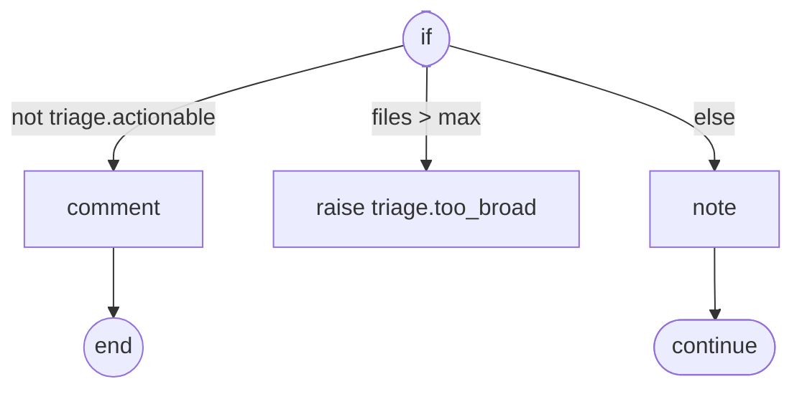

**Lowering.** A compound state with one eventless transition per branch, guarded and taken in order, each targeting a child compound state that holds the branch's steps. All branch children target a shared `join` final state. The parent's `done` continues the flow.

---

## 6.2 `match`

```
route = match triage.severity {
  critical      => "page-oncall"
  high | medium => { note "queued"; yield "queue" }
  _             => "ignore"
}

match r.winner {
  "human" => note "operator overrode triage"
  _       => {}
}
```

**Semantics.**
- Arms are tried in order. A pattern can be:
  - a literal or enum value
  - alternatives with `|`
  - a record pattern, `{ status: "retry", retry_after: d }`, which binds `d`
  - a type pattern, `x is Finding`
  - a guard, `p if cond`
  - the wildcard, `_`
- An arm's body is either an expression or a `{ block }`.
- **Exhaustiveness.**
  - When matching over an enum, bool or literal union, a missing case is a compile error, unless a `_` arm is present.
  - Over `string`, `int` or `json`, a `_` arm is required.

**Output.** The chosen arm's value. Its type is the union of all arm types.

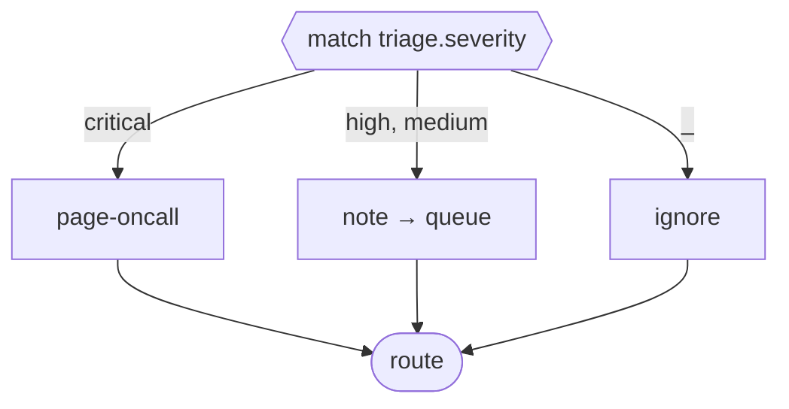

**Lowering.** The same as `if`, with each arm's pattern compiled into a guard expression plus bindings.

---

## 6.3 `fork`: different work, side by side

```
investigate = fork (join: 2, losers: cancel, branch_error: continue, concurrency: 3) {
  files                { … }
  deps                 { run `cargo audit --json` (parse: json) }
  history if deep_dive { … }                      // guarded branch (multi-choice)
}
```

| Option | Values | Default |
|---|---|---|
| `join` | `all` · `any` · an `int` N · `when(b => expr)` · `vote(…)` (agentic, §9.4) | `all` |
| `losers` | `cancel` · `wait` · `detach` | `cancel` |
| `branch_error` | `fail_fast` · `continue` | `fail_fast` |
| `concurrency` | an `int` | unlimited (bounded by `limits.concurrency`) |

**Semantics.**
- **Branches** are named. All non-guarded branches, plus guarded branches whose `if` is true, start concurrently, up to `concurrency` at a time.
- **A guarded branch whose condition is false** is `skipped` and does not count toward the join. This is the "local synchronizing merge" (Appendix B, WCP-7/37).
- **Join** fires when its condition is met over the *active* branches:
  - `all`: every active branch has finished, successfully or with a tolerated failure.
  - `any` / `N`: at least N branches have **succeeded**.
  - `when(b => …)`: `b` is a record with the status of every branch (`b.files.status`, `ok(b.deps)`). Re-evaluated whenever a branch finishes. This is Argo's `depends`.
- **Losers** are branches still running when the join fires:
  - `cancel`: cancelled immediately.
  - `wait`: the flow continues past the fork right away, but the enclosing block won't complete until the losers finish. Their results are discarded. This gives the blocking discriminator and blocking partial join (WCP-28/31).
  - `detach`: they continue, reparented to the instance root, and their results are discarded. The instance can't complete until they finish.
- **Branch errors:**
  - `fail_fast`: the first branch failure cancels the remaining branches and re-raises.
  - `continue`: the failure is recorded as that branch's status, and the join counts it as finished but not succeeded.
- **`join: when(b => …)`** takes a lambda over a record of branch statuses. **`join: vote(…)`** replaces the block's output with the vote record (§9.4).
- **An unsatisfiable join** raises `join.unsatisfiable`. That happens when too many branches have failed or been skipped for `any`/N ever to be met.

**Output.** A record keyed by branch name, holding each branch's yield (or last step value). Branches that were skipped, cancelled or failed-and-continued are `null`, so each field is typed `T?`. The exception is an *unguarded* branch under `join: all` with `branch_error: fail_fast`, which is `T`; a guarded branch is always `T?`. Use `status(investigate.files)` to tell why a field is null.

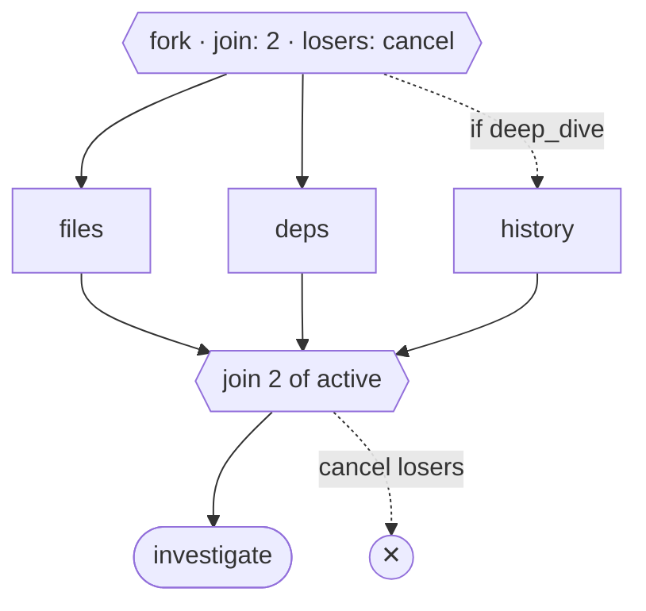

**Lowering.**
- A `parallel` state with one region per branch. Each guarded region starts in an eventless choice: `if cond → body`, else `→ skipped (final)`.
- Each region ends in `final ok`, `final failed` or `final skipped`, and raises an internal `fork.<id>.arrived` event carrying its status.
- A counter variable and the join guard sit on the parallel state. When the guard holds, it transitions out of the parallel state, which (per SCXML) exits and so cancels every still-active region (`losers: cancel`).
- `losers: wait` and `detach` instead move the remaining regions into a *trailing region* of the enclosing scope (or of the root), so the main path can continue.

---

## 6.4 `map`: the same work over many items

```
audits = map file in triage.files (concurrency: 4, key: file, item_error: continue,
                                   until: results.any(r => r?.audit.severity == critical)) {
  a = agent @code-auditor -> Audit "Audit {{ file }} ({{ index + 1 }}/{{ count }})"
  hits = if a.suspicious { run `rg -n {a.pattern} {file}` (parse: lines) }
  yield { audit: a, hits: hits }
}
  place distribute(["w1", "w2"], workspace: sync)
```

| Option | Values | Default |
|---|---|---|
| `concurrency` | `int` | `1` (sequential). The lint `map-default-concurrency` asks you to state it. |
| `key` | expression over the item → `string` | the item's index |
| `item_error` | `fail_fast` · `continue` | `fail_fast` |
| `join` | `all` · `any` · `int` · `when(rs => …)` · `vote(…)` | `all` |
| `until` | expression over `results` (completed so far) → `bool` | — |
| `losers` | `cancel` · `wait` · `detach` | `cancel` |
| `order` | `input` · `completion` | `input` |

**Semantics.**
- The item expression is evaluated once, when the map starts.
- **Each item runs as an *item scope*:** a unit with its own identity `key`, journaled and resumed individually. Inside the body, the loop variable, `index` (0-based) and `count` are in scope.
- **Item identity.**
  - Stable keys make resume correct even if a re-evaluated list changes. The item list itself is journaled at start and is *not* recomputed on resume.
  - Duplicate keys raise `map.duplicate_key` at start.
- **Early exit.** `until` is checked after each item finishes. When it holds, the remaining and running items are treated as losers. `until` (which sees the implicit `results`) is equivalent to `join: when(rs => …)` (a lambda over the same list) plus `losers: cancel`, but reads better for "stop early".
- **`place` on a map** applies to each item scope. `distribute` assigns items to hosts round-robin by index.

**Output.**
- `list<T>` in input order: the body's yield, or its last step's value, for each item.
- With `item_error: continue`, or with losers that never complete, the type is `list<T?>`.
- `order: completion` orders by finish time instead.
- Per-item status is available as `status(audits[i])`.

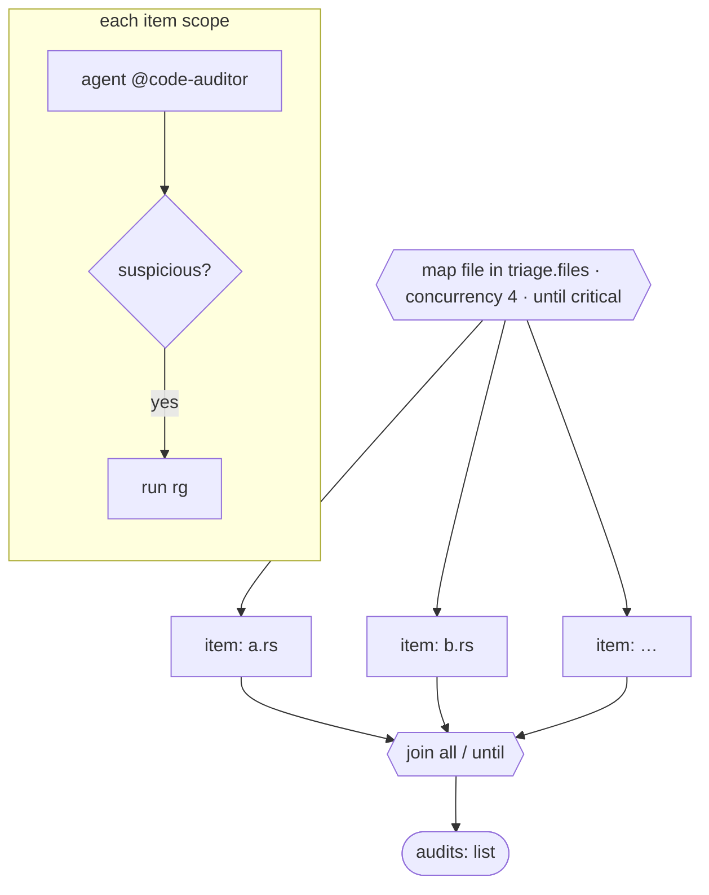

**Lowering.**
- A dynamic region `R⟨key⟩` whose template is the lowered body. The map state spawns at most `concurrency` instances at a time from the journaled item list.
- Each region instance's completion raises `<id>.item_done{key, status, value}` (or `<id>.item_failed{key, error}`).
- The map state's transitions keep the results table, check `until` and `join`, and spawn the next pending item.
- On exit, any remaining region instances are cancelled, or moved to a trailing region, according to `losers`.

---

## 6.5 `pipeline`: items stream through stages

```
confirmed = pipeline file in files (key: file) {
  stage audit   (concurrency: 8)                    { yield agent @code-auditor -> Audit "Audit {{ file }}" }
  stage confirm (concurrency: 2, item_error: drop)  { yield run `rg -n {audit.pattern} {file}` (parse: lines) }
  stage report  (concurrency: 1)                    { tool issues.comment(…, body: "{{ file }}: {{ confirm.lines.size() }} hits") }
}
```

| Stage option | Values | Default |
|---|---|---|
| `concurrency` | `int` | `1` |
| `item_error` | `fail_fast` · `continue` · `drop` | `fail_fast` |
| `if` | per-item guard; when false, the item skips this stage | — |

**Semantics.**
- **Streaming.** An item enters stage *k+1* as soon as it finishes stage *k* and stage *k+1* has a free slot. No stage waits for the whole list, so item 7 can be in `confirm` while item 30 is still in `audit`.
- **Scope.** Inside stage *k*, the item variable and the yields of stages *1..k−1* are in scope by stage name: `audit` above is the audit stage's yield for *this* item.
- **Errors:**
  - `drop` removes the item from later stages and the output, and records it.
  - `continue` passes `null` onwards, so later stages see `T?`.
  - `fail_fast` cancels the whole pipeline.

**Output.** `list<T>` of each item's *final* stage yield, in input order (`list<T?>` under `continue`). The record of every stage's yield per item is available as `stages(confirmed)`.

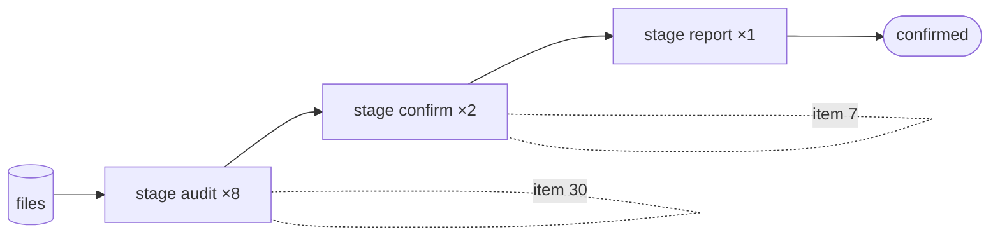

**Lowering.**
- One dynamic region per item, whose template is a sequence of stage sub-states.
- A **stage gate**: entering stage *k*'s sub-state needs a slot. It takes a `semaphore(pipeline.<id>.<k>, n)`, as in §6.11 but local to the instance.
- Items park in `waiting_k` states until the slot is granted, which is delivered as an internal event.

---

## 6.6 `race`: first to finish wins

```
r = race {
  fast  { yield agent @quick-triager -> Triage "…" }
  slow  { sleep 10m; raise triage.too_slow }
  human { o = wait for operator.override; yield o.triage }
}
match r.winner {
  "human" => note "operator overrode triage"
  _       => {}
}
let decided = r.value                       // Triage (union of the branches' yield types)
```

**Semantics.**
- All branches start at once. The first branch to **complete successfully** wins, and the rest are cancelled.
- A branch that *fails* drops out. If every branch fails, the race raises `race.all_failed`, with every error in `data`.
- A raised error inside a branch is a failure, not a win. So `slow { sleep 10m; raise … }` makes the *race* fail only if it's the last branch left. To make a timeout win, `yield` a value instead.
- `race` is `fork (join: any, losers: cancel, branch_error: continue)`, plus `race.all_failed` in place of `join.unsatisfiable`, with an output shape suited to deferred choice (WCP-16).

**Output.** `{ winner: "<branch>", value: <union of branch types> }`. The `winner` field is typed as the union of the branch-name literals, so `match` on it is exhaustive.

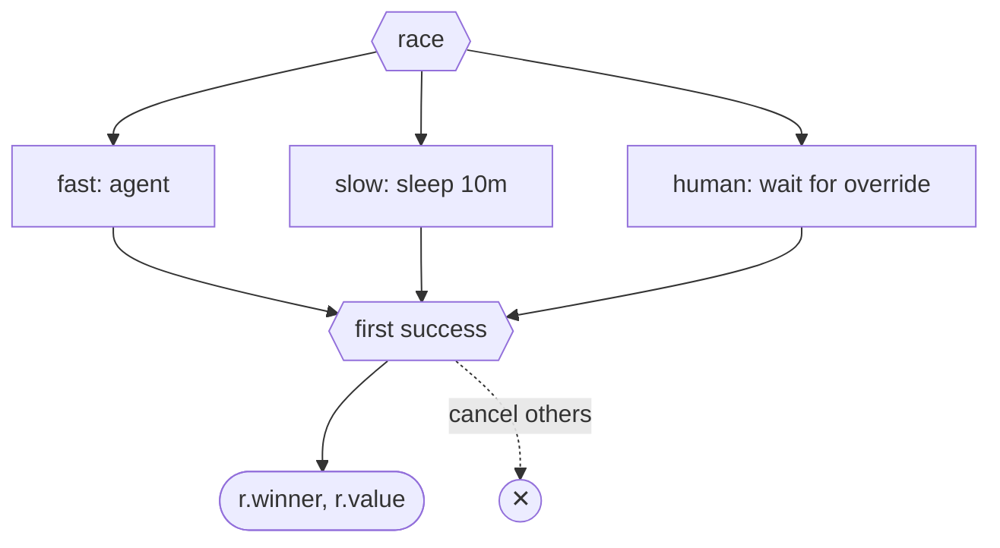

**Lowering.** As `fork` with `join: any` and `losers: cancel`; the output record is rebuilt as `{winner, value}`.

---

## 6.7 `async` / `await` / `detach`: start now, use later

```
deps = async run `cargo audit --json` -> AuditReport (parse: json)
hist = async agent @git-historian "When was it introduced?"
plan = agent @planner -> Plan "…"                 // runs while deps + hist are in flight
both = await all [deps, hist]                      // { deps: AuditReport, hist: string }

// other forms:
fast = await any [a, b]                            // { winner, value }: a and b stay in flight
r    = await a                                     // a single handle
detach b                                           // b may outlive this scope (see below)
```

**Semantics.**
- `async <step>` starts any step (leaf, block or flow call) and returns `Handle<T>` immediately.
- `await h` suspends until it finishes and yields `T`. If the step failed, `await` re-raises the step's error.
- `await all [h…]` yields a record keyed by handle name; `await any [h…]` yields `{winner, value}` and **does not** cancel the others.
- `await all pending` and `await any pending` also accept a `list<Handle<T>>` expression, for a handle set built up dynamically. They yield `list<T>` (in list order) or `{ index, value }`. The dynamic set is built in steps: `h = async …` and then `pending = pending + [h]`. Handles stored in a `var` are tracked by the checker like named ones.
- **Structured-concurrency check (compile time).** Every handle must be `await`ed or `detach`ed on every path before its scope ends. A handle that is neither is error `E0601 handle-not-awaited`. A handle that might not be awaited, such as one awaited only inside an `if`, has to be detached on the other paths.
- **Detach.** A detached handle is reparented to the instance root. The instance can't complete until detached work finishes or is cancelled. Detached work is cancelled when the instance is cancelled.
- **Why async/await?** It expresses any DAG, including ones that aren't series-parallel (a diamond with a cross edge), without a separate graph syntax:
  ```
  a = async agent @x "…"
  b = async agent @y "{{ await a }}"            // b depends on a
  c = async agent @z "…"
  d = agent @w "{{ await b }} {{ await c }}"    // d depends on b and c
  ```
  `await` inside a template or expression is allowed. The checker hoists it to a statement before the step.

**Output.** `async` yields `Handle<T>`. `await` yields as above.

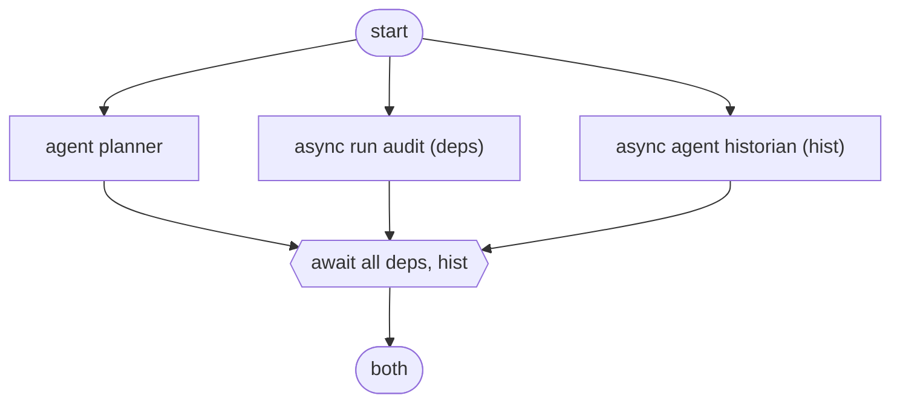

**Lowering.**
- Each `async` spawns a dynamic region in the *enclosing scope's* async pool.
- `await` is a state waiting on `done` events from the named regions.
- The scope's exit transition is guarded on the async pool being empty. That guard is the runtime backstop for the static check.

---

## 6.8 `worklist`: a queue that grows while you work

```
assets = worklist asset in [scope.root] (concurrency: 4, max_items: 500,
                                         dedupe: asset.locator, until: findings_found >= 10) {
  found = agent @recon -> Discovery "Explore {{ asset.locator }}"
  push found.children                          // enqueue newly discovered work (list or single)
  push priority found.hot_leads                // jump the queue
  yield found
}
```

| Option | Values | Default |
|---|---|---|
| `concurrency` | `int` | `1` |
| `max_items` | `int` | **required** (no unbounded worklists) |
| `dedupe` | expression → key | item equality |
| `until` | expression over `results` | — |
| `order` | `fifo` · `lifo` · `priority(x => int)` | `fifo` |
| `item_error` | `fail_fast` · `continue` | `continue` |

**Semantics.**
- The queue is seeded with the initial list. Workers take items while slots are free.
- `push` adds to the queue (deduplicated against everything ever seen). `push priority` puts items at the front.
- **The worklist ends when one of these holds:**
  - the queue is empty and nothing is in flight;
  - `until` holds;
  - `max_items` items have been *started*. Any remaining queue is reported by `unprocessed(assets)`.
- The queue, the seen-set and the in-flight set are journaled, so resume continues exactly.

**Output.** `list<T>` of yields in completion order. Also available: `unprocessed(assets): list<Item>` and `stopped_by(assets): "empty" | "until" | "max_items"`.

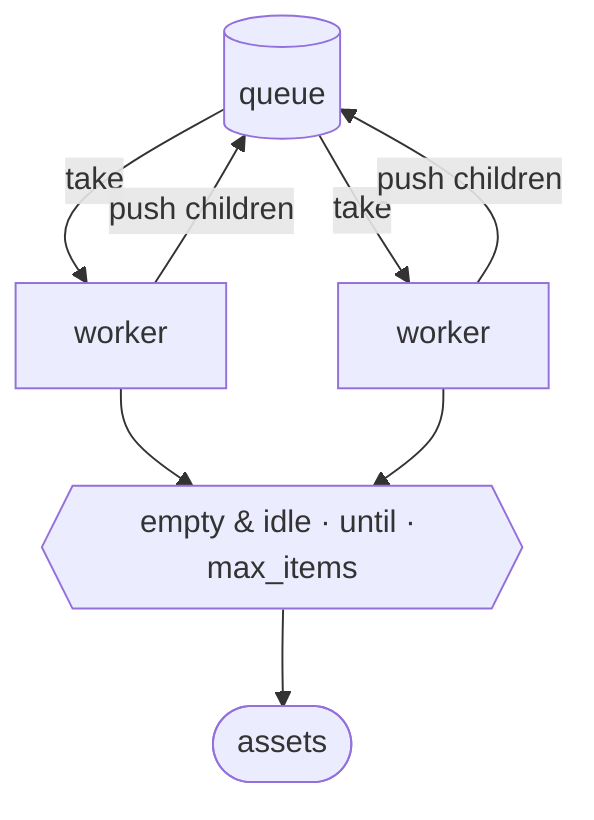

**Lowering.** A dynamic region pool fed from a journaled queue variable. `push` lowers to an internal event that appends to the queue (with the seen-set check). A dispatcher state spawns regions while `in_flight < concurrency`. The exit guards implement the three end conditions.

---

## 6.9 `loop`, `while`, `for`

### `loop`: run the body, check afterwards
```
refine = loop (max: 3, until: ok(verify) and review.resolved, exhausted: continue) {
  patch  = agent @patcher "… last failure: {{ prev.verify?.stderr ?? "(first pass)" }}"
  verify = run `cargo test` on_error continue
  review = panel_review(subject: patch, panelists: reviewers, floor: high)
}
```
| Option | Values | Default |
|---|---|---|
| `max` | `int` | **required** |
| `until` | `bool` expression, checked after each pass | — (loop runs `max` passes or until `break`) |
| `exhausted` | `fail` (raise `loop.exhausted`) · `continue`. Applies only when `until` is set; without `until`, completing `max` passes is a normal finish. | `fail` |

### `while`: check before each pass
```
while queue.depth() > 0 (max: 100) { … }
```

### `for`: sequential iteration with an accumulator
```
score = for f in findings carry total = 0 {
  total = total + weight(f.severity)
}
```
`carry` declares loop-carried `var`s; the output of a `for` is the final value of the first `carry`. With several `carry` variables, the output is a record of all of them.

**Shared semantics.**
- `max` is mandatory on `loop` and `while`, so there are no unbounded loops. `for` is bounded by its list.
- `loop.iteration` (1-based) counts passes.
- **Previous pass.** `prev.<name>` is the previous pass's binding, typed `T?` (null on the first pass). It replaces today's implicit "feedback edge".
- `break [with expr]` exits, and the loop's output is `expr`. `continue` starts the next pass, after checking `until`/`while`.
- **Nesting.** Loops nest freely. Each is its own scope.
- **Fresh bindings each pass.** Every pass re-binds the body's steps. Readers after the loop see the **last** pass's values; earlier passes are reachable through `prev` only inside the loop.

**Output.**
- `loop` / `while`: the last pass's yield or last step's value, or the `break with` value.
- `for`: the carry value(s).

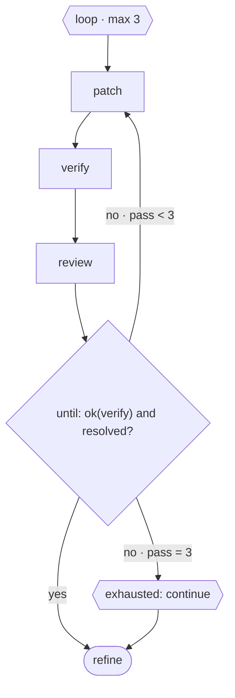

**Lowering.**
- A compound state `body` plus an eventless `check` state.
- The loop counter and `prev` snapshot live in loop-scoped vars.
- `check` takes `→ exit` when `until` holds or the counter reaches `max` (to `exhausted_fail` or `exit`). Otherwise it takes `→ body (reenter)`, which re-runs the body's entry, its activities and its bindings.
- `while` moves `check` before `body`.

---

## 6.10 `with lock`

```
with lock "deploy:" + repo (wait: 30m) {
  run `./deploy.sh {repo}`
}
```

**Semantics.**
- Mutual exclusion across every instance, and across hosts, through the host's `LockService` (§8.10). The lock name is any string expression.
- **Acquiring:**
  - `wait` bounds the acquisition; expiry raises `lock.timeout`.
  - Without `wait`, it waits indefinitely, but durably: the instance is unloaded while waiting.
- **Release** happens when the block exits for any reason: success, error, cancel or `goto`. The lock is leased and renewed while held, so a crashed holder's lock expires.

**Output.** The block's yield.

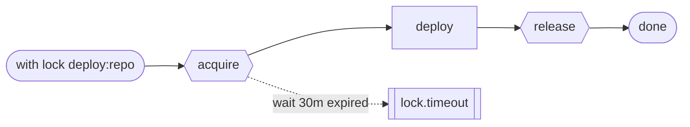

**Lowering.** An `acquire` state invokes the `Acquire{lock}` effect, then the body runs, then an exit action emits `Release`. The release is also attached to every exit path, through the scope's `exit` actions.

## 6.11 `with semaphore`

```
with semaphore "fuzzers" (limit: 3, wait: 1h) {
  run `./fuzz.sh {target}`
}
```

At most `limit` holders hold it at once, across instances and hosts. Otherwise it behaves like `with lock`. (`with lock x` is `with semaphore x (limit: 1)`.)

## 6.12 `throttle`

```
throttle (10 per 1m, key: "anthropic", burst: 3) {
  map f in files (concurrency: 20) { agent @auditor "…" }
}
```

**Semantics.**
- A token bucket over effect *starts* inside the block: `rate per window`, with optional `burst` capacity.
- `key` shares the bucket across every block and instance using that key, through the host's `LockService` rate limiter. Without `key`, the bucket is local to the block.
- An effect over the rate is *delayed*, never failed.
- Retries count as starts.

**Output.** The block's yield.

**Lowering.** Every invoke inside the block's scope gets an `Acquire{token(key)}` pre-effect.

## 6.13 `within`: a deadline over a whole block

```
within 2h {
  …
} else {
  note "gave up after 2h"
  end timed_out
}
```

**Semantics.**
- The deadline starts on entry. On expiry, the block is cancelled (§8.6) and the `else` body runs. Without an `else`, it raises `timeout`.
- Unlike the `timeout` modifier, which is per attempt, `within` spans everything inside it, including retries, loops and waits.

**Output.** The block's yield, or the `else` body's yield.

**Lowering.** A compound state with an `after <d> → else_state` transition on the scope. Exiting it cancels the body.

## 6.14 `budget`: cost caps around any block

```
budget (usd: 5, tokens: 1_000_000, time: 2h) {
  …
} on soft(0.8) {
  note "80% of budget spent — converging"
} on exhausted {
  end budget_exhausted
}
```

**Semantics.**
- **Dimensions.** Effects report `usage` in their results: a map of dimension name to number. The agentic extension reports `usd`, `tokens`, `tokens_in` and `tokens_out`. `time` is wall-clock, built in. Dimension names are free-form and checked against what the `use`d extensions declare.
- **Accounting.** Usage is summed per budget scope, including nested scopes and retries. The binding `budget` is in scope inside the block: `budget.spent.usd`, `budget.fraction` (the maximum over dimensions), `budget.stage` (`ok`, `soft` or `hard`).
- **`on soft(f)`** runs once, non-interrupting, when any dimension crosses fraction `f` (default `0.8`). It also sets `budget.stage == soft`, which the agentic extension turns into a "converge" hint for agents inside.
- **`on exhausted`** is interrupting. It cancels the block when any dimension reaches 1.0 and runs its body. Without it, the block raises `budget.exhausted`.
- **Enforcement.** Budgets are checked *before* each new effect starts (§8.5), never mid-effect. An in-flight agent finishes its current turn.

**Output.** The block's yield, or the `on exhausted` body's yield.

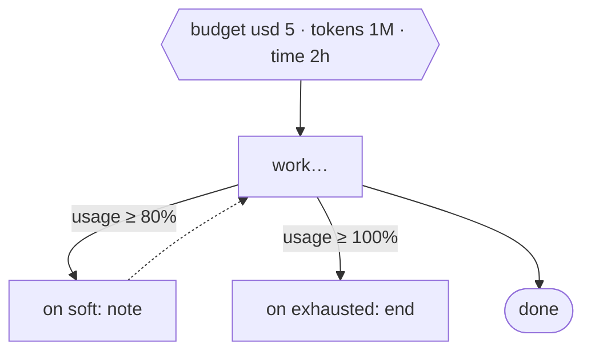

**Lowering.** Scope-level accounting vars. Every `EffectDone` input carries `usage`, and the stepper adds it to every enclosing budget scope. Eventless guards drive the soft action and the exhausted exit. A *pre-dispatch guard* refuses new invokes once the scope is `hard`.

## 6.15 `try` / `catch` / `finally`

```
try {
  pr = tool scm.prs.create(…)
  run `./post-merge-check.sh {pr.number}`
} catch tool.conflict {
  goto refine
} catch run.exit_code as e {
  note "post-merge check failed: {{ e.message }}"
} finally {
  tool issues.comment(…, body: "attempt finished")
}
```

**Semantics.**
- `catch` clauses behave exactly like the modifier (§5.4), but over a whole block.
- `finally` always runs: after success, after a handled or unhandled error, and on cancel. On cancel it runs within the cancellation grace period.
- An error raised *inside* `finally` replaces the original one.
- `try` blocks nest.

**Output.** The `try` body's yield, or the handling `catch` body's yield.

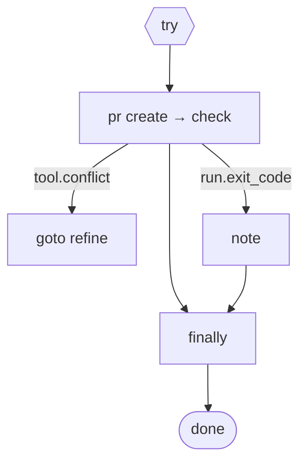

**Lowering.**
- The body is a compound state. Each catch clause is an `on failure catch <pattern>` transition to a handler state.
- `finally` is a sub-state that every exit path passes through. The original outcome is held in a scope var and re-applied after `finally`: re-raise, continue, or follow a pending `goto`/`end`.

## 6.16 `saga` / `compensate`

```
saga (on_cancel: compensate) {
  branch = tool scm.branches.create(name: "rupu/sec-{{ n }}")
    compensate { tool scm.branches.delete(name: branch.name) }
  pr = tool scm.prs.create(head: branch.name, …)
    compensate { tool scm.prs.close(number: pr.number) }
  run `./deploy.sh {pr.number}`
}
```

**Semantics.**
- As each step with a `compensate` modifier succeeds, its compensation body is pushed onto the saga's stack, together with the bindings it captured.
- **On failure inside the saga,** the stack is unwound in **reverse order**: each compensation runs as a journaled flow, and then the original error is re-raised.
- **When a compensation itself fails,** the failure is recorded (`saga.compensation_failed`, with every error attached) and unwinding continues. The raised error becomes `saga.compensation_failed`, with the original error as `cause`.
- **On cancel,** compensation runs only with `on_cancel: compensate`. The default is `skip`.
- Steps without `compensate` are allowed inside a saga; they simply have nothing to undo.

**Output.** The body's yield.

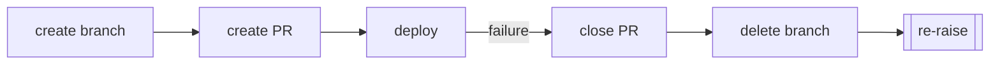

**Lowering.** A scope var `__comp` (a list of `{flow_ref, captured}`). Each `compensate` registration is an assign action on that step's `done`. The saga's failure transition goes to an `unwind` state, which iterates the list in reverse like a `for` over compensation flow-calls, then re-raises.

## 6.17 `during … on`: listening while working

```
during {
  audits = map f in files (concurrency: 8) { agent @auditor "…" }
} on operator.note as n {
  notes = notes + [n.body]                  // non-interrupting: work continues
} on github.issue.closed {
  cancel                                    // interrupting: ends the during-block
} on operator.stop {
  end operator_stop
}
```

**Semantics.**
- While the body runs, events matching any `on` clause are delivered to that clause. The pattern can carry `if` guards and `as` bindings.
- **How a handler affects the body:**
  - A handler **without** `cancel`, `goto`, `end` or `raise` is *non-interrupting*. It runs concurrently, scoped to the during-block, and the body continues.
  - A handler that reaches `cancel` *interrupts*: it cancels the body, and the during-block completes with `null` (typed `T?`).
  - `goto`, `end` and `raise` interrupt and route as usual.
- **Delivery is innermost-first.** When `during` blocks nest, or a `pursue`, `wait for` or `approve` inside the body also listens for the event, the innermost listener consumes it, and outer handlers don't see it (§4.5's processing order).
- Handlers fire **once per event**. A long handler doesn't block delivery of later events: each runs as its own handler instance, serialised per clause.

**Output.** The body's yield, or `null` if it was cancelled.

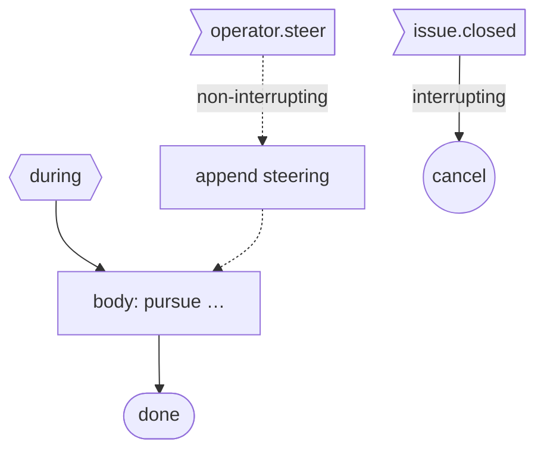

**Lowering.** A parallel state with region `body` and one region per `on` clause. Each clause region is a self-transition on its event that spawns a handler dynamic region. Interrupting handlers raise an internal event that exits the parallel state.

## 6.18 The local `states` block

A flow can embed an event-driven section that yields the final state it reached. See §7.8.

```
deal = states negotiation {
  initial state asking { do ask "Accept the proposed scope?" (form: { ok: bool })
                         on done if output.ok -> agreed
                         on done              -> revising }
  state revising       { flow { … } on done -> asking }
  final state agreed
  final state abandoned
  after 3d -> abandoned
}
match deal.outcome { "agreed" => …, "abandoned" => end abandoned }
```

## 6.19 Agentic blocks

These are specified fully in chapter 09:

| Block | Purpose |
|---|---|
| `best_of N (judge: …) { … }` | run N candidates in parallel; a judge picks the winner |
| `vote(…)` | a `join:` policy for `fork`/`map`: majority, unanimous, quorum or weighted agreement |
| `pursue goals […] (…) { round { … } on stalled(n) { … } }` | goal-directed round loop: the agentiflow envelope as a construct |

## 6.20 Control words

| Word | Valid in | Meaning |
|---|---|---|
| `yield expr` · `yield <step>` | any block or flow | Sets the output of the innermost enclosing **value block**: any block or flow except `if`/`match`, which are transparent to `yield`. (An `if`/`match` gets its own value from the taken arm's last step or arm expression.) Execution continues to the block's end, and a later `yield` overrides an earlier one. `yield <step>` runs the step and yields its result. |
| `break [with expr]` | `loop`, `while`, `for`, `worklist`, `map` | Exits the innermost loop-like block. In `map` and `worklist` it cancels the remaining items and makes the output what has finished so far. |
| `continue` | `loop`, `while`, `for` | Next pass. |
| `goto <name>` | flows | Jumps to a named step at the same flow level or an enclosing one, forward or backward. Every scope it leaves is exited (and cancelled). Jumping *into* a block re-enters it from its start: a loop restarts with its counter reset. Jumping into the middle of a `fork`, `map`, `pipeline`, `race` or `during` is a compile error (`E0710 goto-into-concurrent`). |
| `goto <state>` | inside a state's activity | Same as the state-layer transition `-> state` (ch. 07). |
| `end [outcome] [with expr]` | anywhere | Finishes the **machine**: cancels every scope (running `finally` and hook flows) and completes with `outcome`. The default outcome is `completed`. `with expr` sets the machine's output explicitly; it is validated against the `output` type, and the `output` expression is then not evaluated. Outcome names are collected into the IR's outcome table (§8.9). |
| `cancel` | `during` handlers, `race`/`fork` branches, `catch` bodies | Cancels the innermost enclosing cancellable scope. |
| `raise` / `fail` | anywhere | Raise a typed error (§5.2). |
| `push [priority] expr` | `worklist` body | Enqueue items (§6.8). |
| `restart with { … }` | machine root flow or state activity | Continue-as-new: ends this instance's journal and starts a fresh one with the same key, carrying the given `var`s (§8.8). |
