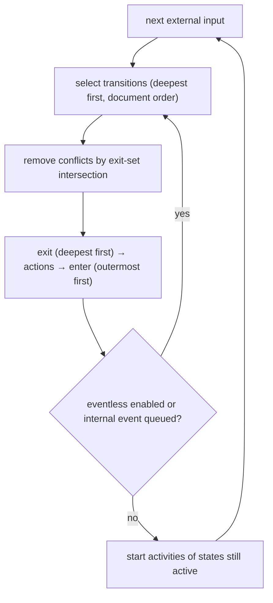
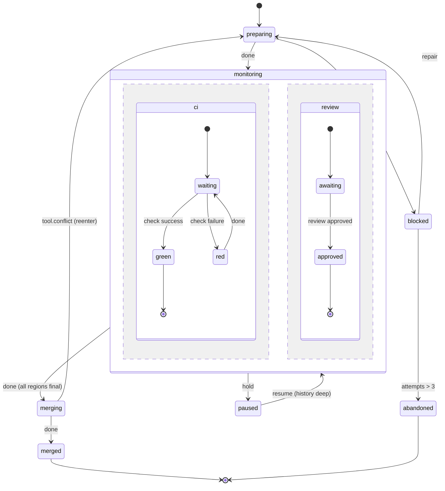

# 07. The state layer

Use the state layer for anything long-lived or event-driven: entity owners (issues, PRs), shepherds, approval processes that span days, agentiflow-style envelopes. It uses the same language, expressions, steps and modifiers as flows. Only the shape of the body differs.

## 7.1 States

```
initial state preparing { … }       // exactly one initial per compound level
state monitoring { … }
final state merged                  // terminal; the name is the outcome
final state abandoned
```

| Kind | Declared as | Meaning |
|---|---|---|
| atomic | `state x { … }` with no child states | a leaf configuration |
| compound | `state x { … initial state a { } state b { } }` | has children; exactly one child is active |
| parallel | `parallel state x { region r1 { … } region r2 { … } }` | every region is active at once |
| final | `final state x` | terminal for its parent. At the root it ends the machine with outcome `x`. |
| history | `history` / `history deep` inside a compound or parallel state (in a parallel state it records every region) | a pseudo-state: `-> x.history` resumes the last active child (shallow) or the whole active subtree (deep) |

- **Parameterised states.** `state dispatching(d: Dispatch) { … }` declares a parameter, and a transition passes it: `-> dispatching(output.dispatch)`. Parameters are read-only inside the state.
- **State-local `var`s** reset on every entry, except entry through history.

## 7.2 What a state contains

```
state working {
  var tries = 0                          // state-local variable

  entry { note "entered working" }       // fire-and-forget actions
  exit  { note "left working" }

  flow { … }                             // the activity (OR: do <step>)

  on done                -> watching     // transitions
  on failure as e        -> blocked { last_error = e }
  on github.issue.closed -> released
  after 30m              -> working (reenter)
  if tries > 3           -> blocked
}
```

### Activities
- **`flow { … }`** runs a flow while the state is active.
- **`do <step>`** is shorthand for a single-step flow: `do call machine kitchen_sink(repo: entity.repo)`.
- **Lifecycle.** The activity starts at the end of the macrostep that entered the state (§7.6). Leaving the state cancels the activity (§8.6).
- **Results.** When the activity completes, the internal event `done` fires, with `output` set to the activity's result. When it raises, `failure` fires, with `e`/`error` set.
- **At most one activity per state.** For concurrent activities, use a `parallel state`.
- **Unhandled activity failures bubble up.** If no `on failure` clause on the state matches, the failure is offered to the `on failure` transitions of each enclosing state in turn, innermost first, then to the root handlers. If nothing matches, the instance fails with that error.

### Entry, exit and transition actions
- They may contain any core leaf step (`let`, assignment, `emit`, `send`, `note`, `raise`) and **fire-and-forget** extension steps such as `tool issues.comment(…)`.
- **They are not awaited.** A failure inside one surfaces as an `error.action` event, which can be handled with `on error.action as e -> …`, and never blocks the transition.
- Anything you need to await belongs in the activity.

## 7.3 Transitions

```
on <event-pattern> [if <cond>] [as <name>] -> <target> [(reenter)] [{ actions }]
on done    [if <cond>]                     -> <target> [{ actions }]
on failure [catch <pattern>] [as <name>]   -> <target> [{ actions }]
if <cond>                                  -> <target> [{ actions }]   // eventless
after <duration-expr>                      -> <target> [{ actions }]   // delayed
on <event-pattern> [if <cond>] [as <name>] { actions }                 // targetless
on <event-pattern> {}                                                  // swallow
```

| Form | Semantics |
|---|---|
| event | Fires when a matching external or internal event is processed while the state is active. Patterns may use `.*`. |
| `done` | The activity completed, or (compound) a child final state was entered, or (parallel) every region reached a final state. |
| `failure` | The activity raised. `catch` patterns work as in §5.4; the first matching clause wins, in document order. With no match, it bubbles to the ancestors (§7.2). |
| eventless (`if`) | Re-evaluated after every microstep. Taken as soon as the guard is true. |
| delayed (`after`) | A durable timer started on entry, holding an **absolute deadline**, and cancelled on exit. An expression duration is evaluated on entry. |
| targetless | Runs actions without exiting or entering anything, so the activity keeps running. |
| swallow (`{}`) | Matches the event and does nothing. A deeper state can use it to override an ancestor's handler. |
| `(reenter)` | Exits and re-enters the target even when it is the source or an ancestor. This restarts entry actions and the activity, and resets state-local vars. Without it, a transition from a state to itself, or to an ancestor, is **internal**: no exit, no re-entry. |

**Targets:**
- a sibling, or any state, by path (`monitoring.ci.red`)
- `x.history`
- a parameterised state with arguments: `dispatching(d)`
- several targets in different regions of one parallel state, at once: `-> (ci.red, review.awaiting)`

**Root handlers.** Transitions declared at machine level, outside any state, act as the handlers of an implicit root state. Every state therefore inherits them unless a deeper state handles or swallows the same event.

## 7.4 Parallel states

```
parallel state monitoring {
  region ci {
    initial state waiting { … }
    state red { … }
    final state green
  }
  region review {
    initial state awaiting { … }
    final state approved
  }
  on done -> merging                 // every region final
}
```

- Every region is active while the parallel state is active. Each region's transitions are selected independently, and they don't conflict unless their exit sets overlap (§7.6).
- `done` fires when every region has entered a final state.
- A transition out of the parallel state, from any region or from the parallel state itself, exits every region and cancels their activities.
- `in_state("monitoring.ci.green")` tests a region's configuration from guards anywhere in the machine.

## 7.5 History

```
state monitoring {
  history deep
  initial state ci_wait { … }
  …
}
state paused { on unhold -> monitoring.history }
```

- **On exit,** the history pseudo-state records the active child (shallow) or the whole active descendant configuration (deep).
- **Entering `x.history`** restores what was recorded. If nothing was ever recorded, it enters `x`'s `initial`.
- **Restored subtrees** don't reset their state-local vars. Their activities restart, and they are resumed from the journal: an agent step continues its conversation (§8.5).

## 7.6 Execution semantics

These follow the W3C SCXML algorithm, with **one deliberate deviation**: a transition targeting its own source state, or an ancestor of it, is **internal by default** (no exit and re-entry) unless it is marked `(reenter)`. This is XState v5's behaviour, and it reads more naturally. In SCXML such transitions default to external. Everything else must match SCXML exactly. Plan 2 ships conformance tests derived from it, with the self-transition cases adjusted.

**1. Inputs.** External inputs (events, timers, effect results, operator commands) are processed one at a time from the instance inbox (§4.5). Each one starts a **macrostep**.

**2. Microsteps.**
- **(a) Select the enabled transitions.** For each atomic state in the active configuration, in document order:
  - Walk from the state through its ancestors, outward. The **first** transition whose event matches and whose guard holds is selected for that state, by document order within each state.
  - Eventless transitions are selected the same way, but with no event.
- **(b) Remove conflicts.** Two selected transitions conflict if their **exit sets** intersect.
  - If one transition's source is a descendant of the other's, the descendant's transition wins.
  - Otherwise, the one selected first in document order wins.
- **(c) Execute the surviving transitions as one microstep:**
  1. Exit the union of their exit sets, deepest first and in reverse document order: run `exit` actions, record history, cancel activities.
  2. Run the transition actions, in document order.
  3. Enter the union of their entry sets, outermost first and in document order: run `entry` actions, and for compound states descend into their `initial` or restored history.
  4. Entering a final state raises the internal `done` event for its parent. All regions final raises `done` for the parallel state.

**3. Completing the macrostep.**
- After each microstep, select **eventless** transitions first, then **internal** events (raised by actions, `done`, `failure`, `error.action`) in FIFO order.
- The macrostep ends when no eventless transition is enabled and the internal queue is empty.
- **Activities start only now,** and only for states that are still active. A state entered and exited within one macrostep never starts its activity.

**4. Unmatched events.** An external event that matches no transition is **discarded**, recorded in the journal as `unhandled`. Lint `event-never-handled` flags declared events with no handler.

**5. Livelock guard.** More than 100 microsteps in one macrostep raises `error.livelock` at the root. The checker also flags eventless cycles statically, where no guard on the cycle changes.



## 7.7 Static checks

| Check | Level |
|---|---|
| exactly one `initial` per compound state; at least one root final state, or `instance` declared (an owner may run forever) | error |
| a target names an unknown state, or a region outside the transition's parallel ancestor | error |
| a state is unreachable from the initial configuration | warning `unreachable-state` |
| a non-final state has no outgoing transitions and no activity whose `done`/`failure` is handled | warning `state-no-exit` |
| a parallel state with `on done` has a region with no final state | error |
| an `on <event>` for an event that is neither declared, in the host vocabulary, nor sent or emitted anywhere | warning `event-never-sent` |
| an eventless cycle with no guard progress | warning `eventless-cycle` |
| an action writes a `var` that another region also writes | error (concurrent write, §4.6) |
| `-> x.history` where `x` declares no history | error |

## 7.8 Composition with flows

**A state can run a flow.** That is the `flow { }` activity (§7.2).

**A flow can contain a state section,** with `states <name> { … }`:

```
deal = states negotiation {
  initial state asking {
    do ask "Accept the proposed scope?" (form: { ok: bool })
    on done if output.ok -> agreed
    on done              -> revising
  }
  state revising {
    flow { proposal = agent @scoper "Revise: {{ … }}" }
    on done -> asking
  }
  final state agreed
  final state abandoned
  after 3d -> abandoned
}
match deal.outcome {
  "agreed"    => note "scope agreed"
  "abandoned" => end abandoned
}
```

- The `states` block runs until one of its final states is entered.
- It yields `{ outcome: <final state name>, vars: <its vars> }`. The `outcome` field is typed as a union of the final-state names.
- Transitions declared directly inside the block, such as `after 3d` above, are that section's root handlers.

## 7.9 Example: a PR shepherd

```
/// Rebase, wait for CI and review, and merge a PR; recover from conflicts.
machine pr_shepherd
uses agentic

input { pr: int, repo: string }
event repair { reason: string }
event hold                                     // domain-level "hold this PR" (distinct from engine pause, §8.6)
event unhold
var attempts   = 0
var last_error : Error? = null

on github.pr.closed if event.pr.number == pr -> abandoned
on hold                                      -> paused

initial state preparing {
  entry { note "shepherding PR #{{ pr }}" }
  flow {
    run `git fetch origin`
    run `git rebase origin/main`
    tool scm.branches.push(repo: repo, force_with_lease: true)
  }
  on done         -> monitoring
  on failure as e -> blocked { last_error = e }
}

parallel state monitoring {
  history deep
  region ci {
    initial state waiting {
      on github.check.completed if event.conclusion == "success" -> green
      on github.check.completed if event.conclusion == "failure" -> red
    }
    state red {
      flow { fix = agent @ci-fixer "CI failed on PR #{{ pr }}. Fix it and push." }
      on done -> waiting
    }
    final state green
  }
  region review {
    initial state awaiting {
      on github.pr.review if event.state == "approved" -> approved
      after 48h { tool issues.comment(project: repo, number: pr, body: "Gentle ping for review 🙏") }
    }
    final state approved
  }
  on done -> merging
}

state merging {
  do tool scm.prs.merge(repo: repo, number: pr)
  on done                        -> merged
  on failure catch tool.conflict -> preparing (reenter)
}

state paused {
  on unhold -> monitoring.history
}

state blocked {
  on repair as r -> preparing { attempts = attempts + 1 }
  if attempts > 3 -> abandoned
  after 24h { tool issues.comment(project: repo, number: pr, body: "Blocked: {{ last_error?.message }}") }
}

final state merged
final state abandoned
```



(The `after 48h { … }` in `awaiting` and the `after 24h { … }` in `blocked` are targetless delayed transitions: reminders that leave the state unchanged. Note that a targetless `after` fires once per entry. For a repeating reminder, use `after 48h -> awaiting (reenter) { … }`.)
