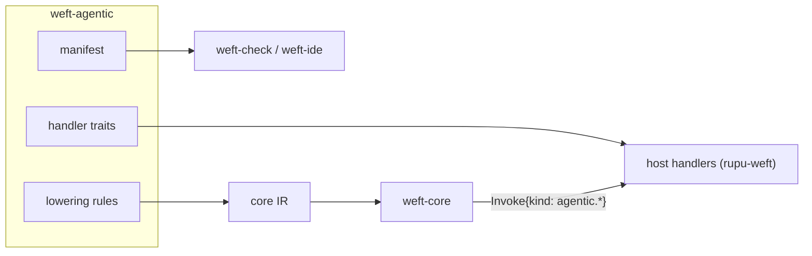

# 09. Extensions and the agentic extension

## 9.1 The extension contract

An extension is a Rust crate that provides three things:

1. **A manifest.** Static data that the checker, formatter, LSP and WASM tooling consume. It is also exported as `manifest.json`.
2. **Lowering rules.** Functions from the extension's syntax nodes to core IR. A lowering can only produce core constructs plus `Invoke`s of the extension's own effect kinds.
3. **Effect handler traits,** optionally with host-agnostic default implementations. The **host** supplies concrete handlers for each effect kind.

**An extension never adds runtime machinery.** It doesn't touch the stepper, the journal or the scheduler. That is why every extension construct is automatically durable, resumable, cancellable, testable and drawn in the graph.



### 9.2 The manifest

```rust
pub struct Manifest {
    pub name: &'static str,                       // "agentic"
    pub version: semver::Version,
    pub keywords: Vec<KeywordSpec>,               // contextual keywords
    pub steps: Vec<StepSpec>,                     // leaf steps (uniform shape)
    pub blocks: Vec<BlockSpec>,                   // block steps (uniform shape + body)
    pub top_level: Vec<TopLevelSpec>,             // machine-level blocks (goals, scope, pool)
    pub join_policies: Vec<JoinPolicySpec>,       // e.g. vote(...)
    pub functions: Vec<FunctionSpec>,             // stdlib additions with signatures
    pub bindings: Vec<BindingSpec>,               // host-provided journaled bindings (goals.*, coverage.*)
    pub types: Vec<TypeSpec>,                     // Run, Approval<F>, Verdict…
    pub error_types: Vec<ErrorTypeSpec>,          // agent.*, provider.*, tool.* …
    pub event_types: Vec<EventTypeSpec>,          // approval.*, operator.*
    pub usage_dimensions: Vec<&'static str>,      // usd, tokens, tokens_in, tokens_out
    pub effect_kinds: Vec<EffectKindSpec>,        // agentic.agent … with arg schema, placeable?, pausable?
    pub catalogs: Vec<CatalogSpec>,               // what the host must supply: agents, tools, events
}

pub struct StepSpec {
    pub keyword: &'static str,                    // "agent"
    pub subject: SubjectSpec,                     // AgentRef | ToolCall | Command | Prose | …
    pub returns: ReturnSpec,                      // Contract (-> T) allowed? default type?
    pub options: Vec<OptionSpec>,                 // name, type, default, doc
    pub prose: ProseSpec,                         // none | optional | required
    pub doc: &'static str,                        // shown in hover/completion
}
```

- **The grammar is fixed.** Every step and block uses the uniform shape (§5.1). A `BlockSpec` adds a body, named sub-sections (like `pursue`'s `round { }`) and `on <hook>` clauses. The parser accepts any keyword in uniform shape, and the checker validates it against the manifest.
- **Host catalogues.** An extension can declare catalogues that the host must supply, such as `agents`, `tools` and `events`. The host provides them through `weft.toml`'s `catalog` command (§10.4). The checker uses them to resolve `@agents`, check tool arguments against the tool's schema, and know event payload types.

---

## 9.3 The agentic extension: leaf steps

### `agent`
```
<name> = agent <@ref | Agent-expr> [-> T] [(options)] <prose>
```
| Option | Type | Default | Meaning |
|---|---|---|---|
| `tools` | `list<tool-name \| pattern>` | the agent's own grant | **narrows** the agent's tool grant to this list (rupu's `actions:`; built-ins always survive) |
| `model` | `string` | the agent's frontmatter | model override |
| `provider` | `string` | the agent's | provider override |
| `max_turns` | `int` | the agent's | turn cap; hitting it raises `agent.max_turns` |
| `mode` | `readonly \| bypass` | the host's run mode | permission mode for this step |
| `findings` | `full \| summary` | `defaults.findings` → agent → `full` | findings profile |
| `fallbacks` | `list<{provider?, model}>` | agent → host config | recovery-ladder chain |
| `system` | prose | — | an extra system message appended to the agent's own |
| `context` | `list<json>` | `[]` | extra structured context attached to the user turn |
| `converge` | `bool` | `budget.stage == soft` | adds the wrap-up hint |
| `repair` | `int` | `1` | how many times to re-ask with the validation error when the output fails its `-> T` contract, before raising `agent.output_invalid` |

**Semantics:**
- The prompt is rendered, and the host runs the agent loop.
- The **result** is the final assistant text. With `-> T`, the first JSON value in that text that validates against `T` is used, after up to `repair` in-conversation correction turns.
- **Usage** (`usd`, `tokens_in`, `tokens_out`) is reported in the effect result, which feeds `budget`.
- **Resume:** the idempotency key maps onto the host's continuation (rupu: `prepare_continuation`, giving Continue, Recovered or Restart).
- **Pause:** supported, via the host's paused seed.

### `tool`
```
<name> = tool <dotted.tool>(<named args>) [-> T]
```
- The arguments are checked at compile time against the tool's input schema from the host catalogue: unknown or missing required arguments, and type mismatches, are errors.
- The result is typed from the tool's output schema (or `json`).
- The idempotency key is passed to the host handler, which forwards it where the service supports one.
- **Write vs read.** Tools that the catalogue classifies as `write` are subject to `Policy` (rupu's readonly mode refuses them). The lint `retry-non-idempotent` flags `retry` on a write tool without an idempotency-capable service.

### `run`
```
<name> = run <`command`> [-> T] [(options)]
```
| Option | Type | Default |
|---|---|---|
| `parse` | `raw \| json \| lines` | `raw` |
| `cwd` | `string` | the workspace root |
| `env` | `map<string>` | `{}` |
| `ok_exit` | `list<int>` | `[0]` |
| `stdin` | `string` | — |

- A non-allowed exit code raises `run.exit_code`, and `data` holds the `Run` record.
- `parse: json` with invalid JSON raises `run.parse`.
- The host `Policy` decides admission. rupu uses `[workflow].run_step_enabled` plus its allowlist and the permission mode, and a denial raises `run.denied`.

### `approve`
```
<name> = approve <prose> [(options)]
```
| Option | Type | Default | Meaning |
|---|---|---|---|
| `quorum` | `int` | `1` | approvals required |
| `approvers` | approver-set expression | host default | e.g. `maintainers`, `collaborators - author`, `["alice", "bob"]` |
| `form` | record-type literal with defaults | `{}` | structured input the approver fills in |
| `notify` | a step (fire-and-forget) or a list of steps | — | fired when the gate parks; never on `skip_if` |
| `skip_if` | `bool` | `false` | auto-approve without parking (`via: auto`) |
| `reject_reason` | `required \| optional` | `optional` | |

**Result:** `Approval<F> { by, at, form: F, comment? }`.

**Errors:**
- A rejection raises `approval.rejected`, with `data.by` and `data.reason`.
- Timeouts are expressed with `after 72h raise approval.timeout` (§5.4). There is no separate timeout option, because that `after` is how every other step handles time.

**Events.** The gate is decided through the events `approval.approve{id, by, form, comment}` and `approval.reject{id, by, reason}`:
- `id` is the step's static id (e.g. `investigate.files.audit_ok`); `by` is one login per event. A `quorum` of N needs N distinct approvers.
- The host routes CLI, CP and API decisions into these events.
- Decision events that arrive *before* the gate parks are retained (§4.5) and consumed when it parks. A self-approval check, where `approvers` excludes `author`, is enforced by the host.

### `ask`
```
<name> = ask <prose> [(options)]
```
| Option | Type | Default |
|---|---|---|
| `form` | record-type literal | free text (`string`) |
| `from` | approver-set expression | host default |
| `notify` | step(s) | — |

**Result:** the form value. `ask` never "rejects"; to bound the wait, use `after … raise ask.timeout`.

## 9.4 The agentic extension: blocks

### `best_of`
```
best = best_of 3 (judge: @senior-reviewer, criteria: "smallest correct patch",
                  vary: model in ["claude-opus-5-5", "claude-sonnet-5-5", "gpt-5.6"],
                  concurrency: 3) {
  agent @patcher -> Patch "…"
}
```
| Option | Type | Default |
|---|---|---|
| count | `int` (positional) | required |
| `judge` | `Agent` or a lambda `c => number` | required |
| `criteria` | prose (agent judge only) | — |
| `vary` | `<option> in <list>`: varies an agent option per candidate | — |
| `concurrency` | `int` | count |
| `min_valid` | `int` | `1`; if fewer candidates succeed, it raises `best_of.insufficient` |

**Output:** `{ winner: T, index: int, scores: list<float?>, candidates: list<T?>, rationale?: string }`.

**Lowering:** a `map` over `range(count)` with the body as the item scope (and `vary` applied to the option), then either an agent judge invoke with the candidates as context and output contract `{ index, scores, rationale }`, or the lambda evaluated with `max_by`.

### `vote(…)`: a join policy for `fork` and `map`
```
verdict = map m in [@sec-a, @sec-b, @sec-c] (concurrency: 3, join: vote(majority, on: v => v.exploitable)) {
  agent m -> Verdict "Is this exploitable? …"
}
```
| Argument | Values |
|---|---|
| rule | `majority` · `unanimous` · `quorum(k)` · `weighted(x => float)` (weights per voter) |
| `on` | lambda selecting the voted value |
| `early` | `bool` (default `true`): decide as soon as the outcome is mathematically fixed, and cancel the rest |
| `require` | `bool` (default `false`): raise `vote.no_consensus` instead of yielding `decision: null` |

**`join: vote(…)` replaces the block's output type** with the vote record below, replacing the list (for `map`) or record (for `fork`).

**Output:** `{ decision: V?, votes: map<int>, agreement: float, ballots: list<T?> }`. `decision` is `null` on a tie or a failed quorum, and `vote.no_consensus` is raised if `require: true`.

**Lowering:** the map join guard tallies `on(value)` per arrival and evaluates the rule.

### `pursue`: the goal-directed envelope
```
hunt = pursue goals [memory_bugs, coverage(reach: 0.9)] (budget: { usd: 50, tokens: 5_000_000 },
                                                          max_rounds: 40, max_errors: 5) {
  round {
    agent @hunt-lead (tools: [fleet.*, catalog.*, goal.status, coverage.status, budget.status, report_finding],
                      max_turns: 50) """
      Round {{ round }}. Goals: {{ goals.summary }}. Coverage: {{ coverage.summary }}.
      Operator says: {{ steering | join("\n") }}
    """
  }
  on round(10)   { approve "10 rounds in: {{ goals.summary }}. Keep hunting?" }
  on stalled(3)  { note "no goal progress in 3 rounds"; steering = steering + ["Change strategy."] }
  on soft_budget { note "converging" }
  finally        { agent @hunt-lead (max_turns: 10) "Wind down: record every unbanked finding now." }
}
```

**Semantics.** Before each round, the engine evaluates the stop conditions in this fixed, documented order. The first one that holds wins:
1. **`goals_met`**: every required goal in the list is met (at least one required goal must exist).
2. **`coverage_reached`**: the coverage goal is met.
3. **`budget_exhausted`**: a budget dimension is at its hard limit. The dimension is recorded in the reason's `dimension` field.
4. **`max_rounds`**.
5. **`max_errors`**: consecutive round errors. The counter resets after any successful round.

An operator stop arrives as the event `operator.stop`. The `pursue` handles it like an interrupting `during` handler, with reason `operator_stop`.

**Event delivery.** `pursue` is itself a listener for `operator.stop` and `operator.steer`. Following the innermost-first rule (§4.5), it consumes them before any enclosing `during` sees them.

**The round body:**
- A round error is counted and the loop continues; it doesn't fail the block.
- `round` (an `int`) and the bindings `goals`, `coverage`, `budget` and `steering` are in scope.
- `goals`, `coverage` and `budget` are host-evaluated and journaled as effect results, so replay stays deterministic.

**Hooks** run between rounds:

| Hook | When |
|---|---|
| `on round(n)` | before round `n` |
| `on stalled(k)` | after `k` rounds with no goal progress |
| `on soft_budget` | once, when the budget enters `soft` |
| `finally` | after the stop decision, before the output |

Hooks can contain any steps, including `approve`. An `approval.rejected` (or `approval.timeout`) that a hook doesn't catch **does not propagate**: it ends the `pursue` with reason `operator_stop`. Other uncaught errors in a hook count as a round error.

**Output:** `PursueResult { reason: PursueReason, rounds: int, goals: GoalStatus, coverage: CoverageStatus, spent: Usage }`, where `PursueReason = { kind: PursueStop, dimension?: string }` and `enum PursueStop { goals_met, coverage_reached, budget_exhausted, max_rounds, max_errors, operator_stop }`.

**Lowering:** a `budget` scope wrapping a `loop (max: max_rounds)`. Each pass begins with an invoke of the host's `agentic.assess` effect kind, which returns the goals, coverage and stage. Then come the ordered stop guards as `break with` arms, the hook dispatch, and the round body under `catch any { errors = errors + 1 }`, with `errors = 0` after a successful round. The `during` handler covers `operator.stop` and `operator.steer`.

## 9.5 Top-level blocks (agentic)

These mirror today's `AgentiflowDef`, with the same field names, so migration is mechanical:

```
engagement_profiles [binary]

scope {
  authorized true
  roots      [{ kind: repo, path: input.target }]
}

pool {
  agents    [@hunt-lead, @fuzzer, @reverser, @verifier]
  workflows all                         // or [ name, … ] — machines callable as fleet units
}

goals {
  goal memory_bugs {
    objective    "Find exploitable memory-safety bugs."
    findings     classification "memory-safety", count >= 3
    verified     with_poc
    verify_with  @verifier
    required     true
  }
  goal parser_depth {
    asset        kind "parser", locator { component: "http" }
    depth        at_least "fuzzed"
  }
}
```

The checker validates these against the extension's schema: profiles exist, `depth` rungs exist on the profile's ladder, locator keys are valid coordinate tags, and so on. `scope.authorized` must be `true` before any `pursue` may run.

## 9.6 Functions, bindings, types

**Functions:**
- `severity_at_least(s: string, floor: Severity) bool`: for untyped severities, as in tool outputs.
- `agents_with(tag: string) list<Agent>`: from the host catalogue.

**Bindings,** in scope where they apply:
- `goals.summary`, `goals.status`, `goals.required_met`
- `coverage.summary`, `coverage.reach`, `coverage.reach_met`
- `budget.*` is the **core** binding of `budget` blocks (§6.14). `pursue` wraps its rounds in one, so it is in scope there too.
- `steering: list<string>` (inside `pursue`). Unlike the others, this is a pursue-scoped `var`: `operator.steer` events append to it, hooks may write it, and it is cleared after each round that reads it.

**Types:** `Run`, `Approval<F>`, `Verdict`, `PursueStop` (enum), `PursueReason`, `PursueResult`, `GoalStatus`, `CoverageStatus`, `Usage`.

## 9.7 Events and errors (agentic)

**Events:**
- `approval.approve`, `approval.reject`
- `ask.answer{id, by, form}`
- `operator.stop`, `operator.steer{body}`, `operator.repair{reason}`, `operator.release`, `operator.note{body}`
- Engine pause and resume are **operator commands** (§8.6), not events, so no machine handles them.
- The host's SCM/tracker vocabulary: rupu's `github.*`, `gitlab.*` and `issue.*`, from `docs/triggers.md`.

**Errors:** `agent.*`, `provider.*`, `tool.*`, `run.*`, `approval.*`, `ask.timeout`, `best_of.insufficient`, `vote.no_consensus`. The types are listed in §5.5.

## 9.8 What the host must implement for `agentic`

| Effect kind | rupu implementation |
|---|---|
| `agentic.agent` | `rupu-runtime` provider factory + `rupu-agent` runner; tool narrowing; findings; the recovery ladder inside the attempt; `prepare_continuation` for idempotent resume; paused seeds |
| `agentic.tool` | the in-process MCP `ToolDispatcher`, narrowed to the one tool |
| `agentic.run` | the `run_step` executor under `RunStepPolicy` |
| `agentic.approve` / `agentic.ask` | the run store's gate records; CLI, CP and web decisions turned into `approval.*` events; notify hooks |
| `agentic.assess` | goal, coverage and budget evaluation (today's `rupu-agentiflow` evaluators) |
| placement | the fleet `UnitDispatcher` (`host`, `distribute`, `workspace: sync`) |
