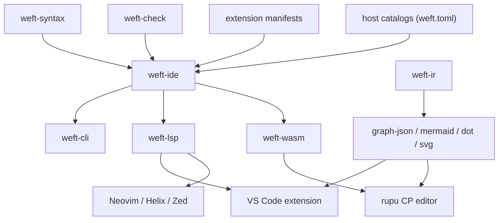

# 10. Tooling

Every tool is built on **one analysis core**, `weft-ide`, which wraps `weft-syntax` and `weft-check`. The CLI, the language server and the WASM build for the CP editor all call it, so they always agree, on diagnostics, completions, formatting and graphs alike.



## 10.1 The `weft` CLI

| Command | Purpose |
|---|---|
| `weft fmt [--check] <paths>` | Canonical formatting: idempotent and comment-preserving, with no options. `--check` exits 1 when a file would change. |
| `weft check <paths>` | Parse, resolve, type-check and analyse. Exits 1 on errors. `--format json` produces machine-readable output for the migration skill. |
| `weft lint <paths>` | Runs the rule catalogue (§10.3). Severities come from `weft.toml`. |
| `weft test [filter] [--coverage]` | Runs `test` blocks (§10.6). |
| `weft simulate <file> [--input k=v] [--script s.json]` | An interactive or scripted dry run (§10.7). |
| `weft render <file> --format mermaid\|dot\|svg\|graph-json [--expand-sugar] [--flow name]` | Graph output (§10.8). |
| `weft lower <file>` | Prints the core form, the lowered IR, pretty-printed as weft core syntax. |
| `weft ir <file>` | Prints the canonical JSON IR and its definition id. |
| `weft explain <code>` | The long explanation for a diagnostic code, with examples. |
| `weft migrate check <old> <new>` | Migration verification (§8.7). |
| `weft new <name> [--template flow\|owner\|pursue]` | Scaffolds a machine file. |

The library's CLI covers authoring only. Running machines is the host's job: rupu provides it through its own commands (§11.2).

## 10.2 Diagnostics

Diagnostics are rustc-style, rendered with labelled spans:

```
error[E0412]: unknown field `summry` on `Triage`
  --> kitchen_sink.weft:31:33
   |
31 |       body: "Not actionable: {{ triage.summry }}")
   |                                        ^^^^^^ did you mean `summary`?
   |
   = note: `triage` is the result of `agent @security-triager -> Triage` (line 22)
   = help: run `weft explain E0412`
```

**Code ranges:**

| Range | Category |
|---|---|
| `E00xx` | syntax |
| `E01xx` | names and imports |
| `E02xx` | types |
| `E03xx` | expressions and templates |
| `E04xx` | steps and options |
| `E05xx` | modifiers |
| `E06xx` | concurrency (handles, concurrent writes) |
| `E07xx` | control flow (goto, end, unreachable joins) |
| `E08xx` | the state layer |
| `E09xx` | extensions and catalogues |
| `W…` | the lint rules (§10.3) |

**Quick fixes.** Every diagnostic that has a mechanical fix carries a machine-applicable suggestion. These are used by the LSP's code actions and by `weft check --fix`.

## 10.3 Lint rule catalogue (initial)

| Rule | Default | Flags |
|---|---|---|
| `unused-binding` | warn | a step result or `let` that is never read (use `_ =` to discard deliberately) |
| `unused-var` | warn | a `var` that is never read |
| `unused-import` | warn | |
| `silent-catch` | warn | a `catch` (or `on_error continue`) whose body neither notes, yields, raises nor routes |
| `retry-non-idempotent` | warn | `retry` on a catalogue-`write` tool whose service has no idempotency support |
| `loop-agent-no-timeout` | warn | an agent step inside `loop`/`while`/`worklist` with no `timeout` (inherited timeouts count) |
| `race-no-deadline` | warn | a `race` where no branch can finish by time (`sleep`, `after`, `within`) |
| `wait-no-timeout` | info | `wait for` with no `timeout` and no enclosing `within` |
| `prompt-unbounded-value` | warn | interpolating a `json` value, list or long string into prose without `truncate` |
| `map-default-concurrency` | info | `map`/`worklist` without an explicit `concurrency` |
| `fork-single-branch` | warn | a `fork` with one branch |
| `event-never-sent` | warn | waiting on an event that nothing declares, emits or sends, and that isn't in the host vocabulary |
| `event-never-handled` | warn | a declared event that nothing handles |
| `state-no-exit` | warn | a non-final state with no way out |
| `unreachable-state` / `unreachable` | warn | |
| `eventless-cycle` | warn | eventless transitions forming a cycle without guard progress |
| `compensate-outside-saga` | warn | |
| `no-restart-in-forever-machine` | info | an `instance per …` machine with a cycle and no `restart` |
| `deep-nesting` | info | block nesting deeper than 5; suggests extracting a `flow` |
| `long-flow` | info | more than 80 steps in one flow; suggests extracting |
| `dangling-doc` | warn | |
| `naming` | warn | `snake_case` / `PascalCase` / `@kebab-case` conventions |
| `magic-agent-option` | info | agent options repeated across 3+ steps; suggests `defaults` |

**Configuration** lives in `weft.toml`:
```toml
[lint]
"prompt-unbounded-value" = "error"
"map-default-concurrency" = "off"
```

**Inline suppression:** `// weft:allow(silent-catch) — reason` on the line above.

## 10.4 Project configuration (`weft.toml`)

```toml
[project]
roots = [".rupu/workflows", "lib"]       # where machines and libraries live

[extensions]
agentic = "1"

[catalog]
command = "rupu catalog --json"          # host catalogues: agents, tools (+ schemas), events (+ payloads), entity schemas
refresh = "on-save"                      # on-save | manual | interval:5m

[schemas]
paths = [".rupu/contracts", "~/.rupu/contracts"]

[lint]
# rule overrides
```

**The catalogue command** prints one JSON document, `{ agents: [...], tools: [...], events: [...], entities: {...}, approver_sets: [...] }`, versioned by `catalog_format`. The LSP caches it and re-runs it according to `refresh`. If the command fails, the tools keep the last cached catalogue and warn; they never block editing.

## 10.5 Language server (`weft-lsp`)

Built on `tower-lsp`. Capabilities:

| Feature | Behaviour |
|---|---|
| Diagnostics | Live as you type, debounced to 150 ms: syntax, types, lints. |
| Completion | Context-aware. **Keywords** and step/block snippets. **Options** for the step under the cursor, from the core or manifest schema. **Agents** (`@` triggers) with their descriptions. **Tools** (after `tool `) inserting a snippet of the required arguments from the schema. **Events** (after `on `, `wait for `, `trigger on `) with payload docs. Fields of bindings in scope, with types. Enum values. Flow names with parameter snippets. Error types after `catch`/`retry on`. |
| Hover | Inferred type, `///` docs, agent/tool/event documentation, a step's effective modifiers (merged defaults), and a mini graph of a block. |
| Signature help | Tool calls, flow calls, standard-library functions. |
| Navigation | Go to definition (bindings, flows, types, imports, and agent files when the catalogue gives paths); find references; document and workspace symbols; call hierarchy for flows. |
| Rename | Bindings, vars, flows, types, states; across files. |
| Code actions | Apply quick fixes; *extract to flow*; *wrap in retry/try/within*; *add timeout*; *convert `if`-chain to `match`*; *add missing match arms*. |
| Inlay hints | Inferred types of step bindings; the effective `timeout`/`retry` inherited from `defaults`. |
| Semantic tokens | Distinct colours for effects (`agent`/`tool`/`run`/`approve`/`ask`), agent refs, events, error types, durations, prose interpolation. |
| Formatting | Full document and range, through `weft fmt`. |
| Folding, selection ranges | By block. |
| Custom request `weft/graph` | Returns `graph-json` for the document, with the node ↔ source-span map, for the preview pane. |

## 10.6 Tests

```
test "non-actionable issues are closed out" {
  given input { repo: "acme/widget", issue: 7 }

  mock tool issues.get          returns { title: "typo", body: "fix docs typo" }
  mock tool issues.comment      returns {}
  mock agent @security-triager  returns { actionable: false, files: [], summary: "docs typo" }

  expect tool issues.comment called with { body: contains("Not actionable") }
  expect end not_actionable
}

test "sign-off times out into rejection" {
  given input { repo: "acme/widget", issue: 9 }
  mock tool issues.get         returns { title: "overflow", body: "…" }
  mock tool *                  returns {}
  mock agent @security-triager returns { actionable: true, files: ["src/a.rs"], summary: "overflow" }
  mock run *                   returns { exit_code: 0, stdout: "{}", stderr: "", duration: 1s }
  // … mocks for the other agents …
  send approval.approve { id: "investigate.files.audit_ok", by: "alice", form: {} }

  expect waiting at sign_off
  advance 24h
  expect tool issues.comment called with { body: contains("still pending") }
  advance 48h
  expect end rejected
}

test "triage retries on invalid output" {
  given input { repo: "acme/widget", issue: 5 }
  mock tool issues.get         returns { title: "x", body: "…" }
  mock tool *                  returns {}
  mock agent @security-triager returns sequence [ error agent.output_invalid, { actionable: false, files: [], summary: "x" } ]
  expect attempts(triage) == 2
  expect end not_actionable
}

test "an entity owner starts from discovery" {
  given entity { ref: "github:acme/widget#3", repo: "acme/widget", number: 3, labels: ["security"], state: "open" }
  mock call machine kitchen_sink returns { status: "complete", summary: "fixed" }
  expect end complete
}
```

| Statement | Meaning |
|---|---|
| `given input {…}` / `given var x = …` | initial conditions; the test starts the machine with this input |
| `given event E {…}` | start the machine through the trigger that matches `E` (its `if` and `with` are applied) |
| `given entity {…}` | start an `instance per …` machine as entity discovery would; `entity` is bound to the record |
| `mock <kind> <subject> returns <value>` | A canned result. Kinds: `agent @ref`, `tool name`, `run `cmd``, `approve`, `ask`, `call machine name`, or an extension effect kind by short name (`assess`). `*` matches any subject; a mock naming the subject takes precedence over `*`. `returns sequence [...]` gives one value per attempt; `error <type>` produces that failure. |
| `send E {…}` | deliver an event mid-test |
| `advance <duration>` | virtual time; fires due timers |
| `expect …` | `end <outcome>`, `waiting at <step\|state>`, `in_state <path>`, `<kind> <subject> [not] called [n times] [with {…}]`, or any `bool` expression over bindings (`attempts(triage) == 2`, `review.resolved`) |

**Mock semantics:**
- **What a mock returns.** A mock supplies the effect's **raw result**. The engine then applies the step's processing as in a real run:
  - `run` mocks return a `Run` record; `parse:` and any `-> T` contract are applied to it.
  - `agent` mocks return the final value; when the step has `-> T`, the value is validated as if parsed from the reply.
  - `tool` mocks return the tool's output.
  - Values are validated against the result types, so a mock missing a required field is a test error.
- **No accidental real-world calls.** An effect with no mock fails the test with `unmocked effect`.
- **The exceptions are `approve` and `ask` left unmocked:** they park, and wait for `approval.approve` / `approval.reject` / `ask.answer` events sent by the test, or for virtual time to reach an `after`.

**Matchers.** Inside `with { … }`, field values may be literals or matchers: `contains(s)`, `matches(re)`, `starts_with(s)`, `any()`, `size(n)`. A record pattern matches when every listed field matches; unlisted fields are ignored.

**Timing.** After each `given`, `send` and `advance`, the simulated host runs the machine **to quiescence**: until every remaining effect is a wait, a parked gate or a future timer. Only then is the next statement executed. `expect` statements observe the state at that point.

**How tests run.** Against the pure stepper and an in-memory simulated host: deterministic and instant, with no network and no cost.
- **Coverage.** `--coverage` reports which states, transitions, branches, catch clauses and loop exits were exercised, per machine.
- **Reporting.** Tests appear in VS Code's Test Explorer, and `weft test --format junit` produces CI output.

## 10.7 Simulation

`weft simulate kitchen_sink.weft --input repo=acme/widget` opens an interactive terminal session:
- It shows the active configuration and pending effects.
- At each pending effect you choose an outcome: a value, an error type, or *use mock*.
- Commands: `advance 2h`, `send operator.stop`, `back` (time-travel to an earlier step, made possible by the pure stepper), `graph` (opens the rendered graph with live highlighting).

`--script s.json` runs it non-interactively and writes a trace (`--trace out.jsonl`) usable as a regression test.

## 10.8 Rendering (`weft render`)

| Format | Use |
|---|---|
| `graph-json` | The canonical graph model: nodes (with kind, label, construct options, source span and structural id), edges (with kind: sequence, branch, join, loop-back, event, timer, error, compensation) and nesting groups. **Consumed by the VS Code preview and the rupu CP graph engine**, which therefore share one layout input. |
| `mermaid` | Flows become `flowchart TD`; the state layer becomes `stateDiagram-v2`. Every construct's shape is defined in chapter 06; this format generated the diagrams in this spec. |
| `dot` / `svg` | Graphviz, for documentation. |

- `--expand-sugar` shows the lowered core states instead of construct nodes.
- `--collapse <depth>` folds nested blocks.

## 10.9 The VS Code extension

**Contents:**
- **TextMate grammar** (`weft.tmLanguage.json`) for instant highlighting before the LSP starts: keywords, effect keywords, `@agents`, dotted events and errors, durations, strings with `{{ }}`/`` interpolation highlighted as embedded expressions, command literals with `{x}` interpolation, comments and doc comments (embedded Markdown).
- **Language configuration:** comment tokens, bracket pairs, auto-closing (including `"""` and backticks), indentation rules, and folding markers.
- **Snippets:** `machine`, `flow`, `fork`, `map`, `loop`, `race`, `state`, `parallel`, `test`, `approve`, `agent`.
- **LSP client:**
  - It starts the bundled `weft-lsp` for each platform (darwin-arm64/x64, linux-x64/arm64, win32-x64), or `weft.server.path` from settings.
  - It surfaces every LSP feature in §10.5.
- **Graph preview pane** (command *weft: Open Graph Preview*, also a toolbar button):
  - a webview rendering `weft/graph` output with the same graph renderer component as the CP (shared npm package `@weft/graph`);
  - bi-directional sync: moving the cursor highlights a node, and clicking a node reveals its source;
  - collapse/expand of blocks, and a sugar/core toggle.
- **Test Explorer integration:** discovers `test` blocks, runs them through `weft test --format json`, and shows a pass/fail gutter.
- **Commands:** *Format Document*, *Show Lowered Core*, *Show IR*, *Render to Mermaid (copy)*, *Explain Diagnostic*, *Refresh Catalog*.
- **Settings:** `weft.server.path`, `weft.catalog.command` (overrides `weft.toml`), `weft.preview.autoOpen`, `weft.lint.*`.

**Published** to the VS Code Marketplace and Open VSX from the library repo's CI.

**Tree-sitter grammar** (`tree-sitter-weft`), shipped in the same plan, for Neovim, Helix, Zed and GitHub-style highlighting. It includes highlight, injection (prose templates, Markdown docs) and fold queries.

## 10.10 WASM (`weft-wasm`)

The analysis core is compiled to `wasm32-unknown-unknown` with `wasm-bindgen` and published as the npm package `@weft/wasm`. Its API:

```ts
parse(src: string): ParseResult                       // CST summary + syntax diagnostics
check(files: Record<string,string>, catalog: Catalog): Diagnostic[]
complete(files, catalog, file: string, offset: number): CompletionItem[]
hover(files, catalog, file, offset): Hover | null
format(src: string): string
lower(files, catalog, file): IR
graph(files, catalog, file, opts): GraphJson         // same as `weft render --format graph-json`
applyGraphEdit(src: string, edit: GraphEdit): string  // structural edit → re-formatted source (comments kept)
```

`applyGraphEdit` is what lets a visual editor change the text without losing comments. Edits are structural operations: insert a step after a node, wrap a node in a block, change an option, delete, move, rename. They are applied to the CST, and the result is printed by the formatter.

## 10.11 Documentation deliverables

| Deliverable | Contents |
|---|---|
| **Language reference** | Generated from this spec: one page per construct, each with syntax, options, semantics, example and Mermaid diagram. |
| **Tutorial** | From a 5-line flow up to an entity-owner machine. |
| **Cookbook** | One recipe per Workflow Pattern (Appendix B), plus agentic recipes: review panel, best-of patching, fleet hunt, PR shepherd, release train. |
| **Diagnostics reference** | Generated from `weft explain`. |
| **Extension author guide** | The manifest, lowering rules and handler traits. |
