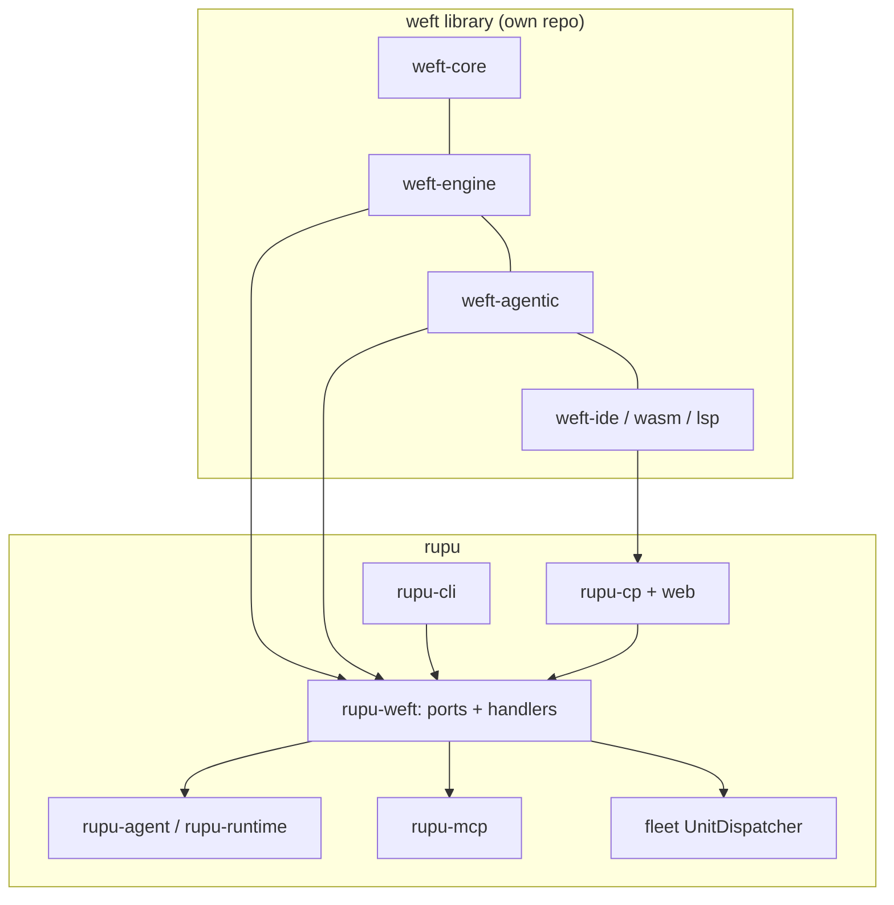

# 11. rupu integration (plan 6, sub-plans 6a–6f)

rupu becomes a **weft host**. It implements the engine ports, supplies the agentic effect handlers and catalogues, and renders machines and instances in the CLI and the CP. The legacy workflow engine, the autoflow claim logic and the agentiflow envelope loop are deleted once the parity corpus passes.

## 11.1 Sub-plan 6a: the `rupu-weft` host crate

| Port | rupu implementation |
|---|---|
| `JournalStore` | `<global>/runs/<instance-id>/`: `journal.jsonl` (append-only, fsync per input), `snapshot.json` (atomic rename), `inbox/` (one file per event, named by sequence, under a lock). This stays compatible with the SSH/tunnel/bucket mirroring that today's transcripts and `coverage.jsonl` already use. |
| `InstanceRegistry` | Definitions stored by id under `<global>/machines/<id>.ir.json`. Instance keys indexed in `<global>/instances/index.jsonl`. Leases are files with `runner_pid` + expiry (today's lock and lease patterns). Entity arbitration (priority, yield, takeover) generalises the claim store (`autoflow_claim_store.rs`). |
| `EffectHandler: agentic.agent` | Builds `AgentRunOpts` through today's `DefaultStepFactory` logic, made machine-aware: agent loading, provider factory, model limits, `recovery_opts`, tool narrowing, findings options, `dispatch_agent`, netflow. Then calls `run_agent_full`. **Idempotency** goes through `rupu_agent::continuation::prepare_continuation`. **Pause** uses paused seeds. **Usage** is reported from the transcript ledger. |
| `EffectHandler: agentic.tool` | The in-process MCP `ToolDispatcher`, `narrowed_to(tool)`; the findings profile passed through. |
| `EffectHandler: agentic.run` | The `run_step` executor under `RunStepPolicy`. |
| `EffectHandler: agentic.approve/ask` | Gate records in the run store. `rupu workflow approve/reject`, the CP buttons and the API all post `approval.approve/reject` events into the instance inbox. Notify steps are dispatched fire-and-forget. |
| `EffectHandler: agentic.assess` | The agentiflow goal and coverage evaluators and the budget enforcer (lifted from `rupu-agentiflow`). |
| Placement | `place host(...)` / `distribute(...)` go through the existing fleet `UnitDispatcher` (SSH, HTTP, tunnel and bucket connectors), with `workspace: sync` deltas and coverage-stream ingestion as today. |
| `TimerService` | In-process timers for the instance's driver, plus a durable timer index read by the `cp serve` sweep. This **replaces the gate sweep**: an approval timeout is now just a timer. |
| `EventBus` | Webhook server, poll sources and the wake queue (`rupu-runtime::wake`) become the inbox feeders; `emit` is routed to triggered machines. |
| `LockService` | Local file locks and semaphores; CP-coordinated locks for fleet-wide names. |
| `CacheStore` / `BlobStore` | `<global>/cache/weft/` and the content-addressed store at `<global>/blobs/`. |
| `Policy` | Permission modes (`readonly` refuses write tools and `run`), the author gate for entity machines (fail-closed), the run-step allowlist, and `scope.authorized` for `pursue`. |
| `Observer` | Writes `events.jsonl` (a new run event schema, v3: observations keyed by structural id), feeds the CP SSE and the CLI live view, and keeps the usage ledger. |

**Who drives an instance.**
- **The CLI** (`rupu workflow run`) drives it in the foreground.
- **`cp serve`** runs an **engine worker pool** that holds leases on detached instances: launched from the CP, triggered, entity owners, and resumed runs.
- **Operator commands** are **inbox inputs**, not signals, addressed by instance id. Cancel, pause and resume are engine commands (§8.6); approve, reject and steer are events. Whoever holds the lease processes them. Whoever holds the lease processes them. This removes today's SIGTERM-to-`runner_pid` and marker-file paths for weft instances. A dead lease holder is recovered by any worker taking the expired lease, which also replaces orphan reaping.

## 11.2 The CLI surface

Command naming is open question #3 in the index, decided in plan 6a. The capabilities are fixed:

| Capability | Proposed command |
|---|---|
| run a machine (foreground live view, or `--detach`) | `rupu workflow run <name\|file> [--input k=v]` |
| list, show, tail instances | `rupu workflow runs`, `show-run`, `tail` |
| decide gates; answer asks | `rupu workflow approve/reject <id> [--form k=v]`, `rupu workflow answer <id> --form …` |
| operator events | `rupu workflow send <id> <event> [--payload json]` (steer, repair, stop) |
| cancel / pause / resume | as today; implemented as inbox inputs |
| instances of entity machines | `rupu workflow instances [<machine>]`: key, state, lease, since |
| upgrade / migrate | `rupu workflow upgrade <machine> --to latest` |
| authoring | `rupu workflow check/fmt/test/render`, delegating to `weft-ide` |
| host catalogue | `rupu catalog --json` (used by `weft.toml`) |

## 11.3 Event vocabulary

The trigger vocabulary in `docs/triggers.md` (`github.*`, `gitlab.*`, the semantic `issue.*` / `pr.*` aliases) is exported in the catalogue with **typed payloads**, so `trigger on`, `on` and `wait for` are fully checked. Operator events are listed in §9.7.

## 11.4 Entity schema (for `instance per …`)

| `select` field | Source (today's `AutoflowSelector`) |
|---|---|
| `states [open, closed]` | `selector.states` |
| `labels_all / labels_any / labels_none` | same names |
| `authors [..]`, `authors_from collaborators\|org_members`, `on_skip skip\|label_needs_human` | same names and the same precedence rules |
| `draft include\|exclude\|only`, `base "main"` | PR entities only |
| `limit N` | `selector.limit` |
| `source "linear:<team>"` | `autoflow.source` |

**Entity kinds:**
- `issue` (repository or tracker)
- `pull_request`
- `pr_head`: keyed by head SHA, replacing `claim.key: pr_head_sha`

The `entity` binding carries: `ref`, `repo`, `number`, `title`, `url`, `state`, `labels`, `author`, `head_sha` (PRs), `tracker`.

## 11.5 Sub-plan 6b: workflows cut over

1. `.rupu/workflows/*.weft` (project) and `~/.rupu/workflows/*.weft` (global) are discovered by `weft.toml` roots.
2. A legacy `*.yaml` workflow is **refused**, with a message pointing at the migration skill. Refused files are listed by `rupu workflow list --legacy`.
3. The in-repo samples (`.rupu/workflows/`, `examples/workflows/`) are migrated with the skill and checked against the parity corpus.
4. **Deleted when the corpus is green:**
   - `rupu-orchestrator`'s `runner.rs`, most of `workflow.rs`, `step_factory.rs` (logic moves into handlers), and `recovery.rs` (superseded by journal recovery)
   - the legacy branch of the executor `Event` enum
   - the TypeScript mirror `web/src/lib/workflowGraph.ts`, plus the legacy `StepForm.tsx`
   - `rupu-app-canvas`'s `Step` walker, regenerated from `graph-json`
5. **Kept and moved behind the host:** `RunStore` record shapes still needed by the CP (run lists, usage, codenames). Codenames are minted per instance and per effect (`AgentStarted` already carries them).

## 11.6 Sub-plan 6c: autoflows become instance machines

- **Each autoflow becomes an `instance per issue|pull_request|pr_head` machine** whose activity calls the work machine (example: `examples/security_issue_owner.weft`).
- **Outcome contracts.** `autoflow_outcome_v1` becomes a weft type, `Outcome`, in a shared library (`lib/autoflow.weft`). `dispatch` becomes `call machine (…)` from a `dispatching(d)` state.
- **Deleted:** the reconcile tick's claim state machine (`execute_autoflow_cycle`, `apply_terminal_run_to_claim`, `should_run_claim`, `claim_should_yield_to_winner`, …).
- **Generalised into the `InstanceRegistry` and `EventBus`:** wake hints, `reconcile_every` (now `after 30m -> working`), `retry_after` (now a computed `after`), and cleanup (now `retain`).
- **The `autoflow.enabled` overload disappears.** Cron is just `trigger cron`, and ownership is just `instance per …`.

## 11.7 Sub-plan 6d: agentiflows become `pursue` machines

- `AgentiflowDef` maps one-to-one onto the agentic top-level blocks (§9.5) plus a `pursue` (example: `examples/vuln_hunt.weft`).
- **Deleted:** `rupu-agentiflow`'s `Envelope::run` loop.
- **Kept as agentic effects and tools:** the fleet substrate (board, mailboxes, directives, `FleetSupervisor`, `dispatch`/`run_workflow`/`join` lead tools). `run_workflow` now launches weft machines.
- **Gains:**
  - resume after a crash (journal recovery)
  - pause
  - steering through `rupu workflow send <id> operator.steer`
  - human checkpoints (`on round(n) { approve … }`)
  - author-editable stop order and phases (by writing the envelope as raw states, when needed)

## 11.8 Sub-plan 6e: the CP

### Editor
- **CodeMirror 6 language mode.** Highlighting is a Lezer grammar generated from the tree-sitter grammar's queries, or the TextMate grammar through `codemirror-textmate`, as decided in the plan. **Diagnostics, autocomplete, hover and format** come from `@weft/wasm` with the catalogue served by `GET /api/catalog`. They match VS Code exactly.
- **Split view: text ↔ graph.** Editing the graph (insert or delete a step, wrap in a block, change an option, connect a state transition) calls `applyGraphEdit`. The source is re-formatted with comments preserved. Selecting a node highlights its source and vice versa.
- **Save** validates through `POST /api/workflows/validate`, which uses the same `weft-ide`. That makes it authoritative, and the client-side check only gives speed.
- **Launcher.** The input form is generated from `input { }`, including `///` docs, defaults, enums and lists.

### Graph engine and UI
The graph engine is one renderer, shared with VS Code through `@weft/graph`, and its input is `graph-json`.

**Node catalogue.** Every construct is drawn distinctly:

| Construct | Visual treatment |
|---|---|
| `agent` | rounded card, agent avatar and codename; model chip; tool-narrowing badge |
| `tool` | connector card with the tool icon; write tools marked |
| `run` | terminal card showing the command |
| `approve` / `ask` | gate diamond; quorum/approver chips; a form preview; a countdown when an `after` timer exists |
| `wait for` / `sleep` | hourglass node with the event name or wake time; live countdown |
| `emit` / `send` | outbound arrow node naming the target machine/event |
| `call machine` | portal node linking to the child instance's graph |
| flow call | collapsible group with the flow name |
| `if` / `match` | branch diamond with labelled arms; untaken arms dimmed live |
| `fork` | split bar → branch lanes → join bar labelled with the policy (`2 of 3`, `vote majority`); loser lanes struck through |
| `map` | stacked-card node with an item counter (`12/40 · 3 running · 1 failed`); expands to an item grid; each item drills down to its own subgraph |
| `pipeline` | horizontal stage lanes with per-stage throughput and queue depth |
| `race` | lanes with a finish line; the winner is highlighted |
| `async` / `await` | dotted "in flight" edges from the `async` node to its `await` |
| `worklist` | queue node with queue depth, seen count and processed count; a feedback edge for `push` |
| `loop` / `while` / `for` | a frame with a loop-back edge and a pass counter (`pass 2/3`); a previous-pass selector |
| `with lock` / `semaphore` / `throttle` | a frame with a lock badge (holder or waiter state) or a rate meter |
| `within` / `budget` | a frame with a deadline countdown, or a spend gauge (soft/hard marks) |
| `try` / `catch` / `finally` | a frame with error-edge lanes labelled by pattern; a `finally` footer |
| `saga` | a frame with compensation edges, drawn in reverse when unwinding |
| `during … on` | a frame with an event-listener rail; handler firings as ticks on a timeline |
| `best_of` / `vote` / `pursue` | candidate lanes plus a judge node / a ballot tally / a round counter with goal-progress bars |
| states | statechart nodes: compound frames, parallel regions as dashed partitions, history (H/H*) markers, final double rings, transitions labelled with event / guard / timer |

**Live overlay.**
- Observations (§8.10) are mapped onto nodes by structural-id prefix.
- **Status** is shown with the existing two-channel convention: kind colour plus a state glyph/animation (pending, running, waiting, succeeded, failed, skipped, cancelled).
- **Edges** animate on transition.
- **Timers** count down. Per-node **usage** is shown on hover.

**Run views:** **Graph** (above), **Timeline** (a Gantt of effects with retries and waits), **Transcript** (for agent nodes; unchanged), **Events**, **Findings** (per run, unchanged), and **Journal** (raw inputs and effects, for debugging).

**Instances view** (new): every live entity-owner instance with its key, its current state (as a mini statechart badge), its lease and time in state, filterable by machine and state. It replaces the autoflow claims page.

**Collapse.** Blocks are collapsible. A sugar/core toggle shows the lowered statechart for advanced debugging.

- **The CLI live view** (`rupu workflow run` in the terminal) uses the **same `graph-json` model** through a regenerated `rupu-app-canvas`, so terminal and web always show the same structure.

## 11.9 Sub-plan 6f: migration, corpus, docs

### The migration skill (Claude)
A Claude Code skill (`.claude/skills/migrate-rupu-flow/SKILL.md`, shipped in the rupu repo) that:
1. Reads a legacy workflow, autoflow or agentiflow file.
2. Drafts the `.weft` equivalent using the mapping in Appendix C, plus `examples/`.
3. Runs `rupu workflow check --format json` and fixes the diagnostics, looping until clean (at most 5 rounds, then it reports what's left).
4. Writes `test` blocks that pin the legacy behaviour, using the corpus patterns.
5. Shows a side-by-side diff, plus a summary of every semantic change. Typical items: "a missing template variable that used to render empty is now a compile error", or "branch arms are now nested blocks".
6. Writes the file only after the user approves it.

### The parity corpus
`tests/weft-parity/` in rupu: one machine plus its `test` blocks per legacy feature, and per autoflow and agentiflow behaviour. Entry #1 is `examples/kitchen_sink.weft` against `examples/legacy/kitchen-sink.yaml`. 6b's deletions are gated on the corpus passing.

### Docs
- `docs/workflow-format.md` is replaced by the weft language reference (generated, §10.11), plus the rupu host guide: catalogue, placement, entity schema, CLI.
- `docs/triggers.md` gains the payload types.
- `CLAUDE.md`'s crate map is updated.

## 11.10 Risks and mitigations

| Risk | Mitigation |
|---|---|
| A large deletion breaks unknown consumers | The parity corpus gates 6b; the CP API keeps its run-list and usage shapes (§11.5). |
| Authors find the new language unfamiliar | The migration skill, the LSP's autocomplete and quick fixes, the tutorial and cookbook, and examples that mirror the legacy samples. |
| Remote hosts run an older rupu | Capability advertisement, as today (`host_features()`), with an `engine.weft` feature. A connector refuses placement on a peer without it, never silently. |
| Journal growth for long-lived owners | Snapshots, blobs, `restart with`, `retain`. |
| WASM bundle size in the CP | Lazy-loaded on the editor route; the analysis core has no tokio and no engine. |
