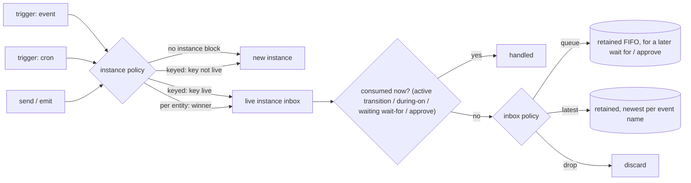

# 04. Program structure

## 4.1 Files

| File kind | Contains | Rule |
|---|---|---|
| **machine file** | exactly one `machine`, plus any `enum`, `type`, `event`, `flow` and `test` items | runnable |
| **library file** | `enum`, `type`, `event`, `flow` and `test` items only | importable, not runnable |
| **test file** (`*.test.yoko`) | `import`s plus `test` items | run by `yoko test` |

## 4.2 Imports

```
import "./lib/review.yoko"                 // brings every top-level item into scope
import "./lib/review.yoko" as rv           // namespaced: rv.review(...), rv.Review
import agentic/panel                       // an extension's standard library module
import schema "triage_v1" as Triage        // JSON Schema → yokoito type (§2.7)
```

- Relative paths resolve from the importing file.
- `ext/module` paths resolve inside a `use`d extension.
- `import schema "<name>"` resolves through the host's schema search path. rupu searches `<project>/.rupu/contracts/` and then `~/.rupu/contracts/`.
- **Name clashes and cycles.** If two imports bring in the same name, it is a compile error unless one of them uses `as`. Import cycles are compile errors.
- **Visibility.** Every top-level item in a library is importable. There is no `pub` keyword.

## 4.3 Anatomy of a machine

Items appear in this canonical order. The formatter reorders them, and the checker accepts any order.

```
/// Doc comment — shown as the machine's description everywhere.
machine kitchen_sink
version "3"                                  // optional human label; identity is the IR hash
uses agentic                                 // extensions (comma-separated)

import "./lib/review.yoko"

enum  Severity { low, medium, high, critical }
type  Triage   { actionable: bool, files: list<string>, summary: string }
event repair   { reason: string }            // user-declared, typed events

input  { … }
output <expr> : <Type>

trigger …                                    // zero or more
instance …                                   // optional
var …                                        // zero or more durable variables

defaults { … }
limits   { … }

on start   { … }                             // lifecycle hooks
on failure { … }
on cancel  { … }
finally    { … }

migrate from "2" { … }                       // zero or more (ch. 08 §8.7)

flow { … }                                   // THE BODY: a flow …
// … or states:  initial state x { … }  state y { … }  final state z

flow helper(…) -> T { … }                    // named sub-flows (reusable)

test "…" { … }                               // zero or more
```

### `input`
```
input {
  /// Shown in `--help`, the CP launcher form and hover.
  repo:           string
  max_files:      int      = 8
  severity_floor: Severity = high
  labels:         list<string> = []
}
```
- A field with no default is required.
- Inputs come from the host's run command (rupu: `rupu workflow run <name> --input k=v`), from trigger `with { }` mappings, from the CP launcher form, and from `call machine` arguments.
- Values are validated against the declared types when the machine starts, so a bad input fails the start before any work runs.

### `output`
```
output report : Outcome                                  // a binding
output { pr: pr?.url, resolved: review.resolved } : Outcome
```
- Evaluated when the machine reaches its end, unless that end was an `end … with <expr>`, which supplies the output directly.
- Bindings that might not have run on every path are typed `T?` inside the output expression; use `??` to cover them.
- Validated against the type. A failure ends the machine as `failed` with `output.invalid`.
- `call machine` callers receive it typed.
- An output that is omitted is `null`.

### `event`
```
event repair         { reason: string }
event operator.steer { body: string }
```
- Declares the events this machine accepts beyond the host vocabulary (§11.3).
- `send`, `emit`, `on` and `wait for` payloads are checked against these declarations.

## 4.4 Triggers

```
trigger manual
trigger cron "0 4 * * 1-5" (tz: "Europe/Madrid")
trigger every 6h (jitter: 5m)
trigger on github.issue.labeled if "security" in event.issue.labels
  with { repo: event.repo.full_name, issue: event.issue.number }
trigger on release.ready                                  // an event another machine emits
```

- A machine may declare any number of triggers. A machine with no triggers can only be started by hand or by `call machine`.
- **`if`** filters the trigger. **`with`** maps the event onto `input` fields. Anything left unmapped uses the field's default; a required field that stays unmapped is a compile error.
- **`cron`** uses five fields, evaluated in UTC unless `tz` is given. **`every`** is anchored to the machine's first registration. **`jitter`** spreads starts out.
- **Duplicate deliveries.** Trigger delivery is deduplicated by the event's delivery id. When the host supplies none, the deduplication key is derived from the trigger and its payload hash.
- **Where the trigger goes.** By default each trigger firing starts a **new instance**. The `instance` declaration changes that.

## 4.5 Instances

```
instance keyed input.issue_ref {          // same key → same live instance
  route    github.issue.*  by event.issue.ref     // how later events find their instance
  route    github.pr.*     by event.pr.issue_ref
  inbox    queue                          // queue (default) | drop | latest
  debounce 2m
}

instance singleton                        // at most one live instance of this machine

instance per issue keyed entity.ref {     // entity-scoped ownership (the autoflow form)
  select {
    states       [open]
    labels_all   [security]
    labels_none  [blocked]
    authors_from collaborators
    on_skip      skip                     // skip | label_needs_human
    limit        100
  }
  priority  50
  yield     unless in [working, blocked]
  lease     4h, renew while active
  inbox     queue
  debounce  2m
  workspace worktree, branch "rupu/sec-{{ entity.number }}"
  retain    7d
}
```

| Setting | Meaning |
|---|---|
| `keyed <expr>` | The instance key, evaluated over `input` when the instance starts. A trigger that maps to a key with a live instance delivers its event to that instance instead of starting a new one. |
| `route <event-pattern> by <expr>` | How a *later* external event finds its instance: `<expr>` is evaluated over `event` and must yield a key. An event with no matching `route` (and not addressed by `send` or by instance id) reaches no keyed instance. Operator commands from the host (approve, steer, cancel, …) are addressed by instance id and bypass routing. |
| `singleton` | `keyed` with a constant key. |
| `per <entity-kind>` | The host discovers candidate entities (issues, PRs, tracker items) matching `select`, and binds each to **one** winning machine. **Entity discovery is the implicit trigger:** a `per` machine needs no `trigger`. The key is `entity.ref`, and events about that entity are routed to its instance automatically, with no `route` lines needed. The `entity` binding is in scope everywhere. Tests start one with `given entity { … }` (§10.6). |
| `select { … }` | Entity filter. Its fields come from the host's entity schema; rupu's are listed in §11.4. |
| `priority <int>` | When several machines select the same entity, the highest priority wins; ties go to the machine name, ordered lexically. |
| `yield unless in [states]` | When a higher-priority machine wants the entity, this instance gives it up, unless it is in one of the listed states. |
| `lease <dur>, renew while active` | Ownership lease. The engine renews it while the instance holds the inbox lease. An expired lease can be taken over. |
| `inbox queue \| drop \| latest` | What happens to an external event that **nothing consumes when it is processed** (see the table below). The default is `queue`. |
| `debounce <dur>` | Coalesces bursts of events into one delivery, keeping the latest payload plus a `count`. |
| `workspace …` | A host-specific materialisation of the workspace, passed to effect handlers. |
| `retain <dur>` | How long a finished instance's journal is kept before compaction. |



**How an external event is processed.** Events are processed one at a time, in arrival order, between macrosteps. Running activities never block event processing: an agent working for an hour doesn't delay a `github.issue.closed`. Each event is offered to these consumers, in this order:

1. an enabled **state-layer transition** (§7.6);
2. a matching **`during … on`** handler or **pursue** listener, innermost first;
3. an **active `wait for`** whose pattern and guard match;
4. a parked **`approve` / `ask`** whose decision event this is (matched by step id).

If none of these consumes the event:

| Policy | The unconsumed event | Effect on a later `wait for` / `approve` |
|---|---|---|
| `queue` (default) | is retained, FIFO, up to the inbox capacity (§8.11) | when it starts, it takes the oldest matching retained event at once: a **persistent trigger** |
| `latest` | is retained, but only the newest per event name | as `queue`, newest only |
| `drop` | is discarded and journaled `unhandled` | sees only events that arrive while it is active: a **transient trigger** |

Retained events are **only** offered to later `wait for` / `approve` / `ask` steps. They are never replayed into state transitions, which follow SCXML: an event either matches a transition when it is processed, or it is gone.

## 4.6 Variables

```
var attempts    = 0
var steering    : list<string> = []
var last_error  : Error? = null
```
- **Machine-level `var`s** are durable: they live in the snapshot.
- **Scoped `var`s.** A `var` declared inside a `flow`, block or state is scoped there. A state's `var`s reset on entry, unless the entry is through history.
- **Mutation.** Assignment (`attempts = attempts + 1`) is only allowed on a `var`. Bindings (`x = step`, `let`) are immutable.
- **Concurrent writes.** Writing one `var` from two concurrent branches is a compile error. Either give each branch its own `var`, or have the branches `yield` values and combine them after the join. This rule is what keeps fork results deterministic, the job LangGraph's reducers do.

## 4.7 Defaults and limits

```
defaults {
  on_error fail                                          // fail | continue
  timeout  30m                                           // per step attempt
  retry    2x on provider.transient, backoff exp(10s)
  place    host("worker-1")                              // applies to placeable steps only
  findings full                                          // (agentic) findings profile
}

limits {
  concurrency 6                                          // max concurrently running effects, whole instance
  wall_clock  12h                                        // whole-instance deadline → raises limits.wall_clock
  max_steps   10_000                                     // journal-entry safety net → raises limits.steps
}
```

- A step's own modifier overrides the matching default. `defaults` is the only place where modifiers apply to many steps at once. Each default applies only to the steps it is valid on: `place` to placeable steps (§5.4), `findings` to agent steps, and so on.
- When a limit fires, it raises a catchable error at the machine root. An uncaught limit error fails the instance with that error type.

## 4.8 Lifecycle hooks

| Hook | Runs when |
|---|---|
| `on start { … }` | before the body begins (after input validation) |
| `on failure as e { … }` | the instance is about to fail; `e` is the error |
| `on cancel { … }` | the instance was cancelled (after the scope cancels) |
| `finally { … }` | always, last: after success, failure, rejection or cancel; `run.status` and `run.outcome` are set |

**How hooks run:**
- Hooks are flows. They are journaled and run to completion before the instance is finalised.
- A failure inside a hook is recorded as `hook.failed` and never changes the instance's outcome.
- Hooks are subject to `limits.wall_clock` plus a 5-minute grace period.

## 4.9 The body

The body is exactly one of the following:

- **A flow body.** `flow { … }` is a top-to-bottom pipeline (chapters 05–06). The instance completes when the flow reaches its end, or an `end`.
- **A state body.** A set of `state` declarations with exactly one `initial` (chapter 07). The instance completes when a root `final state` is entered.

The two layers nest. A state can run a flow as its activity, and a flow can contain a `states` block (§7.8).

## 4.10 Named flows (reuse)

```
/// Run a panel of reviewers over a subject, fixing findings until clean.
flow panel_review(subject: string, panelists: list<Agent>, floor: Severity,
                  fix_with: Agent = @finding-fixer, max: int = 3) -> Review {
  var blocking : list<Finding> = []
  passes = loop (max: max) {
    …
    if blocking.is_empty() { break with loop.iteration }
    yield loop.iteration
  }
  yield { resolved: blocking.is_empty(), findings: blocking, iterations: passes }
}

// call site — a step like any other:
rv = panel_review(subject: patch, panelists: reviewers, floor: severity_floor)
  timeout 2h
```

- **How a flow runs.** A named flow is **inlined** into the caller's instance: same journal, same run. It has its own scope, and in the graph its steps appear nested under the call site.
- **Parameters** are typed and may have defaults. Arguments are named at the call site, and positional only for single-parameter flows.
- **Return value.** The return type follows `->`. The flow's output is its last `yield`.
- **Recursion** needs `flow f(...) (max_depth: N)`. Exceeding the depth raises `flow.depth`. Without `max_depth`, recursion is a compile error.
- **Modifiers.** Every modifier (`timeout`, `retry`, `catch`, ...) applies to a flow call as a whole.

### Named flow vs child machine

| | `x = panel_review(…)` | `x = call machine deploy(…)` |
|---|---|---|
| Identity | part of the caller's instance | a **child instance**, with its own id and journal |
| Version | caller's definition | pinned independently to the child's latest version at call time |
| Graph | expanded inline | one node linking to the child's graph |
| Cancel | cancelled with the caller's scope | cancelled with the caller's scope (structured). `call machine … detach` starts a fully independent instance instead (§5.2). |
| Use for | reusable steps | independently owned, versioned or long-lived work |

## 4.11 A complete header, annotated

```
/// Owns one security issue from "labeled security" until closed or released.
machine security_issue_owner
version "4"
uses agentic

event repair { reason: string }

instance per issue keyed entity.ref {
  select { states [open]; labels_all [security]; authors_from collaborators }
  priority 50
  lease    4h, renew while active
  inbox    queue
  debounce 2m
}

var attempts   = 0
var last_error : Error? = null

defaults { retry 2x on provider.transient, backoff exp(10s) }
limits   { wall_clock 30d }

finally { note "owner finished: {{ run.outcome }}" }
```
