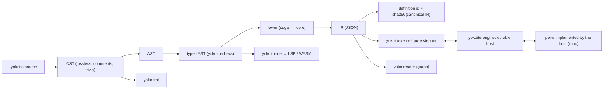

# 08. Runtime semantics and the IR

## 8.1 Pipeline



**Crate responsibilities:**
- `yokoito-syntax` owns the CST and the formatter.
- `yokoito-check` owns name resolution, types and static analysis.
- The lowering lives in `yokoito-ir`.
- `yokoito-kernel` executes the IR and **never** sees source syntax.

## 8.2 The IR

The IR is a JSON document described by a JSON Schema, generated with `schemars` and published as `yokoito-ir.schema.json`. Its top-level shape:

```jsonc
{
  "yokoito_ir": 1,                            // IR format version
  "id": "sha256:9f2c…",                    // definition hash (§8.2.4)
  "machine": "kitchen_sink",
  "version_label": "3",
  "extensions": [{ "name": "agentic", "version": "1.0.0" }],
  "types":    { "Triage": { "kind": "record", "fields": { … }, "open": false }, … },
  "events":   { "repair": { "payload": { "$type": "record", … } }, … },
  "input":    { "repo": { "type": "string" }, "max_files": { "type": "int", "default": 8 } },
  "output":   { "expr": { … }, "type": "Outcome" },
  "triggers": [ { "kind": "event", "event": "github.issue.labeled", "if": { … }, "with": { … } } ],
  "instance": { "keyed": { … }, "inbox": "queue", "debounce": "2m", … },
  "vars":     { "attempts": { "type": "int", "init": { "lit": 0 } } },
  "defaults": { … }, "limits": { … },
  "outcomes": ["completed", "rejected", "failed", "cancelled", "budget_exhausted"],
  "effect_kinds": ["agentic.agent", "agentic.tool", "agentic.run", "agentic.approve", "core.call", "core.wait", "core.sleep", "core.lock", "core.flow"],
  "root":     { /* StateNode */ },
  "flows":    { /* named sub-flow templates, referenced by flow-call invokes */ },
  "migrations": [ … ],
  "source":   { "files": ["kitchen_sink.yoko"], "spans": "separate" }   // spans live in a sidecar
}
```

### 8.2.1 State nodes

```jsonc
{
  "id": "refine.body.patch",               // structural path, unique
  "kind": "atomic|compound|parallel|final|history|dynamic",
  "initial": "patch",                      // compound
  "children": [ … ],                       // compound
  "regions": [ … ],                        // parallel
  "template": { … },                       // dynamic (§8.3)
  "history": "shallow|deep",               // history
  "vars": { "tries": { "type": "int", "init": { "lit": 0 } } },
  "params": { "d": "Dispatch" },
  "entry": [ /* Action */ ], "exit": [ /* Action */ ],
  "activity": { /* Invoke */ },
  "transitions": [ /* Transition */ ],
  "outcome": "rejected",                   // final states
  "origin": { "sugar": "loop", "name": "refine", "role": "body" },   // for graph + errors
  "span": 1734                             // index into the span sidecar
}
```

### 8.2.2 Transitions, actions, invokes

```jsonc
// Transition
{ "on": "github.issue.closed" | "done" | "failure" | null,
  "catch": ["tool.conflict"], "guard": { /*Expr*/ }, "after": { /*Expr: duration*/ },
  "bind": "e", "target": ["merging"], "reenter": false,
  "actions": [ /* Action */ ], "internal": true, "span": 88 }

// Action  (instantaneous; extension invokes here are fire-and-forget)
{ "assign": { "var": "attempts", "expr": { … } } }
{ "raise":  { "event": "fork.investigate.arrived", "payload": { … } } }
{ "emit":   { "event": "release.ready", "payload": { … } } }
{ "send":   { "machine": "security_issue_owner", "key": { … }, "event": "repair", "payload": { … } } }
{ "note":   { "text": { /*Template*/ } } }
{ "fire":   { /* Invoke, not awaited */ } }
{ "spawn":  { "dynamic": "audits.item", "key": { … }, "bind": { … } } }
{ "cancel": { "scope": "investigate" } }
{ "release":{ "lock": { … } } }

// Invoke  (an activity, or a step inside a lowered flow)
{ "id": "refine.body.patch",              // effect-id base
  "kind": "agentic.agent",                // extension kind | core.call | core.wait | core.sleep | core.flow | core.lock
  "args": { "agent": { "lit": "@patcher" }, "prompt": { /*Template*/ }, "options": { … } },
  "returns": "Patch",                     // output contract type, or null
  "modifiers": { "timeout": "20m", "retry": { "max": 2, "on": ["provider.*"], "backoff": { "exp": ["10s", "1m"] } },
                 "cache": { "by": { … }, "for": "7d" }, "place": { "host": "worker-1", "workspace": "sync" } },
  "bind": "patch" }
```

### 8.2.3 Expressions and templates
- **Expressions** are a typed tree: `{ "op": "and", "args": [ … ], "type": "bool" }`, `{ "field": [ { "var": "triage" }, "files" ] }`, `{ "call": "filter", "recv": …, "lambda": { "param": "f", "body": … } }`, `{ "lit": 3 }`.
- **Templates** are a sequence of `{ "text": "…" }`, `{ "expr": …, "filters": [ … ] }`, `{ "if": … }` and `{ "for": … }` parts.
- **Types are attached to every node,** so the stepper never type-checks at runtime. The only runtime validation is on `json` access and on `-> T` contracts.

### 8.2.4 Definition identity
- **The id is `sha256` of the canonical IR.** Canonical means keys sorted, `span`, `source`, doc comments and `version_label` removed, and numbers normalised.
- **Consequences:**
  - Reformatting, editing comments or relabelling the version never changes the id.
  - Any semantic change always changes it.
- Instances pin this id (§8.7).

## 8.3 Dynamic regions

SCXML has only static regions. yokoito adds one core construct, the **dynamic region**: a region *template* instantiated at runtime once per key, inside the same instance and journal. It is how `map`, `pipeline`, `worklist`, `async`, `best_of`, the handlers of `during`, and the item scopes of `distribute` are lowered.

- A `dynamic` node owns a template subtree, a **key table** (`key → instance status`) and a **concurrency gate**.
- **`spawn`** creates a keyed instance. Its state ids are prefixed `<node>{<key>}`, e.g. `audits.item{src/a.rs}.audit`.
- **Completion and failure.** When a keyed instance reaches a final state, the internal event `<node>.item_done{key, status, value}` is raised to the owner. Failures raise `<node>.item_failed{key, error}`.
- **Exit.** When the owner exits, every still-active keyed instance is exited, so their activities are cancelled, unless the lowering has moved them to a trailing region (`losers: wait`/`detach`).
- **Conflicts.** Transition selection treats each keyed instance like a region of a parallel state.

XState's *spawned actors* are separate actors with separate persistence. Dynamic regions share the instance's single journal, which gives atomic snapshots and simple recovery. `call machine` is the escape hatch when separate identity is wanted.

## 8.4 The pure stepper (`yokoito-kernel`)

```rust
pub fn step(def: &Definition, snap: &Snapshot, input: Input) -> Result<Step, StepError>;

pub struct Step {
    pub snapshot: Snapshot,
    pub effects: Vec<Effect>,
    pub observations: Vec<Observation>,   // for the Observer port (§8.10)
}

pub enum Input {
    Start   { at: Time, input: Value },
    Event   { at: Time, name: EventName, payload: Value, delivery_id: String },
    EffectDone   { at: Time, id: EffectId, value: Value, usage: Usage },
    EffectFailed { at: Time, id: EffectId, error: ErrorValue, usage: Usage },
    TimerFired   { at: Time, id: TimerId },
    LockGranted  { at: Time, id: EffectId },
    Cancel { at: Time, scope: Option<ScopeId> },
    Pause  { at: Time }, Resume { at: Time },
    Migrate { at: Time, to: DefinitionId },        // §8.7
}

pub enum Effect {
    Invoke { id: EffectId, kind: EffectKind, args: Value, idempotency_key: String, placement: Option<Placement> },
    CancelInvoke { id: EffectId, grace: Duration },
    PauseInvoke { id: EffectId }, ResumeInvoke { id: EffectId, seed: Option<Value> },
    ScheduleTimer { id: TimerId, at: Time }, CancelTimer { id: TimerId },
    Emit { event: EventName, payload: Value },
    Send { machine: MachineName, key: String, event: EventName, payload: Value },
    StartChild { id: EffectId, machine: MachineName, input: Value, detached: bool },
    Acquire { id: EffectId, lock: LockSpec },     // lock | semaphore | throttle token
    Release { lock: LockSpec },
    CacheLookup { id: EffectId, key: CacheKey }, CacheStore { key: CacheKey, value: Value, ttl: Duration },
    Complete { outcome: Outcome, output: Value },
    ContinueAsNew { vars: Value },
}
```

**The snapshot** holds:
- the active configuration (state ids, including keyed instances);
- variables by scope;
- loop counters and `prev` values;
- dynamic key tables and queues;
- pending effects, by id, with attempt numbers;
- timers, as absolute deadlines;
- history records;
- budget accumulators;
- the compensation stacks;
- the RNG state;
- the inbox cursor;
- the definition id.

The snapshot is serialised as JSON and versioned by `snapshot_format`.

**Properties** (enforced by plan 2's property tests):
- **Determinism.** The same `(def, snap, input)` always gives the same `Step`.
- **Purity.** No I/O, no clock reads, no global state.
- **Totality.** Every input either produces a `Step` or a `StepError`. `StepError` is reserved for engine bugs and corrupt snapshots. Language-level failures are values: errors raised inside the machine.
- **Static node ids vs runtime effect ids.**
  - IR **node ids** are static structural paths that include the lowering's internal segments: `refine.body.patch`, `audits.item.audit`.
  - Runtime **effect ids** are derived from the node id by two rules. First, every loop segment is annotated with its pass number `[n]`, and every dynamic-region segment with its item key `{key}`. Second, the lowering's internal segments (`body`, `check`, `item`, `branch`, …) are dropped. The attempt number `#aN` is appended last.
  - Example: `refine[2].review[1].panel{@security-reviewer}.assess#a1`.
  - The same work always has the same id across replays, and the UI maps an effect id back to its node by stripping the annotations.

## 8.5 The durable engine (`yokoito-engine`)

### Journal
There is one append-only journal per instance, through the `JournalStore` port. Its entries:

| Entry | Written when |
|---|---|
| `started { def_id, input, at }` | instance creation |
| `input { seq, Input }` | every input, **before** it is stepped |
| `effects { seq, [EffectId] }` | the effects produced by stepping `seq` (ids only; the args are recomputable) |
| `cache_hit { id, key }` | a cache lookup hit |
| `snapshot { seq, Snapshot }` | every N inputs (default 200), and before `Complete` |
| `unhandled { seq, event }` | an event discarded with no transition (§7.6) |
| `migrated { from, to, at }` | after a migration (§8.7) |
| `completed { outcome, output, at }` | the end |

### The processing loop (per instance; single writer)
1. Take the instance lease (`InstanceRegistry`). Load the latest snapshot and replay any later `input` entries through `step()`. This is deterministic, so no effects are re-produced for entries that already have an `effects` record.
2. Take the next input from the inbox, timers or effect results.
3. Append `input` to the journal and **fsync**.
4. `step()`.
5. Append `effects`, then **dispatch** them: invoke handlers, schedule timers, emit, send, acquire locks.
6. Every N inputs, write a snapshot.

### Guarantees
- **State transitions are exactly once.** An input is only ever stepped once its journal entry is durable, and replaying it is deterministic.
- **Effects are at least once.** After a crash, effects recorded for a stepped input but without a result input are **re-dispatched with the same idempotency key**. Handlers use the key to deduplicate: a tool call passes it to the service, and rupu's agent handler maps it onto `prepare_continuation`, so an interrupted agent continues, or is recovered if it had already finished.
- **Durability modes.**
  - `sync` (the default) fsyncs per input, as above.
  - `ephemeral` keeps no journal: in-memory, for tests and throwaway runs, chosen per instance at start.

### Budgets, caches, placement
- **Budgets.** Before dispatching an `Invoke`, the engine asks the stepper's pre-dispatch guard, which is computed into the snapshot. A scope in `hard` budget stage raises `budget.exhausted` *instead of* dispatching.
- **Caching.** `CacheLookup` resolves before `Invoke`. A hit feeds an `EffectDone` with the cached value and journals `cache_hit`.
- **Placement** is passed through to the effect handler, which owns the host choice and workspace sync.

### Blobs
Any effect result value larger than `blob_threshold` (default 64 KiB) is stored in the `BlobStore` port, content-addressed. The journal holds `{ "$blob": "sha256:…", "size": n }`. The stepper treats blob references as opaque values; expression access transparently loads them. This keeps journals small: LangGraph's state-bloat lesson.

### Inbox
- Arriving events are appended to the instance's durable inbox (`JournalStore`) and processed in order, as described in §4.5: they are offered to the consumers in the listed order, and an unconsumed event is retained or discarded according to the `inbox` policy.
- Retained events (`queue`/`latest`) are kept up to `inbox_capacity` (default 1000). Beyond that the oldest are dropped, with a journal `unhandled` entry. Retained events are visible only to later `wait for` / `approve` / `ask`.
- `debounce` coalesces events at enqueue time.

### Timers
- `ScheduleTimer` carries an absolute deadline. The `TimerService` delivers `TimerFired` at or after the deadline, even across restarts: the timers are persisted.
- A late firing is processed normally, and `now()` is the firing input's `at`.

## 8.6 Cancellation and pause

- **Cancelling a scope.** `Cancel{scope}`, or exiting a scope that still has running work, makes the stepper:
  1. emit `CancelInvoke{id, grace}` for every in-flight invoke inside the scope;
  2. cancel timers and release locks;
  3. exit the scope's states, which runs their `exit` actions and the `finally` flows. Those are allowed during the grace period.
- **Grace period.** Default 30s, configurable by `limits { cancel_grace 2m }`.
- **Handler acknowledgement.** Handlers acknowledge a cancel with `EffectFailed{error: cancelled}`. When the grace period expires without an acknowledgement, the effect is recorded `cancelled` and any late result is discarded as stale. Stale results are recognised by attempt number and incarnation.
- **Instance cancel** (`Cancel{scope: None}`) cancels the root, then runs `on cancel` and `finally`, then completes with outcome `cancelled`.
- **Pause** (`Input::Pause`) is an **engine-level operator command**. It is machine-agnostic, works on every instance, and is not an event the machine sees.
  - It stops the dispatch of new effects and new timers.
  - Each in-flight effect gets `PauseInvoke`. The handler may pause it (rupu: an agent mid-turn produces its paused seed, returned in `EffectFailed{error: paused, data: seed}`) or let it finish.
  - `Resume` sends `ResumeInvoke{seed}` for paused effects and releases held timers.
  - A machine that wants a *domain-level* hold (like `pr_shepherd`'s `hold`/`unhold`) models it with its own events and states. The two mechanisms are independent.
- **Compensation** does not run on cancel unless the saga says `on_cancel: compensate` (§6.16).

## 8.7 Versioning and migration

- **Every instance is pinned** to the definition id it started with. The engine keeps every definition still referenced by a live instance. rupu stores them by id, next to the run.
- **New instances use the newest definition.** Old instances finish on theirs.
- **A migration** is declared in the *newer* source:
  ```
  migrate from "3" {                      // version label or "sha256:…"
    state watching   -> idle              // state renames / merges (old → new)
    state backoff.*  -> working           // subtree mapping
    var  retry_after : duration = 0s      // new var: type + default
    var  steering    -> notes             // renamed var
    drop var legacy_flag
  }
  ```
- **`yoko migrate check <old> <new>`** proves statically that:
  - every *reachable* old configuration maps to a valid new configuration;
  - every old var is kept, renamed or dropped;
  - every new var has a default;
  - the types are compatible.
- **Applying a migration.** The engine applies `Input::Migrate` only at a **safe point**: no in-flight effects inside regions that the mapping changes. Otherwise the migration is deferred until such a point.
- **Commands.** Upgrades are a host operator command (rupu: `rupu workflow upgrade <machine> --to latest`, §11.2). The engine API is `Engine::upgrade(machine, to, filter)`, and each upgrade writes the `migrated` journal entry. Without a migration path, old instances simply drain. The library's own CLI only *checks* migrations (`yoko migrate check`).

## 8.8 Continue-as-new

`restart with { attempts: 0, notes: notes }` completes the current journal with outcome `restarted` and starts a fresh instance with:
- the same instance key and lease;
- the newest definition, or the same one with `restart with … (same_version: true)`;
- the given vars;
- the initial state, or `restart … at <state>` to start elsewhere.

Long-lived owners use it to bound their journal and to pick up new definitions at a natural point. The checker warns (`no-restart-in-forever-machine`) when an `instance per …` machine has a cycle but no `restart`.

## 8.9 Outcomes

Every instance ends with exactly one **outcome**:
- `completed` is the default, from flow end or a root `final state completed`.
- **Named outcomes** come from `end <name>` and root `final state <name>`.
- `failed` (with an error), `cancelled`, `restarted`.

The IR lists every reachable outcome, so the CP can show and filter by them, and so `call machine` callers can `match` on `outcome(child)`.

## 8.10 Ports

These are implemented by the host. Every port is async and `Send + Sync`.

```rust
trait JournalStore {      // per instance append-only log + snapshots + inbox
    async fn append(&self, inst: &InstanceId, entries: &[Entry]) -> Result<Seq>;   // durable on return
    async fn read_from(&self, inst: &InstanceId, seq: Seq) -> Result<Vec<Entry>>;
    async fn latest_snapshot(&self, inst: &InstanceId) -> Result<Option<(Seq, Snapshot)>>;
    async fn inbox_push(&self, inst: &InstanceId, ev: InboxEvent, policy: InboxPolicy) -> Result<()>;
    async fn inbox_pop(&self, inst: &InstanceId) -> Result<Option<InboxEvent>>;
}
trait InstanceRegistry {  // keys, leases, entity arbitration, definition storage
    async fn resolve(&self, machine: &str, key: &str) -> Result<Resolution>;  // live | start | yield-to
    async fn lease(&self, inst: &InstanceId, ttl: Duration) -> Result<LeaseGuard>;
    async fn store_definition(&self, ir: &Definition) -> Result<()>;
}
trait EffectHandler {     // one per effect kind (e.g. "agentic.agent")
    async fn invoke(&self, req: InvokeRequest, ctx: EffectCtx) -> Result<EffectResult, ErrorValue>;
    async fn cancel(&self, id: &EffectId, grace: Duration);
    async fn pause(&self, id: &EffectId) -> PauseOutcome { PauseOutcome::Unsupported }
}
trait TimerService { async fn schedule(&self, inst: &InstanceId, id: TimerId, at: Time); async fn cancel(&self, inst: &InstanceId, id: TimerId); }
trait EventBus     { async fn emit(&self, ev: Event); fn subscribe(&self, filter: EventFilter) -> EventStream; }
trait LockService  { async fn acquire(&self, spec: &LockSpec, holder: &EffectId) -> Result<LockGuard>; async fn release(&self, spec: &LockSpec, holder: &EffectId); }
trait CacheStore   { async fn get(&self, key: &CacheKey) -> Result<Option<Value>>; async fn put(&self, key: &CacheKey, v: Value, ttl: Duration) -> Result<()>; }
trait BlobStore    { async fn put(&self, bytes: Bytes) -> Result<BlobRef>; async fn get(&self, r: &BlobRef) -> Result<Bytes>; }
trait Policy       { fn admit(&self, inst: &InstanceMeta, effect: &Effect) -> PolicyDecision; }   // allow | deny(reason) | require_approval
trait Observer     { fn observe(&self, inst: &InstanceId, obs: &Observation); }
```

**Observations** are the structured live stream, consumed by the graph UI, the CLI live view and audit logs:
- `InstanceStarted`, `StateEntered{id}`, `StateExited{id}`, `TransitionTaken{from, to, on}`
- `EffectStarted{id, kind}`, `EffectProgress{id, note}`, `EffectFinished{id, status, duration, usage}`
- `TimerSet{id, at}`, `Waiting{id, for}`, `Note{text}`, `Unhandled{event}`
- `InstanceCompleted{outcome}`

Every observation carries the **structural id**, so a UI can map it onto IR nodes by prefix.

## 8.11 Defaults and limits (initial values; to be tuned in plans 2–3)

| Setting | Default |
|---|---|
| snapshot interval | 200 inputs |
| cancel grace | 30 s |
| blob threshold | 64 KiB |
| inbox capacity | 1000 events |
| microstep cap per macrostep | 100 |
| expression operation cap | 1,000,000 |
| map item ceiling per dynamic node | 10,000 (more → use `call machine` per chunk) |
| `limits.max_steps` default | 100,000 journal inputs |

## 8.12 Conformance

Plan 2 ships a conformance suite:
1. The applicable W3C SCXML IRP tests, translated to yokoito.
2. One golden test per construct in chapter 06. Each pairs a source snippet, a scripted input sequence, and the expected effect and outcome trace.
3. Property tests: determinism, replay equivalence (snapshot plus tail replay equals full replay), and the cancellation invariants (no orphaned effects, every scope exit releases its locks).
