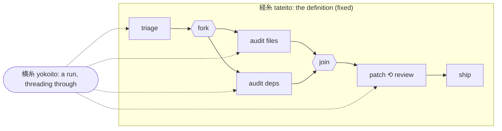

# yokoito 横糸

**A language for weaving complex, durable, agentic workflows.**

> **横糸** *yokoito* (n.), "sideways thread": the **weft**. On a loom, it is the thread the shuttle carries back and forth *across* the fixed lengthwise threads of the warp, row after row, until cloth appears.

---

## Why "yokoito"?

A loom has two sets of threads.

- **経糸 *tateito*, the warp.** These threads are stretched taut along the loom before any weaving starts. They are fixed, ordered and structural, and they never move.
- **横糸 *yokoito*, the weft.** This is the thread carried *across* the warp by the shuttle. It goes over some warp threads and under others, splits, rejoins and changes colour, and the fabric is the record of its path.

That is exactly the split this library makes between a *definition* and an *execution*:

| On the loom | In yokoito |
|---|---|
| **経糸 tateito**: the warp, fixed before weaving begins | the **machine definition**: states, transitions and steps, compiled once into an immutable IR |
| **横糸 yokoito**: the weft, woven through the warp | **execution**: a run threading its way through the definition |
| **杼 hi**: the shuttle that carries the weft across | the **stepper** (`yokoito-kernel`): moves execution forward one step at a time |
| **機 hata**: the loom that holds it all and keeps it going | the **engine** (`yokoito-engine`): durability, timers, instances, recovery |
| several weft threads at once, in different colours | **parallelism**: `fork`, `map`, `race`; threads split apart and are woven back together at a join |
| **紋紙 mongami**: the punched pattern cards of the Jacquard loom, used in Kyoto's Nishijin weaving since the 1870s and an ancestor of programmable machines | the **source program**: a readable description of what to weave |
| **織物 orimono**: the woven fabric | the **journal**: every row woven is recorded, so a dropped thread can be picked up exactly where it left off |
| **耳 mimi** ("ear"): the selvedge, the self-finished edge that stops cloth fraying | **structured concurrency**: nothing unravels past the block that started it |



The name says what makes workflows hard: they aren't straight lines. They loop back, fan out, wait for days, get interrupted, and must resume without tearing. yokoito is the thread that holds all of that together.

It also belongs to a family. Its first host is **rupu**, ループ, "loop": the loop that drives an agent, and yokoito is the thread woven through those loops.

**The short forms:**
- The CLI is **`yoko`** (横, "sideways"), so you run `yoko check`, `yoko fmt`, `yoko test`.
- Source files end in **`.yoko`**.

## What it is

yokoito is a **statechart language and durable engine**, written in Rust, for workflows too complex for a YAML pipeline.

- **Readable.** A pipeline reads top to bottom, a lifecycle reads as a set of states, and every loop, fan-out and join is visible where it opens.
- **Powerful.** It covers all 43 control-flow [Workflow Patterns](B-workflow-patterns.md), including:
  - nested loops, map, pipelines and worklists
  - fork/join with any join policy, races, and `async`/`await`
  - locks, rate limits, deadlines and budgets
  - typed errors with retry/catch, and sagas
  - timers and event listeners
  - human approvals and questions
  - long-lived instances scoped to an entity such as an issue or PR
- **Safe.** Statically typed, prompt templates included. Agent, tool and event references are checked before anything runs.
- **Durable.** State transitions happen exactly once, every effect is journaled, and every construct resumes after a crash at its finest unit.
- **Agentic, by extension.** The core knows nothing about LLMs. The `agentic` extension adds `agent`, `tool`, `run`, `approve`, `ask`, `best_of`, `vote` and `pursue`, and the host application implements them.

## A taste

```
/// Triage a security issue, investigate in parallel, patch until tests pass and review is clean.
machine fix_issue
uses agentic

input { repo: string, issue: int }

flow {
  triage = agent @security-triager -> Triage "Triage issue #{{ issue }} in {{ repo }}."

  if not triage.actionable { end not_actionable }

  evidence = fork (join: 2, losers: cancel) {
    files   { map f in triage.files (concurrency: 4) { agent @code-auditor -> Audit "Audit {{ f }}" } }
    deps    { run `cargo audit --json` (parse: json) }
    history { agent @git-historian "When was this introduced?" }
  }

  loop (max: 3, until: ok(tests) and review.resolved) {
    patch  = agent @patcher "Fix it. Evidence: {{ evidence | tojson | truncate(20000) }}"
    tests  = run `cargo test` on_error continue
    review = panel_review(subject: patch, panelists: [@security-reviewer, @maintainability-reviewer], floor: high)
  }

  approve "Ship the fix for #{{ issue }}?"
    after 24h keep_waiting { note "still waiting on sign-off" }
    after 72h raise approval.timeout
}
```

Long-lived work is written as states:

```
machine issue_owner
uses agentic

instance per issue keyed entity.ref {
  select { labels_all [security] }
  lease 4h, renew while active
}

on github.issue.closed -> released

initial state working {
  do call machine fix_issue(repo: entity.repo, issue: entity.number)
  on done    -> watching
  on failure -> blocked
}
state watching {
  on github.issue.commented -> working
  after 30m                 -> working
}
state blocked { on operator.repair -> working }
final state released
```

## Crates

| Crate | Role |
|---|---|
| `yokoito` | the umbrella crate, re-exporting the public API |
| `yokoito-syntax` | lexer, lossless parser, formatter |
| `yokoito-ir` | the canonical JSON IR, and definition hashing |
| `yokoito-check` | names, types, static analysis |
| `yokoito-kernel` | the pure stepper: (definition, state, input) → (state′, effects) |
| `yokoito-engine` | the durable host: journal, snapshots, timers, instances, locks |
| `yokoito-agentic` | the agentic extension |
| `yokoito-ide` · `yokoito-lsp` · `yokoito-wasm` | shared analysis, the language server, and the browser build (`@yokoito/wasm`) |
| `yokoito-test` · `yokoito-cli` | `test` blocks and simulation · the `yoko` binary (`fmt / check / lint / test / render`) |

## Status

**The design is complete; implementation hasn't started.** The full specification is in this directory:

| Start with | Then |
|---|---|
| [00 Index](00-index.md): goals, decisions, plan order, glossary | [05 Steps](05-steps.md) · [06 Blocks](06-blocks.md) · [07 State layer](07-state-layer.md) |
| [examples/](examples/): four complete machines, with tests | [08 Runtime & IR](08-semantics-and-ir.md) · [09 Agentic](09-extensions-and-agentic.md) · [10 Tooling](10-tooling.md) |
| [C Legacy parity](C-legacy-parity.md): for readers coming from rupu YAML | [A Grammar](A-grammar.md) · [B Workflow Patterns](B-workflow-patterns.md) |

yokoito is being built as an independent library. Its first host is [rupu](../../../../README.md), an agentic code-development CLI, whose workflows, autoflows and agentiflows all move onto yokoito ([11 rupu integration](11-rupu-integration.md)).
