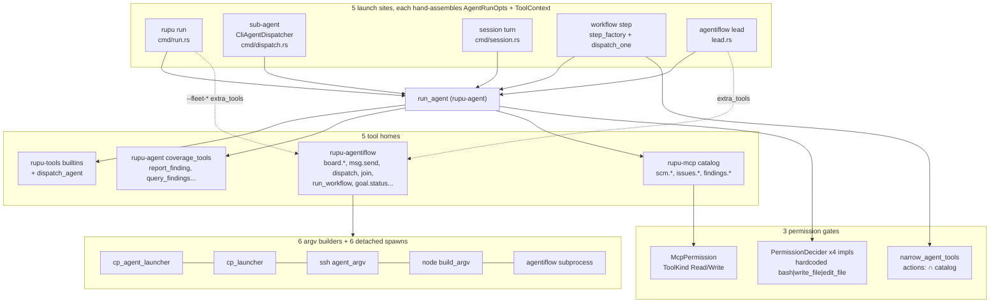
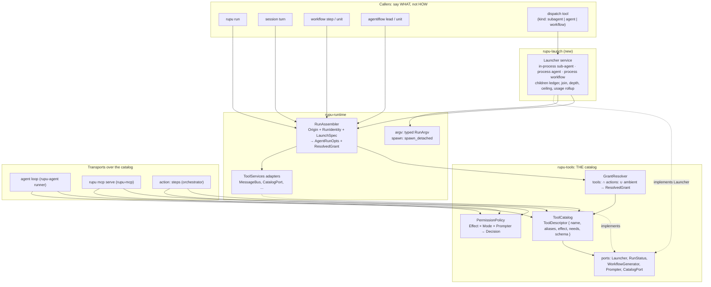
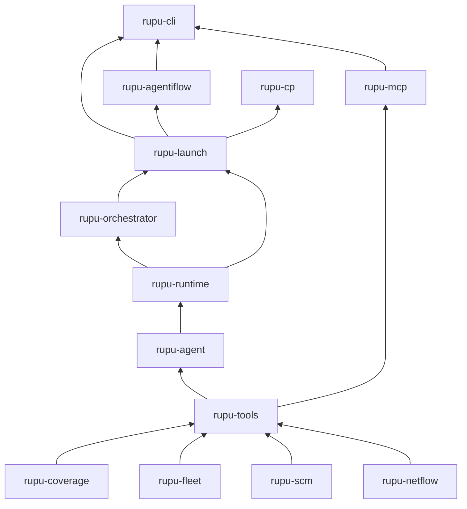
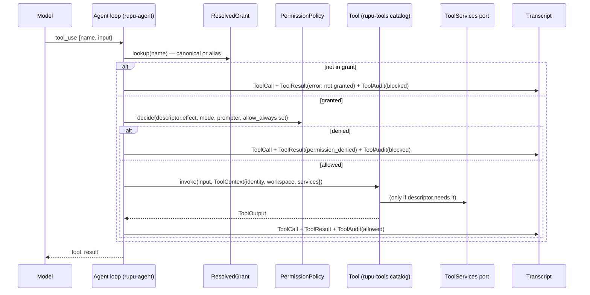
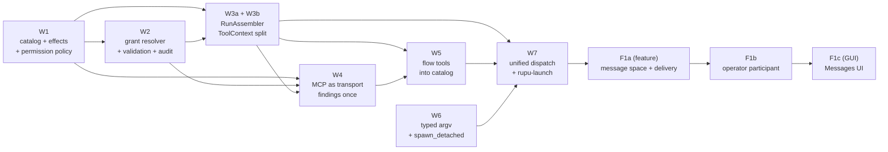

# rupu tool and launch architecture: one way to do each thing

- **Date:** 2026-10-07
- **Status:** draft, for matt's review
- **Kind:** re-architecture. Functionally neutral except for the bugs it fixes on purpose, listed in §3.
- **Followed by:** the feature work this session was opened for. It is specced here too, against the post-refactor architecture: [F1](F1-messaging-everywhere.md) messaging for every run kind (F1a/F1b/F1c).

## How to read this spec

| File | What it is | Card |
|---|---|---|
| `00-index.md` (this file) | Problem inventory, principles, target architecture, decision log, workstream order, how to add a tool | — |
| [W1-tool-catalog-and-permissions.md](W1-tool-catalog-and-permissions.md) | One tool descriptor + catalog, one effect classification, one permission policy | W1 |
| [W2-tool-grants.md](W2-tool-grants.md) | One grant resolver: `tools:` validation, wildcards, ambient grants, audit for every tool | W2 |
| [W3-run-assembly.md](W3-run-assembly.md) | One run assembler that turns "launch this agent here" into `AgentRunOpts`; the five hand-built sites collapse into it | W3a, W3b |
| [W4-mcp-as-transport.md](W4-mcp-as-transport.md) | MCP stops owning tools and becomes a transport over the catalog; findings tools implemented once | W4 |
| [W5-flow-tools-into-catalog.md](W5-flow-tools-into-catalog.md) | Board/mailbox/roster/status tools move into the catalog; "lead tools" stop being a category | W5 |
| [W6-process-spawn.md](W6-process-spawn.md) | One typed argv for `rupu run` / `workflow run`, one detached-spawn helper | W6 |
| [W7-unified-dispatch.md](W7-unified-dispatch.md) | One `dispatch` + `join`: `kind: subagent \| agent \| workflow`, async by default | W7 |
| [F1-messaging-everywhere.md](F1-messaging-everywhere.md) | (feature) overview: what matt asked for, the channel problems M1–M7, the decisions FD1–FD7 | — |
| [F1a-message-space-and-delivery.md](F1a-message-space-and-delivery.md) | (feature) message space per root, canonical log, participants + addresses, one writer API, delivery + receipts, `Message`/`Injected` transcript events, workflow `messaging:` key | F1a |
| [F1b-operator-participant.md](F1b-operator-participant.md) | (feature) the operator messages anyone in any run; steering folded in; `rupu message` CLI; CP API; remote-host contract | F1b |
| [F1c-messages-ui.md](F1c-messages-ui.md) | (feature, GUI) the Messages tab for runs/sessions/flows showing every kind; composer; messages as transcript bubbles | F1c |

Each W-file stands on its own. It has scope, design, the files it touches, what it deletes, acceptance tests and its dependencies. One card is one session is one PR.

---

## 1. Why

rupu's tool and agent-launch code grew one feature at a time. Each feature (sub-agent dispatch, MCP/SCM tools, coverage, findings, sessions, agentiflow, placed units) brought its own copy of three things:

1. **how a tool is defined and granted**
2. **how an agent run is assembled**
3. **how a child run is launched and watched**

The copies then drifted apart. The deep dive on 2026-10-07 found **5** hand-built run-assembly sites, **5** homes for tools, **4** read/write classifications, **3** unconnected permission gates, **6** argv builders, **2** depth limits that disagree, and **2** dispatch systems. Several of the drifts are not cosmetic: they are security and correctness bugs (§3).

The goal of this re-architecture is one clear rule for each of these questions:

- **Where does a tool live, and what does it declare?** One catalog in `rupu-tools`. Every tool declares its name, schema, *effect* and the *services* it needs.
- **Who may call it?** One grant resolver (agent `tools:` ∩ step `actions:` ∪ explicit ambient grants) and one permission policy (effect × mode).
- **How is a run built?** One `RunAssembler`. Launch sites state *what* they want (an origin, an identity, a prompt). They never hand-fill 45 fields.
- **How does an agent start another agent or workflow?** One `dispatch` tool and one `Launcher` service. The child's *kind* is a parameter.
- **How is a child process started?** One typed argv and one spawn helper.

When we add tool #60 or launch kind #4 there should be exactly one place to put it, and the compiler plus a lockstep test should tell us if we forgot a piece.

## 2. Principles

These are the rules the target architecture enforces. Each W-file cites the rule it implements.

- **P1 — One definition per tool.** A tool's name, description, input schema, effect, required services and invoke body live in one place: the `rupu-tools` catalog. No crate outside `rupu-tools` implements `Tool` in production. Tests may.
- **P2 — Transports are not tool homes.** MCP (stdio `rupu mcp serve`), `action:` workflow steps and the agent loop are three *callers* of the same catalog. None of them owns tools.
- **P3 — Effects, not names, drive permissions.** No permission code compares tool names (`"bash" | "write_file" | "edit_file"`). It reads the tool's declared `Effect`.
- **P4 — Grants are explicit and validated.** What an agent may call is computed in one place. Unknown names fail at load. Every tool that reaches the model is visible in the resolved grant, ambient ones included, and every call is audited.
- **P5 — Run assembly is one function.** A launch site supplies an `Origin` + `RunIdentity` + `LaunchSpec`. Provider, limits, recovery, decider, services, findings, netflow, bash config, usage ledger, codename and admission are derived from them once, by `RunAssembler`.
- **P6 — Identity is set once and never overwritten.** Run id, codename, agent, model, provider, surface, depth and parent are fixed by the assembler. No field is "patched later by the runner".
- **P7 — Services are ports with honest absence.** A tool that needs a service (launcher, message bus, run status, …) gets it from `ToolServices`. If an agent is *granted* a tool whose service this run cannot provide, the run starts with a `tool_unavailable` notice naming the tool and the missing service. The tool is not silently dropped and not silently kept.
- **P8 — The child kind is a parameter, not a code path.** In-process sub-agent, own-process agent and workflow are three `kind`s of one launch. They share allowlists, depth, the permission ceiling, codenames, usage rollup, events and the children ledger.
- **P9 — The CLI is thin (CLAUDE.md rule 2, currently violated).** `CliAgentDispatcher`, `fleet_attachment` and the run assembly inside `cmd/run.rs` / `cmd/session.rs` move into library crates.
- **P10 — Delete what this replaces.** Every workstream lists the code it deletes. A replaced path left alive is the drift this spec exists to end.

## 3. Problem inventory (what the deep dive found)

Paths are relative to `crates/`. ⚠ marks behaviour bugs, which get fixed by construction (per the [[fix bugs when found]] rule they are in scope, not deferred). ✂ marks duplication or dead code.

### 3.1 Tools: five homes, four classifications

| # | Finding | Where | Fixed in |
|---|---|---|---|
| T1 | ✂ Tools live in 5 places: `rupu-tools` builtins (9), `rupu-agent/src/coverage_tools.rs` (10), `rupu-mcp/src/tools/` (21 MCP specs), `rupu-agentiflow/src/{tools,status_tools,dispatch_tools,roster}.rs` (19), and dead `PermissionGate` lists | — | W1, W4, W5 |
| T2 | ⚠ **Readonly mode only blocks `bash` / `write_file` / `edit_file`.** `dispatch_agent`, `findings.verify` (rewrites the ledger), `tag_findings`, `board.post`, `dispatch`, `run_workflow`, `generate_workflow` (spawns processes, calls a model) all run under readonly | `runner.rs:1325`, `cmd/run.rs:1803` | W1 |
| T3 | ⚠ **Ask mode never prompts for MCP writes.** `AskDecider` passes non-native tools and `McpPermission` returns Ok in Ask (`ask_cb` is never set), so `scm.prs.create` runs unprompted under `--mode ask` | `cmd/run.rs:1887`, `rupu-mcp/src/permission.rs:63` | W1 |
| T4 | ⚠ **"Allow always" approves every tool, not one.** `AllowAlwaysForToolThisRun` flips the whole run to Bypass | `runner.rs:2950` | W1 |
| T5 | ✂ Four read/write classifications: MCP `ToolKind`, dead `KNOWN_READ/WRITE_TOOLS`, the hardcoded triple in 3 deciders, bash `RESERVED_NATIVE_TOOLS` | `rupu-tools/src/permission.rs:32`, `bash.rs:73` | W1 |
| T6 | ✂ Two `ReadonlyDecider`s | `runner.rs:1325`, `cmd/run.rs:1803` | W1 |
| T7 | ⚠ **Unknown names in `tools:` are silently ignored** by the spec parser, `filter_to` and the MCP allowlist. A typo means the agent silently lacks a capability | `spec.rs:40`, `tool_registry.rs` | W2 |
| T8 | ⚠ **Wildcards mean different things per layer.** `tools: ["*"]` gives no builtins but all MCP tools. The same agent in a step with `actions:` *gains* all builtins (`narrow_agent_tools` expands `*` over the builtins). `scm.*` works, `coverage_*` doesn't | `tool_registry.rs`, `step_factory.rs:710`, `runner.rs:3446` | W2 |
| T9 | ⚠ Four paths reach the model outside `tools:`: `concerns:` registers 6–7 coverage tools, an engagement profile adds `report_finding` + `asset_mark`, the lead auto-appends `report_finding`, and `extra_tools` skip the filter | `runner.rs:1866–1967`, `rupu-agentiflow/src/run.rs:736` | W2 |
| T10 | ⚠ The `tool_audit` trail covers catalog tools only. A builtin denied by `ReadonlyDecider` never fires `on_tool_call` | `step_factory.rs:863`, `runner.rs:2913` | W2 |
| T11 | ✂ Findings implemented twice: `report_finding`/`query_findings`/`tag_findings` vs MCP `findings.record`/`.query`/`.tag`. The schemas differ and the MCP tag path has no run stream | `coverage_tools.rs`, `rupu-mcp/src/tools/findings.rs` | W4 |
| T12 | ✂ The in-process MCP server is started per run and no adapter talks to it | `runner.rs:2010`, torn down `:3356` | W4 |
| T13 | ✂ `ToolContext.tool_mappings` is never set, so the coverage path in `McpToolAdapter` is dead | `tool.rs`, `mcp_tool.rs` | W4 |
| T14 | ✂ `GET /api/tools` lists MCP tools only. The CP can't show builtins, coverage, findings or flow tools | `rupu-cp/src/api/tools.rs:15` | W4 |
| T15 | ✂ Three naming conventions (`report_finding`, `finding.verify`, `findings.*`) and near-collisions (`coverage_status` vs `coverage.status`, `dispatch_agent` vs `dispatch`) | — | W1 (names), W4/W5 (moves) |
| T16 | ✂ Copy-pasted helpers `done`/`failed`/`req_str`/`ok_output`/`err_output`; `attribution_from_ctx` re-implements `coverage_emit::attribution_from` | agentiflow `tools.rs`, `dispatch_tools.rs`, `roster.rs`, `coverage_tools.rs:26` | W1 |
| T17 | `glob` has no `is_inside` check (the other fs tools do) | `rupu-tools/src/glob.rs` | W1 |

### 3.2 Run assembly: five hand-built sites

The five production sites are: (A) `rupu run` `cmd/run.rs:1230`, (B) sub-agent `cmd/dispatch.rs:462`, (C) session turn `cmd/session.rs:7978`, (D) workflow step `step_factory.rs:490` + `orchestrator runner.rs:9883 dispatch_one`, and (E) agentiflow lead `lead.rs:585`. Each writes its own ~45-field `AgentRunOpts` and ~20-field `ToolContext` literal.

| # | Finding | Fixed in |
|---|---|---|
| R1 | ⚠ The agentiflow lead skips model-limit resolution (`ModelLimits::unknown()`, `rupu-agentiflow/src/run.rs:851`) and recovery (`Default`, `lead.rs:642`): no `max_tokens` discovery, no fallback chain | W3 |
| R2 | ⚠ **Sub-agents always run under `BypassDecider`** (`dispatch.rs:477`), and the child's `permissionMode` can *raise* the parent's mode (`:422`). A readonly run can launch a child that writes and runs bash | W1 (ceiling), W7 (across processes) |
| R3 | ⚠ Sub-agents ignore `[bash]` config (empty allowlist, 120 s, `dispatch.rs:434`). This is I-18 again, fixed for D only | W3 |
| R4 | ⚠ Sub-agents set `scope_name`/`surface_tag` to `None`, so a child's findings land under the wrong scope | W3 |
| R5 | ⚠ The lead's findings options skip `findings_opts::base_options` (no artifact root, no `[findings]` limits, no ticket patterns). It has no `netflow_sink`/`net_capture` on `ToolContext` and ignores every frontmatter pin (effort, contextWindow, output_*, anthropic_*, concerns) | W3 |
| R6 | ⚠ The lead has no MCP registry, no codename (`AgentiflowRecord.codename` is always `None`) and a synthetic `workspace_id` | W3 |
| R7 | ⚠ Session turns drop openai-compatible params (`session.rs:7802`), set `dispatcher: None` while advertising `dispatchable_agents`, get no engagement profiles, and record no usage (`on_usage: None`) | W3 |
| R8 | ⚠ Workflow resume drops `system_prompt_suffix` (`workflow.rs:3843`, `resume.rs:535`), so a resumed autoflow loses its `## Run target` section | W3 |
| R9 | ⚠ Admission control (`rupu_runtime::admission::acquire`) runs only for workflow steps. `dispatch_agents_parallel`, `rupu run`, sessions and the lead bypass it | W3 |
| R10 | ✂ `ProviderConfig` is built by hand at all 5 sites. `provider_config_for` exists but leaves the agent-level fields `None`, so nobody uses it for the primary provider | W3 |
| R11 | ✂ `AgentRunOpts` duplicates `depth` / `dispatchable_agents` / `parent_run_id` / `workspace_path` from `ToolContext`, and the runner never reads the `opts` copies. Six `ToolContext` fields are overwritten by the runner, so sites pass `None` | W3 |
| R12 | ✂ `CliAgentDispatcher::new` (21 args) is called 4×, and `DefaultStepFactory {…}` is built 3× with the same config maps (`workflow.rs:3773/3836`, `:5629/5700`, `resume.rs:466/528`, `run.rs:1077`) | W3 |
| R13 | ✂ The usage-ledger hook is wired separately in 4 places. Sessions, standalone `rupu run` and their sub-agents record nothing; the CP estimates them from transcripts | W3 |

### 3.3 Launch: two dispatch systems, six argv builders

| # | Finding | Fixed in |
|---|---|---|
| L1 | ✂ Two ways to start a child agent. `dispatch_agent`/`dispatch_agents_parallel` (`rupu-tools`, in-process, sync, `dispatchableAgents`, `MAX_DEPTH=5`) and agentiflow `dispatch`/`join`/`run_workflow`/`generate_workflow` (subprocess, async, pool, a *separate* `MAX_DEPTH=5`) | W7 |
| L2 | ⚠ **The agentiflow depth check can never fire.** Depth is always 0 and isn't propagated across the process boundary; every `rupu run` / `workflow run` resets depth to 0 | W7 |
| L3 | ⚠ `run_workflow`'s pool check ignores the workflow's agents' `dispatchableAgents`, so a unit can `dispatch_agent` outside the pool | W7 |
| L4 | ⚠ The step's `actions:` narrowing and `tool_audit` don't apply to sub-agents (known limitation, `dispatch.rs:269–296`) | W7 (ceiling inherits the narrowed grant) |
| L5 | ⚠ Usage is lost. Sub-agents of an agentiflow *agent* unit aren't counted (`usage.rs:15`, documented); standalone `rupu run` sub-agents record nothing | W3 + W7 |
| L6 | ✂ Six argv builders for `rupu run` / `workflow run`, which differ in prompt quoting, engagement joining, `--tmp`, `RUPU_CODENAME` and `--fleet-*`: `cp_agent_launcher`, `cp_launcher`, `ssh.rs agent_argv/workflow_argv`, `node.rs build_argv`, agentiflow `subprocess.rs rupu_run_argv` | W6 |
| L7 | ✂ Six hand-rolled detached spawns (null stdio + `process_group(0)`) | W6 |
| L8 | ⚠ Codename honouring differs by launcher: the local CP launcher drops `req.codename`, SSH passes `RUPU_CODENAME`, tunnel/bucket/HTTP mint their own run id and drop it, and the remote honours it only with `--run-id` | W6 |
| L9 | ✂ Four readers of "the child's final answer", all thin wrappers over `final_turn_text` | W7 |
| L10 | ✂ Four completion-polling loops (`FleetUnitDispatcher`, `SubprocessUnitLauncher::poll`, `FleetSupervisor::join`, tokio-join in parallel dispatch) | W7 |
| L11 | ✂ Five codename schemes, including agentiflow participants `<agent>#n` that aren't codenames | W3 (identity), W7 (children), F1 (addresses) |
| L12 | ⚠ `build_dispatcher_if_needed` gives the `local` host connector no agent launcher, so `host: local` from the CLI fails | W6 |
| L13 | ⚠ Sub-runs can't be continued: `rupu run --continue` only looks in `transcripts/`, and workflow recovery doesn't plan sub-runs | W7 (children ledger makes them findable; continuation itself is a follow-up) |
| L14 | `dispatch_agent`'s error text still says "only works inside `rupu workflow run`" | W7 |

### 3.4 Messaging and operator channels (inputs for F1, not fixed by W1–W7)

Ten channels with different stores, identities, timing and visibility (steering, `--now`, graceful stop, directives, direct `msg.send`, broadcast, `board.post`, claims, roster, session send, workflow control). Collector injections are **not recorded in transcripts** (`collector.rs:13`'s comment says they are; `collectors.rs:31` correctly says they aren't), so replay diverges from what the model saw. Dead letters: `msg.send` to `"parent"` / a role, role-addressed directives (`role` is always `None`), and workflow-unit `--fleet-participant` (discarded at `workflow.rs:449`). F1 owns all of this.

## 4. Target architecture

### 4.1 Before



### 4.2 After



### 4.3 Crate responsibilities after the change

| Crate | Owns | Must not |
|---|---|---|
| `rupu-tools` | **Every** production `Tool` impl. `ToolDescriptor`, `ToolCatalog`, `Effect`, `Service`, `GrantResolver`, `PermissionPolicy`. The port traits for effects that need a runtime above it (`Launcher`, `RunStatus`, `WorkflowGenerator`, `Prompter`, `CatalogPort`). Shared output helpers | depend on `rupu-agent`, `rupu-orchestrator`, `rupu-runtime` |
| `rupu-agent` | The agent loop: turns, provider calls, tool-call dispatch *through* `PermissionPolicy` + `ResolvedGrant`, collectors, transcript writes, continuation | define tools; build its own MCP server |
| `rupu-mcp` | The MCP *transport*: stdio server exposing a `ResolvedGrant` of the catalog | own tool bodies or a second permission gate |
| `rupu-runtime` | `RunAssembler`, provider/limits/recovery (as today), `ToolServices` adapters for ports whose impl needs config or agent loading, typed `RunArgv`, `spawn_detached` | depend on `rupu-orchestrator` |
| `rupu-launch` *(new)* | `Launcher` impl: in-process sub-agent runs, process agent runs, process workflow runs, the children ledger, `join`, usage rollup | business logic of workflows or flows |
| `rupu-orchestrator` | Workflows: parse, render, run steps; calls `RunAssembler` for agent steps; runs `action:` steps through the catalog | assemble runs by hand; host an `AgentDispatcher` impl |
| `rupu-agentiflow` | The envelope, goals, rounds, roster semantics; implements `RunStatus` for flows | define `Tool`s; own a subprocess launcher |
| `rupu-fleet` | Board / mailbox / claims stores (unchanged) | — |
| `rupu-cli` | clap → library calls | `CliAgentDispatcher`, `fleet_attachment`, run assembly |

Dependency direction: `rupu-tools` adds edges to `rupu-scm` (W4) and `rupu-fleet` (W5). It already depends on `rupu-coverage` and `rupu-netflow`. Neither new crate depends back on `rupu-tools`, so no cycle forms. `rupu-agent` drops its dependency on `rupu-mcp`. `rupu-launch` sits above `rupu-orchestrator` (it needs `RunStore`) and below `rupu-agentiflow` / `rupu-cli` / `rupu-cp`.



(An arrow means "is depended on by". The arrows point up toward the consumers.)

### 4.4 Lifecycle of one tool call (after)



Every tool call ends in exactly one `ToolAudit` event, allowed or blocked, whatever the tool's origin (fixes T10, L4).

## 5. Decision log

Each decision is recorded with the alternatives considered and why they were rejected. The W-files refer to these by D-number.

| # | Decision | Why | Rejected alternatives |
|---|---|---|---|
| D1 | All tool **definitions** live in `rupu-tools`. Effects that need a runtime *above* `rupu-tools` go through port traits defined there | matt: "one crate for all tools … allow different flows to import them". A dispatch tool must start agents, but `rupu-agent` depends on `rupu-tools`; a port is the only way to put the definition at the bottom without a cycle. `dispatch_agent` → `AgentDispatcher` already proves the pattern | (a) Leave tools where they are and add a shared registry, which keeps 5 homes. (b) Move tools into `rupu-runtime`, which would make `rupu-mcp` depend on the whole runtime |
| D2 | A tool calls a **store crate directly** when the store is a local-file library with no runtime dependencies (`rupu-coverage`, `rupu-fleet`, `rupu-scm`'s `Registry`). It calls a **port** when the effect needs the runtime (launch, model calls, flow status, agent loading, operator prompts) | Wrapping `rupu_scm::Registry` or `rupu_fleet::Board` in another trait adds ceremony and no isolation. Those crates *are* the ports (`RepoConnector`/`IssueConnector`). Ports exist to break dependency cycles, not to be uniform | Port-for-everything (18 SCM methods mirrored into a trait) |
| D3 | Every tool declares one `Effect`: `Read`, `Record`, `Write`, `External` or `Spawn`. Permission is a pure function of effect × mode | One classification replaces four (T5). It is safe by construction for new tools: a tool without an effect does not compile | Name lists (what we have); per-tool permission callbacks |
| D4 | Readonly allows `Read` and `Record`; `Spawn` only with the child capped at readonly; denies `Write` and `External` | Readonly security reviewers *must* report findings: that's the point of them, and it matches today's working behaviour. "Readonly" means no change to the user's workspace or the outside world. rupu's own ledgers are bookkeeping | Readonly = Read only, which would break every readonly reviewer |
| D5 | Ask prompts for `Write` and `External` when a `Prompter` is present. With no prompter (detached workflow, session worker, flow), ask behaves as bypass **and says so** with a one-time `permission_mode_degraded` notice | Preserves the documented I-78 behaviour (detached runs can't prompt) and makes it visible instead of implicit. Fixes T3 for interactive runs | Fail every write in non-interactive ask, which would break existing ask-mode workflows |
| D6 | "Allow always" means allow **this tool** for the rest of the run | That's what the label says (T4) | — |
| D7 | Child permission ceiling = the most restrictive of (parent's effective mode, child's own `permissionMode`), ordered readonly < ask < bypass. The child's grant is also intersected with the parent step's `actions:` narrowing | Closes R2 and L4. A child can never have more than its parent | Child's own mode wins (today, a privilege escalation) |
| D8 | Unknown names in `tools:` are a **load error** with a did-you-mean | matt's "no silent no-ops" rule. A typo silently removing `report_finding` from a reviewer is a correctness bug | Warn and continue (still silent in detached runs) |
| D9 | One wildcard grammar everywhere: `*` = the whole catalog; `ns.*` = a namespace; exact names otherwise. Legacy names are aliases. There are no other globs | T8. A namespace is the natural unit (`scm.*`, `findings.*`, `board.*`) | Full glob patterns, which are harder to reason about in audits |
| D10 | Ambient grants (`concerns:` → `coverage.*`; an engagement → `findings.report`, `assets.mark`) remain, but are computed by the `GrantResolver` and appear in the resolved grant with their reason | Keeps today's agent files working, and makes ambient grants visible and auditable (T9) | Remove them, which breaks every coverage agent; keep them hidden |
| D11 | Canonical names are `namespace.verb`. Core fs/shell tools stay unqualified (`bash`, `read_file`, …). Old names stay valid as aliases indefinitely in `tools:` and in old transcripts | Consistent catalog (T15) without breaking agent files or replay. Providers already escape dots (`anthropic.rs:99`, `openai_codex.rs:147`) | Rename the core tools too (`fs.read`), which churns every prompt that names them |
| D12 | MCP is a transport. `rupu mcp serve` exposes a resolved grant of the catalog. The agent loop calls tools directly, never through an in-process MCP server | T11–T14: one implementation, one schema, one permission gate | Keep MCP as a tool home and route the agent loop through it |
| D13 | `ToolContext` splits into `RunIdentity` (immutable, set by the assembler), `WorkspaceScope` and `ToolServices` (`Option` ports). `AgentRunOpts` loses its duplicate fields | P6, R11. "Who sets this?" gets one answer per field | Keep a flat struct and document overwrite rules |
| D14 | One `RunAssembler` in `rupu-runtime`. Callers pass an `Origin` enum and the Origin decides per-kind defaults (surface tag, scope, usage tag, codename slot) | R1–R13 are all "site X forgot what site Y does". One function cannot forget for one site | Shared helper functions that each site calls (what `recovery_opts` tried — its doc claims every site calls it, and E doesn't) |
| D15 | One `dispatch { kind, name, prompt, inputs?, wait? }` + `join { handles, timeout? }`. `kind`: `subagent` (in-process tokio task, transcript under the parent's run), `agent` (own `rupu run` process, own run record), `workflow` (own `rupu workflow run` process). Async by default; `wait: true` = dispatch + join in one call | matt: "dispatch(subagent, …) / dispatch(agent, …) … all sub-agents should have always been async … what we should truly determine is whether they are their own process or a sub-process" | Keep two tools; make sub-agents sync |
| D16 | `dispatch_agent` / `dispatch_agents_parallel` / `run_workflow` / `generate_workflow` remain as **aliases** that map onto `dispatch` (+ `join`, + `workflows.generate`) with their old defaults | Existing agent files and prompts keep working; the old names stop being separate code | Hard-remove them, which breaks agents |
| D17 | Allowlists are unchanged in meaning (matt is happy with them). `dispatchableAgents` (+ new `dispatchableWorkflows`) from frontmatter, intersected with the flow's pool when inside an agentiflow | matt: "as for the allow list … I am totally fine" | One new unified key |
| D18 | Depth, ceiling, parent and usage root travel across a process boundary as hidden flags on the typed `RunArgv` (`--launch-depth`, `--launch-ceiling`, `--parent-run`, `--usage-root`) | Fixes L2 and L5. Process children were starting at depth 0 with their own ledger | Environment variables (invisible in argv-based audits) |
| D19 | No runtime workflow-graph mutation. Agents launch children nested under their step | matt (2026-10-07): "allow the agents to launch agents or sub-agents and not modify the workflow". Dynamic graphs are yokoito's job | Insert steps into a running DAG |
| D20 | The children ledger `<parent run dir>/children.jsonl` is the one index of what a run launched (all kinds). CP views, `join`, budget rollup and resume read it. No on-disk migration: legacy `sub/` dirs and agentiflow `units/*.json` stay readable | One reader replaces four polling loops (L10), and sub-runs become findable (L13) | Migrate old run dirs (risk without benefit) |
| D21 | Messaging (board, mailboxes, steering, transcript message events) is **not** part of this refactor. W5 moves the flow tools into the catalog unchanged; F1 then generalizes messaging to every run kind | matt: "once we are done with it we can work on the features" | Do both at once (too big to review) |

## 6. Workstreams and order



**Recommended order:** **W1 → W2 → W6 → W3a → W3b → W4 → W5 → W7**, then the features **F1a → F1b → F1c**.

- **W1 first:** it carries the two security fixes (T2 readonly, T3 ask), it is mostly additive (a descriptor per tool + one policy), and everything later keys off `Effect`.
- **W6 can run in parallel with anything.** It only touches argv and spawn code: CP launchers, SSH, node, agentiflow subprocess. It doesn't overlap with `runner.rs` / `step_factory.rs`.
- **W3 before W4 and W5.** It owns `ToolContext` / `AgentRunOpts`. W4 and W5 both edit tool wiring, and they should land on the new shape instead of rebasing over it.
- **W3, W4, W5 and W7 all touch `rupu-agent/src/runner.rs` registry assembly.** Do them **sequentially**, never two sessions at once.

| Card | Rough size | Risk | Behaviour changes users will notice |
|---|---|---|---|
| W1 | M | low | Readonly runs' children are capped at readonly (no more bypass sub-agents). Ask now prompts for MCP writes. "Allow always" is per-tool |
| W2 | M | medium (agent files with typos stop loading) | Unknown `tools:` names error at load. `*` now means the whole catalog |
| W3a / W3b | L (two PRs) | high (touches every launch) | The lead gets limits, recovery, MCP and a codename. Sessions record usage. Sub-agents respect `[bash]` and scope. Admission everywhere |
| W4 | M | medium | `/api/tools` lists everything. `rupu mcp serve` exposes findings/coverage/fs tools per grant |
| W5 | M | low | None (names gain aliases) |
| W6 | S–M | low | The local CP launcher honours codenames; `host: local` works |
| W7 | L | high | `dispatch`/`join` available to any agent granted them. Sub-agents are async. Depth, ceiling and usage hold across processes |

Every card must, before its PR: pass the targeted tests of the crates it touches (not a cold full-workspace run, per [[feedback-targeted-tests-after-rebase]]) and clippy on touched crates; run `rupu agent validate` (W2+) on the stock fleet and the repo `.rupu/agents`; update the CLAUDE.md crate entries it changes; and list deleted code in the PR body.

## 7. How to add a tool (after this lands)

This is the checklist the architecture is for. If adding a tool needs a step not on this list, the architecture has a hole and the hole gets fixed.

1. **Pick the namespace and name.** `namespace.verb`, e.g. `notes.append`. Core fs/shell tools are the only unqualified names.
2. **Write the tool in `crates/rupu-tools/src/<namespace>/<verb>.rs`.** Implement `Tool` and return a `ToolDescriptor`:
   ```rust
   ToolDescriptor {
       name: "notes.append",
       aliases: &[],
       effect: Effect::Record,          // Read | Record | Write | External | Spawn
       needs: &[Service::NoteStore],    // services this tool reads from ToolServices
       description: "...",
       input_schema: schema_for!(NotesAppendInput),
   }
   ```
3. **If it needs a service:**
   - If the service is a store crate with no runtime dependencies, add an `Option<Arc<thatcrate::Store>>` field to `ToolServices`.
   - Otherwise add a port trait in `rupu-tools/src/ports.rs` and an adapter in `rupu-runtime/src/services/`.
   - Teach `RunAssembler` which `Origin`s provide it (one match arm in `services_for`).
4. **Register it** in `ToolCatalog::builtin()` (one line). The lockstep test `catalog_is_complete` fails if a `Tool` impl in `rupu-tools` isn't registered, if a descriptor lacks an effect, or if an alias collides.
5. **Nothing else.** Permission, grants, wildcards, audit, MCP exposure, `/api/tools`, the CP action-step editor and transcripts all pick it up from the descriptor.

How to add a **launch kind** (e.g. a remote `agent` on a host): add a `ChildKind` variant in `rupu-tools/src/ports.rs`, implement it in `rupu-launch`, and add an argv variant in `rupu-runtime::argv` if it spawns. Then extend the `dispatch` schema enum and the children-ledger record. The children ledger, join, depth, ceiling, codenames and usage rollup are already kind-generic.

How to add a **launch site** (a new way to start a top-level run): add an `Origin` variant, set its defaults in `RunAssembler::defaults_for`, and call `RunAssembler::assemble`. Never build `AgentRunOpts` by hand. A clippy-style test (`no_hand_built_run_opts`) greps production code for `AgentRunOpts {` outside `rupu-runtime` and fails.

## 8. Non-goals

- **Runtime workflow-graph mutation** (D19).
- **Messaging for workflows and sessions:** F1 (specced here, built after the W-cards).
- **Remote `dispatch kind: agent` on a host:** the launch kind is designed to extend to it, but v1 is local. Remote placement stays with the orchestrator's `host:`/`distribute:`.
- **Continuing an interrupted sub-run on resume:** W7 makes sub-runs findable through the children ledger; continuing them reuses the recover-on-interrupt primitive in a follow-up.
- **yokoito integration:** yokoito's agentic extension will call `RunAssembler` and `Launcher`. This refactor is what makes that a clean hookup.
