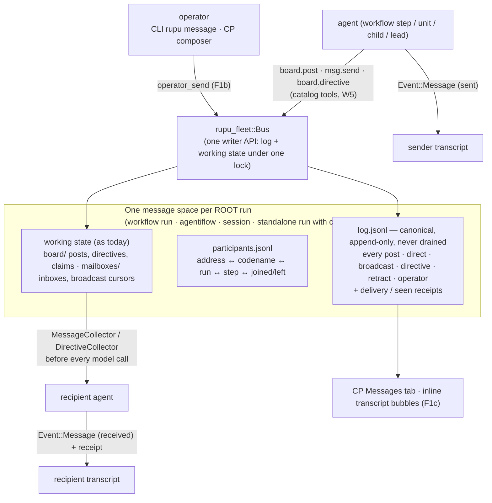

# F1 (feature): messaging for every run kind (overview)

- **Cards:** [F1a](F1a-message-space-and-delivery.md) → [F1b](F1b-operator-participant.md) → [F1c](F1c-messages-ui.md)
- **Depends on:** W1–W7. The F-specs are written **against the post-refactor architecture** and use its types directly: `ToolCatalog`, `ResolvedGrant`, `RunAssembler`/`Origin`, `rupu_fleet::Bus`, `Launcher` + the children ledger, codenames for every participant (matt, 2026-10-07: "it is ok if we depend on new code since we will change a lot now").
- **Status:** draft for matt's review. The four open questions from the first brief are decided in §4. matt can override any of them.

## 1. What matt asked for (2026-10-07)

1. Agents in a **workflow** (parallel branches, fan-out units, a long-running step, children launched with `dispatch`) talk to each other in real time through the **board** and **mailboxes**, as agentiflow agents do.
2. Messages are **part of the transcript**: they belong to an agent's living history, and the UI shows them there with an identifiable, nicer presentation.
3. The **Messages tab shows everything**. Today it shows only board posts and directives: not direct messages, broadcasts, or the operator's own steering.
4. The **operator is a participant**: they can message the lead, any agent, a role or everyone, in any run kind.
5. A workflow can have a **lead-shaped step** if someone wants one. That already falls out of W5 + W7 (any agent can be granted `dispatch`, `board.directive`, …) once F1 gives workflows a message space.

## 2. What exists today (from the deep dive)

Ten separate operator↔agent and agent↔agent channels exist (00-index §3.4). The problems F1 must close:

| # | Problem | Closed by |
|---|---|---|
| M1 | Direct `msg.send`, broadcasts and operator steering are invisible in the CP. Inboxes are destructively drained, so delivered messages can't be shown afterwards | F1a log, F1c |
| M2 | Collector injections aren't recorded in transcripts (`collector.rs:13` claims they are, `collectors.rs:31` correctly says they aren't), so replay diverges from what the model saw | F1a `Event::Injected` |
| M3 | Dead letters: `msg.send` to `parent` or to a role is never drained; role-addressed directives never match (`role` is always `None`); workflow units' `--fleet-participant` is discarded | F1a addressing + delivery status |
| M4 | Identities differ per channel: steering has no author, directives always say `"lead"` (W5 fixes), participants are `<agent>#n` rather than codenames, and mailbox sanitizing collides `recon#1` with `recon-1` | F1a addresses = codename roles |
| M5 | Two meanings of "broadcast" (a post with no `addressed_to` vs the broadcast log) | F1a: one `broadcast` kind |
| M6 | The operator can only reach an agentiflow **lead** (steering) or a **session** (a new turn). There is no path to a unit, a workflow step or a child | F1b |
| M7 | Operator steering and agent messages use different framings and stores, and `--now` exists only for the lead | F1b |

## 3. The shape

**One sentence:** every root run has one message space; everything said in it goes through `Bus` into one append-only log; agents receive messages through collectors before each model call; both sides' transcripts record the message; and the UI reads the log.

## 4. Decisions (the brief's open questions, decided)

| # | Question | Decision | Why |
|---|---|---|---|
| FD1 | Does a standalone `rupu run` with no children get a message space? | **Yes, lazily.** It is created on the first message (an operator send or a child launch), never eagerly. | The operator steering a long single agent is a real use (matt: "send messages to the lead or anyone we want"). Lazy creation costs nothing for runs that never use it |
| FD2 | How does a workflow opt its agents into messaging without editing agent files? | **A workflow-level `messaging:` key** (`messaging: true`, or `messaging: { tools: [...] }`) grants the messaging set to every agent step and unit as an ambient grant (reason `ambient:workflow_messaging`). No general per-step `grants:` key. Agents can still opt in individually via `tools:` | Narrow and explicit (YAGNI on a general grants key). Recorded in the `ToolGrant` event, so it's auditable |
| FD3 | Retention | **The log is not count-capped.** A size cap `[messaging].log_max_mb` (default 64) makes further sends fail *to the sender* with an explicit error plus a `messaging_full` notice. Inbox delivery caps (256) and the broadcast cap stay as backpressure | The log is the audit record; silently trimming it would recreate M1 |
| FD4 | Does "now / urgent" interrupt mid-tool-call? | **No.** Every message is delivered before the recipient's **next model call** (collectors already run before each LLM request). `urgent: true` sorts it first and marks it urgent. For an agentiflow lead it also ends the current round early (today's `--now` behaviour) | Interrupting a tool mid-flight (e.g. a long `bash`) risks half-applied effects. Per-model-call delivery is already "real time" for agents |
| FD5 | Framing | **Agent → agent = untrusted data** (today's `wrap_injection` framing). **Operator → agent = an operator instruction** (a distinct, trusted framing, as steering is today). The `from` field is set by the writer API from the caller's identity, never from tool input | Prompt-injection hygiene: one agent must not be able to command another as if it were the operator |
| FD6 | Cross-root messaging (a parent workflow talking to a dispatched child *workflow* or *agentiflow*) | **Not in F1.** In-process sub-agents and process `agent` children **share their parent's root** (they get `--message-space`). `workflow` and `agentiflow` children are their own roots. F2 adds parent ↔ child-flow messaging | Keeps F1's addressing unambiguous: one root, one participant set |
| FD7 | Remote placed units (`host:`/`distribute:`) | **No message space** (W2's `tool_unavailable` notice). A transport is a later spec | Same honesty rule as P7 |

## 5. Card order and scope

| Card | Scope | Blocks |
|---|---|---|
| **F1a** | Message space, log, participants, addresses, one writer API, delivery + receipts, transcript `Message`/`Injected` events, collectors for every origin, workflow `messaging:` key, `--message-space` for process children | F1b, F1c |
| **F1b** | Operator as a participant: `operator_send`, framing, `urgent`, `rupu message` CLI, CP `GET/POST …/messages` for runs/sessions/flows, steering folded in, remote-host contract | F1c |
| **F1c** | Web: Messages tab for workflow runs + sessions, MessageFeed on the log (all kinds), the composer with a recipient picker, inline transcript message bubbles + injected-context chips, cross-links. **GUI: stops for matt's visual check** | — |
| **F2** | [Ephemeral agentiflows as a dispatch kind](F2-dispatch-agentiflow.md) (`dispatch {kind: agentiflow}` + `agentiflows.draft`) | — (needs F1a for parent ↔ child-lead messaging) |
