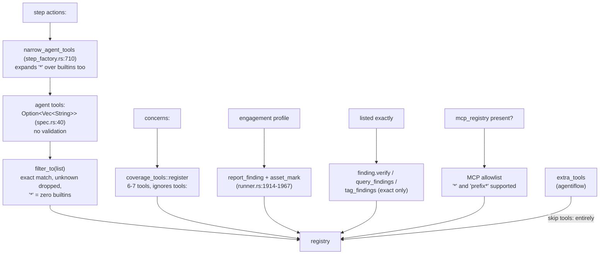
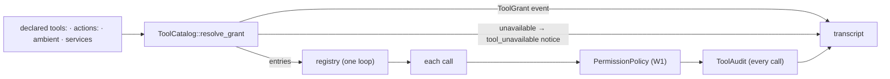

# W2: One grant resolver (what an agent may call)

- **Card:** W2 · **Depends on:** W1 · **Blocks:** W3, W4
- **Principles:** P4 · **Decisions:** D8, D9, D10
- **Fixes:** T7, T8, T9, T10

## 1. Goal

One function decides which tools reach the model. It computes this from the agent's `tools:`, the step's `actions:`, explicit ambient grants (`concerns:`, an engagement, the run's origin) and the run's available services. The result, a `ResolvedGrant`, is the *only* input to registry construction. It is written to the transcript, and every call is audited against it.

## 2. Today: six rules in four places



These produce the inconsistencies in T7–T10. For example, an agent with `tools: ["*"]` gets **no builtins** in `rupu run` but **all nine** when its step has an `actions:` list.

## 3. Design

### 3.1 Grant grammar (D9)

A `tools:` entry is one of:

| Entry | Means |
|---|---|
| `bash`, `findings.report`, … | that canonical tool |
| `report_finding`, `dispatch_agent`, … | an alias, resolved to its canonical tool |
| `findings.*`, `scm.*`, `board.*` | every catalog tool in that namespace (prefix up to a `.`) |
| `core.*` | the unqualified core tools (`bash`, `read_file`, `write_file`, `edit_file`, `grep`, `glob`, `ast_grep`) |
| `*` | the whole catalog |
| anything else | **load error** (D8): `unknown tool "repot_finding" in tools: (did you mean "report_finding" → findings.report?)` |

**Omitted `tools:`** resolves to `DEFAULT_GRANT`, which reproduces today's no-list behaviour: `core.*`, `dispatch`, `join`, `scm.*`, `issues.*`, `github.*`, `gitlab.*`. The constant lives in `rupu-tools/src/grant.rs`, with a comment that this is a compatibility default.

**Wildcards add only tools that this run can serve.** A wildcard never puts a tool in front of the model when its required service is missing. `*` in a plain `rupu run` therefore yields no `board.*`. Wildcard tools left out this way are recorded in the grant as `skipped: missing service`; they produce no notice, because nobody asked for them by name.

**A tool named explicitly whose service is missing** is *not* offered, and produces one `tool_unavailable` notice that names the tool and the service (P7). Example: an agent lists `board.post` and runs under plain `rupu run`, where there is no message bus until F1.

> **As built (W2 PR).** Where the code refines this section:
> - **Required vs optional services.** W1 put optional instrumentation in `needs` (`read_file` → coverage emit, `bash` → netflow capture), which would have withheld core tools from most runs. Descriptors now carry `needs` (required; the grant checks these) and `uses` (fed when present, never a reason to withhold).
> - **Exact services, no post-hoc drops.** Two services were added so the grant can't offer a tool the run can't build: `Service::AgentDispatcher` (the in-process `dispatch_agent*` port; W7 folds it into `Launcher`, which today means the agentiflow unit supervisor) and `Service::Engagement` (`assets.mark` needs Findings + Engagement). Injected tools (`extra_tools`) are self-served ambient grants (`origin:injected`): offered without a service check, because the tool *is* its implementation; a wildcard never drags in a non-injected flow tool. A granted tool the runner can't build is a `RunError::ToolGrant` (a bug), never a silent drop.
> - **`DEFAULT_GRANT`** is `core.*`, `dispatch_agent`, `dispatch_agents_parallel`, `scm.*`, `issues.*`, `github.*`, `gitlab.*` — today's no-list registry; W7 swaps the dispatch pair for `dispatch`/`join`.
> - **Load-time validation** lives in `load_agent` / `load_agent_admitted` (launch paths) → `AgentLoadError::UnknownTool`. Listings (`load_agents`, `find_agent`) only parse, so one bad file never hides or breaks the others; the CP DTO carries `load_error`, CP create/save refuse it (400), `agent create`/`edit` warn after saving.
> - **`actions:`** also rejects an entry naming no connector tool (`bash`, `findings.*`): it would be a silent no-op. A step naming a connector the agent lacks logs one warning per run (it was a per-call warning in the old audit wrapper).
> - **Audit.** The runner writes every `tool_audit` itself (decision `allowed` / `denied:readonly|operator|operator_stop|tool` / `not_granted`); the orchestrator's audit wrapper is deleted, `on_tool_call` passes through. `tool_grant` also records `skipped`. Views show only notable audits (denied, or an `actions:` entry the agent wasn't granted): the CLI printers via `rupu_transcript::grant`, the web tool card drops its neutral "audited" chip.
> - The agentiflow lead's hand-appended `report_finding` is gone: the lead always runs under an engagement, whose ambient grant offers `findings.report` + `assets.mark`, visibly.

### 3.2 `actions:` narrowing: one rule, kept as today's intended semantics

`actions:` narrows **connector tools** only. Builtins are never narrowed (see [[project-step-actions-enforcement]]). Connector tools are the tools whose descriptor `needs` includes `Service::Scm`. The rule is:

```
effective = (G \ Connector) ∪ (G ∩ Connector ∩ actions)
```

Here `G` is the resolved grant. Because `G` is computed by the same grammar whether or not `actions:` is present, the "`*` gains builtins" bug disappears: `*` always means the whole catalog. Narrowing only ever *removes* connector tools.

`validate_step_actions` (`rupu-orchestrator/src/workflow.rs:1598`) keeps rejecting unknown names in `actions:`. It now uses the same vocabulary (`ToolCatalog::resolve_name`) and accepts aliases and namespace wildcards (`issues.*`).

### 3.3 Ambient grants (D10)

The assembler (W3) passes a list of `AmbientGrant { tools: &[&str], reason: GrantReason }`. Until W3 lands, the runner builds the list directly. The sources are fixed and enumerable:

| Source | Grants | Reason recorded |
|---|---|---|
| `concerns:` present | `coverage.mark`, `coverage.status`, `coverage.remaining`, `coverage.concerns.search`, `coverage.concerns.detail`, `findings.report` | `ambient:concerns` |
| engagement profile active | `findings.report`, `assets.mark` | `ambient:engagement` |
| run origin (W5: agentiflow lead / unit) | the origin's coordination set (see W5) | `origin:flow_lead` / `origin:flow_unit` |

Ambient grants are additive and **not** subject to `actions:` narrowing, because none of them are connector tools.

### 3.4 Types (`crates/rupu-tools/src/grant.rs`, new)

```rust
pub struct GrantInputs<'a> {
    pub declared: Option<&'a [String]>,     // agent tools:, None = DEFAULT_GRANT
    pub step_actions: &'a [String],         // empty = no narrowing
    pub ambient: &'a [AmbientGrant],
    pub available: &'a ServiceSet,          // which Services this run provides
    pub alias_scope: AliasScope,            // e.g. FlowLead for the coverage.status alias
}

pub enum GrantReason { Declared, DeclaredWildcard(String), Default, Ambient(&'static str), Origin(&'static str) }

pub struct GrantEntry { pub canonical: &'static str, pub reasons: Vec<GrantReason> }

pub struct ResolvedGrant {
    pub entries: BTreeMap<&'static str, GrantEntry>,     // offered to the model
    pub narrowed: Vec<&'static str>,                     // removed by actions:
    pub unavailable: Vec<(&'static str, Vec<Service>)>,  // named but service missing → notice
    pub skipped: Vec<(&'static str, Vec<Service>)>,      // wildcard-expanded, service missing
}

pub enum GrantError { UnknownTool { name: String, suggestion: Option<String> }, UnknownNamespace(String) }

impl ToolCatalog {
    pub fn resolve_name(&self, name: &str, scope: AliasScope) -> Option<&'static ToolDescriptor>;
    pub fn resolve_grant(&self, inputs: GrantInputs) -> Result<ResolvedGrant, GrantError>;
}
```

### 3.5 Where validation happens

- **At load.** `rupu_agent::load_agent*` validates `tools:` names with `ToolCatalog::validate_names`, which checks names only (no services). An unknown name is an `AgentLoadError::UnknownTool`.
  - Before W4, the name universe is the `rupu-tools` catalog ∪ `rupu_mcp::tool_catalog()` names. `rupu-agent` already depends on `rupu-mcp`. After W4 it is just the catalog.
- **At workflow parse:** `validate_step_actions`, as in §3.2.
- **New command `rupu agent validate [<name> | --all]`.** It loads every agent in global + project scope and reports each one with errors, exiting nonzero if any fail. It exists so matt can check `~/.rupu/agents` (the oracle-* security agents live there, outside the repo: [[project-oracle-security-agents-location]]) before taking a beta with this card. The CP Library page shows the same error on the agent's detail.

### 3.6 Registry construction and audit

In `rupu-agent/src/runner.rs` (`:1719–2063`), the five registration blocks (builtins filter, coverage register, findings-without-coverage, exact-listed findings, MCP allowlist loop, `extra_tools`) are replaced by **one loop over `ResolvedGrant.entries`**. Each entry takes its implementation from the one place that currently provides it. After W4/W5 there is only one place, `ToolCatalog::instantiate`.

At run start the runner writes a new transcript event:

```rust
Event::ToolGrant { entries: Vec<{tool, reasons}>, narrowed, unavailable }   // once per run
```

`ToolAudit` gets two optional fields, `reason` (the grant reason) and `decision` (`allowed` / `denied:<reason>` / `not_granted`), both `#[serde(default, skip_serializing_if)]`. It is now emitted for **every** tool call (fixes T10): builtins, coverage, findings, flow and MCP alike, and calls denied by `PermissionPolicy` too. The orchestrator's `wrap_on_tool_call_with_audit` (`step_factory.rs:863`) stops filtering to catalog tools; it only maps step context. Old readers see the extra fields as unknown keys and ignore them.



## 4. Files

| File | Change |
|---|---|
| `rupu-tools/src/grant.rs` | **new**: grammar, `DEFAULT_GRANT`, `resolve_grant`, `validate_names`, did-you-mean (edit distance ≤ 2 over canonical names + aliases) |
| `rupu-tools/src/catalog.rs` | **new** (or extend W1's): `ToolCatalog` with descriptor lookup by canonical/alias/namespace |
| `rupu-agent/src/spec.rs`, `loader.rs` | load-time validation; `AgentLoadError::UnknownTool` |
| `rupu-agent/src/runner.rs` | one registration loop; `ToolGrant` event; `tool_unavailable` notice; audit every call |
| `rupu-agent/src/tool_registry.rs` | `filter_to` **deleted**; registry built from a grant |
| `rupu-orchestrator/src/step_factory.rs` | `narrow_agent_tools`, `expand_grant`, `builtin_tool_names`, `catalog_tool_names` **deleted**; the step passes `actions:` into `GrantInputs` |
| `rupu-orchestrator/src/workflow.rs` | `validate_step_actions` uses `resolve_name` |
| `rupu-transcript/src/event.rs` | `ToolGrant` variant; `ToolAudit.{reason, decision}` |
| `rupu-cli/src/cmd/agent.rs` | `validate` subcommand |
| `rupu-cp` | the agent detail shows load errors (the agent DTO already carries an error string; verify, else add `load_error`) |
| `docs/transcript-schema.md`, agent-format docs | grammar + new events |

## 5. Deleted

`filter_to`, `narrow_agent_tools`, `expand_grant`, `builtin_tool_names`, `catalog_tool_names`, `mcp_tool_name_matches_allowlist` (`runner.rs:3446`), and the separate registration blocks for coverage, findings and the MCP allowlist in `run_agent_inner`. `extra_tools` keeps working until W5, but the resolver records its tools as `GrantReason::Origin("injected")`, so they are audited too.

## 6. Tests

1. **`grant_grammar`** (`rupu-tools`): a table of input → resolved set covering exact, alias, `ns.*`, `core.*`, `*`, omitted (= `DEFAULT_GRANT`), unknown → error with suggestion, unknown namespace → error.
2. **`star_means_catalog_everywhere`**: `*` with and without `actions: [issues.get]` yields the same non-connector set, and the second yields only `issues.get` among connectors (regression for T8).
3. **`wildcard_skips_missing_service`**: `*` with no MessageBus → no `board.*` entries, no notice. Explicit `board.post` → not offered + one `tool_unavailable` notice.
4. **`ambient_is_visible`**: `concerns:` + `tools: [read_file]` → `coverage.*` entries carry `Ambient("concerns")` in the `ToolGrant` event.
5. **`unknown_tool_fails_load`** (`rupu-agent`): an agent with `tools: [repot_finding]` fails to load with the suggestion text.
6. **`audit_every_call`** (`rupu-agent`): a mock-provider run calling `read_file` (allowed), `write_file` under readonly (denied) and an ungranted name → three `ToolAudit` lines with the right `decision`.
7. **`shipped_agents_validate`** (`rupu-cli` it): every agent in `templates/fleet/` and the repo's `.rupu/agents/` passes `validate_names`. This extends the existing `fleet_bundle_coverage` lockstep.

## 7. Acceptance

- `rupu agent validate --all` passes on the repo, the stock fleet and matt's `~/.rupu` (matt runs that last check himself).
- The transcript of any run shows exactly which tools the model had and why.
- `grep -rn "filter_to\|narrow_agent_tools" crates/` returns nothing.
