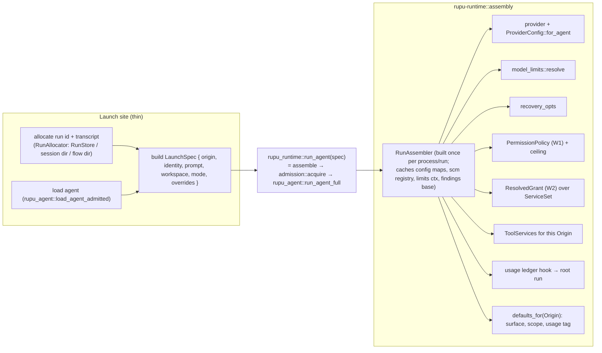

# W3: One run assembler (W3a + W3b)

- **Cards:** **W3a** (assembler + `rupu run` + sub-agent + session) · **W3b** (workflow steps + agentiflow lead + deletions)
- **Depends on:** W1, W2 · **Blocks:** W4, W5, W7
- **Principles:** P5, P6, P9 · **Decisions:** D13, D14
- **Fixes:** R1, R3–R13 (R2 already lands in W1), plus P9 (CLI-thin) violations

## 1. Goal

A launch site says *what* it wants: this agent, this origin, this identity, this prompt, in this workspace. A single `RunAssembler` derives everything else: provider, limits, recovery, permission, grant, services, findings, netflow, bash config, usage ledger, codename and admission. Fields can then no longer drift between sites, and adding a launch site means adding an `Origin` variant.

## 2. Today: five hand-built literals

| Field | A `rupu run` | B sub-agent | C session | D workflow step | E lead |
|---|---|---|---|---|---|
| provider config | own literal | maps | **no openai-compat** | maps | closure |
| model limits | resolve (pins-aware) | resolve | stored/resolve | resolve | **`unknown()`** |
| recovery | `recovery_opts` | `recovery_opts` | `recovery_opts` | `recovery_opts` | **`Default`** |
| MCP | discover | parent's | discover | discover | **None** |
| findings base | `base_options` | parent's | **no engagement** | `base_options` | **skips `base_options`** |
| netflow on ToolContext | yes | yes | yes | yes | **no** |
| bash config | `[bash]` | **empty / 120 s** | `[bash]` | `[bash]` | **default** |
| scope / surface | fleet / — | **None / None** | session | workflow | flow / — |
| frontmatter pins | `AgentPins` | spec | record | spec | **all None** |
| dispatcher | yes | self | **None** (advertises dispatchable) | yes | None |
| usage ledger | fleet units only | root if any | **None** | `ledger_hook` | lead ledger |
| codename | standalone | namer | record | patched later | **None** |
| admission | — | — | — | **only here** | — |

Sources: `cmd/run.rs:1230`, `cmd/dispatch.rs:462`, `cmd/session.rs:7978`, `step_factory.rs:490` + `orchestrator runner.rs:9883 dispatch_one`, `rupu-agentiflow/src/lead.rs:585`.

On top of that, `CliAgentDispatcher::new` (21 args) is constructed 4×, and `DefaultStepFactory {…}` is constructed 3× with the same config maps (`workflow.rs:3773/3836`, `:5629/5700`, `resume.rs:466/528`, `run.rs:1077`).

## 3. Design

### 3.1 Shape



There is **one entry point for running an agent**: `rupu_runtime::run_agent(spec, &assembler) -> RunExit`. It assembles, takes an admission slot (fixes R9), and calls `rupu_agent::run_agent_full`. `rupu_agent::run_agent*` stays public for tests (the mock provider) and is otherwise only called from here.

### 3.2 Types (`crates/rupu-runtime/src/assembly/`, new module)

```rust
/// Why this run exists. Decides per-kind defaults. Adding a launch site = adding a variant.
pub enum Origin {
    Standalone { placed: Option<PlacedUnit> },        // rupu run; CP local launch; SSH/tunnel/bucket unit
    WorkflowStep { workflow_run_id: String, workflow_name: String, step_id: String,
                   unit: Option<UnitKey>, step_actions: Vec<String> },
    SubAgent { parent: ParentLink },                  // dispatch kind: subagent (W7)
    SessionTurn { session_id: String, turn: u32 },
    FlowLead { flow_id: String, round: u32 },
    FlowUnit { flow_id: String, participant: String },// rupu run --fleet-*
}

/// Set once, never overwritten (P6). Replaces ToolContext's identity fields and
/// AgentRunOpts' duplicates.
pub struct RunIdentity {
    pub run_id: String,
    pub codename: Option<Codename>,
    pub agent: String,
    pub provider: String,       // filled by the assembler
    pub model: String,          // filled by the assembler
    pub depth: u32,
    pub parent: Option<ParentLink>,     // { run_id, codename, root_run_id }
    pub surface: Surface,               // Agent | Workflow | Session | Agentiflow
    pub scope_name: Option<String>,     // findings scope
    pub spawn_ceiling: PermissionMode,  // from W1
}

pub struct LaunchSpec {
    pub agent: AgentSpec,
    pub origin: Origin,
    pub run_id: String,
    pub transcript_path: PathBuf,
    pub codename: Option<Codename>,
    pub prompt: UserTurn,               // message, initial_messages, seed_source, turn_index_offset
    pub workspace: WorkspaceBinding,    // { id (from WorkspaceStore::upsert), path }
    pub mode: PermissionMode,
    pub ceiling: Option<PermissionMode>,// a parent's cap (SubAgent, FlowUnit via argv)
    pub prompter: Option<Arc<dyn Prompter>>,
    pub overrides: Overrides,           // provider, model, system_prompt_suffix, max_turns,
                                        // findings_profile, engagement_profiles, limits pins
    pub stream: StreamOpts,             // no_stream, suppress_stdout, on_stream_event
    pub hooks: Hooks,                   // on_tool_call (step audit wrapper), extra on_usage
    pub pause: Option<CancellationToken>,
    pub extra_services: ServiceSet,     // provided by the origin's owner (W5: MessageBus, RunStatus)
    pub collectors: Vec<Arc<dyn TurnCollector>>,
    #[cfg(any(test, feature = "test-support"))]
    pub provider_override: Option<Box<dyn LlmProvider>>, // mock provider seam
}

pub struct RunAssembler { /* Arc<Config>, ConfigPaths, resolver, provider maps,
                              LimitsContext, findings_base, Arc<rupu_scm::Registry>,
                              netflow factory, usage root resolver */ }

impl RunAssembler {
    pub fn new(ctx: AssemblyContext) -> Result<Self, AssembleError>;
    pub async fn assemble(&self, spec: LaunchSpec) -> Result<AssembledRun, AssembleError>;
}
```

### 3.3 The per-origin defaults table (the single place they live)

`RunAssembler::defaults_for(&Origin)` is the one `match`. It must cover every field the old sites disagreed on:

| | Standalone | WorkflowStep | SubAgent | SessionTurn | FlowLead | FlowUnit |
|---|---|---|---|---|---|---|
| `surface` | Agent | Workflow | parent's | Session | Agentiflow | Agentiflow |
| `scope_name` | none (placed: from argv) | override, else workflow name | **parent's** (fixes R4) | session id | flow id | flow id |
| usage ledger root | own run dir | workflow run dir | **parent's root** | session dir | flow dir | flow dir (via `--usage-root`, W7) |
| coverage stream | when placed | — | parent's | — | — | when placed |
| MCP / SCM | yes | yes | yes | yes | **yes** (fixes R6) | yes |
| launcher service | yes | yes | yes | **yes** (fixes R7) | yes (W7) | yes |
| findings options | `base_options` + engagement + profile | same + step profile | parent's + child profile | **+ engagement** (R7) | **`base_options`** (R5) | same as Standalone |
| netflow | per run | per step | per child | per turn | **per round** (R5) | per run |
| bash config | `[bash]` | `[bash]` | **`[bash]`** (R3) | `[bash]` | **`[bash]`** | `[bash]` |
| frontmatter pins | `AgentPins` | `AgentPins` | `AgentPins` | record, else `AgentPins` | **`AgentPins`** (R5) | `AgentPins` |
| admission | yes | yes | yes | yes | yes | yes |

`AgentPins` (today in `cmd/run.rs`, which drops model-specific pins on a `--model` override) moves into the assembler and applies to every origin.

### 3.4 Provider config, once (R10, R7)

`ProviderConfig::for_agent(&spec, &maps, &overrides)` in `rupu-runtime/src/provider_factory.rs` replaces the five literals and the half-used `provider_config_for`. It sets `oauth_prefix`, `prompt_cache`, `anthropic_server_side_fallback`, `openai_compatible` (sessions included now), `tuning` and `kind`. `hop_builder` uses the same function for fallback hops, so the origin hop and fallback hops cannot disagree.

### 3.5 `AgentRunOpts` and `ToolContext` after W3

```rust
pub struct AgentRunOpts {
    pub identity: Arc<RunIdentity>,
    pub system_prompt: String,          // agent prompt + suffix, assembled
    pub prompt: UserTurn,
    pub provider: Box<dyn LlmProvider>,
    pub limits: ModelLimits,
    pub recovery: RecoveryOpts,
    pub permission: PermissionPolicy,
    pub grant: ResolvedGrant,
    pub tool_context: ToolContext,
    pub pins: AgentPins,                // effort, thinking_display, context_window, output_*, anthropic_*
    pub concerns: Option<Concerns>,
    pub max_turns: u32,
    pub stream: StreamOpts,
    pub hooks: Hooks,                   // on_tool_call, on_stream_event, on_usage
    pub pause: Option<CancellationToken>,
    pub collectors: Vec<Arc<dyn TurnCollector>>,
    pub transcript_path: PathBuf,
}

pub struct ToolContext {
    pub identity: Arc<RunIdentity>,
    pub workspace: WorkspaceScope,      // { id, path, bash: BashConfig { env_allowlist, timeout_secs } }
    pub services: ToolServices,         // Option<...> per Service (W1 enum), customer
    pub call: CallContext,              // { tool_call_id } — set per call by the loop
}
```

**Removed fields.**
- From `AgentRunOpts`: `agent_name`, `provider_name`, `model`, `run_id`, `workspace_id`, `workspace_path`, `codename`, `parent_run_id`, `depth`, `dispatchable_agents`, `step_id`, `scope_name`, `surface_tag`, `mode_str`, `decider`, `mcp_registry`, `agent_tools`, `extra_tools` (W5).
- From `ToolContext`: the flat identity fields that the runner used to overwrite, and `tool_mappings` (dead, T13 — deleted here or in W4).

`dispatchable_agents` moves into `ToolServices.launcher`'s policy (W7). Until W7 it lives on `RunIdentity`.

### 3.6 Per-site migration

| Site | After |
|---|---|
| A `rupu run` (`cmd/run.rs`) | parse args → `LaunchSpec { origin: Standalone or FlowUnit }` → `rupu_runtime::run_agent`. `fleet_attachment` moves to `rupu-agentiflow` as `FlowUnitServices::for_participant` (P9) and is passed as `extra_services` + `collectors` |
| B sub-agent (`cmd/dispatch.rs`) | `CliAgentDispatcher` moves to `rupu-runtime::dispatch::InProcessDispatcher` (P9; W7 renames it and moves it to `rupu-launch`), holding `Arc<RunAssembler>`. Its 21-argument constructor becomes `InProcessDispatcher::new(Arc<RunAssembler>, RunStore, namer)` |
| C session (`cmd/session.rs::run_turn`) | `Origin::SessionTurn`; the stored `session.model_limits` is passed as an override pin |
| D workflow (`step_factory.rs`, `dispatch_one`) | `DefaultStepFactory` holds `Arc<RunAssembler>`; `build_opts_for_step` returns a `LaunchSpec`; `dispatch_one` adds pause/seed/codename to the spec (not to built opts) and calls `rupu_runtime::run_agent`. The 3 construction sites in `workflow.rs`/`resume.rs` share one `WorkflowRuntime::new(cfg, run) -> (Arc<RunAssembler>, InProcessDispatcher, DefaultStepFactory)` helper in `rupu-runtime` or `rupu-orchestrator` |
| E lead (`lead.rs`) | `Origin::FlowLead`. The lead now gets real limits + recovery + MCP + pins + findings base (R1, R5, R6), a codename minted at flow start (`AgentiflowRecord.codename` set, crew from the flow id), and a real `WorkspaceStore::upsert` id instead of `ws_<target_id>` |

**Failure stubs.** `agent_load_error_stub` / `provider_build_error_stub` (`step_factory.rs`) become `AssembleError` variants. The step turns them into the same failed-step result and transcript sequence the stubs produce today. A test pins that sequence before and after.

**R8 (resume loses `system_prompt_suffix`).** Add `RunRecord.system_prompt_suffix: Option<String>` (`#[serde(default, skip_serializing_if)]`), written at launch. `resume_run` and `rebuild_opts_from_disk` pass it back as `Overrides.system_prompt_suffix`.

**R13 (usage).** Every origin gets a ledger hook. Before landing, check `rupu-cp/src/usage_index.rs`: wherever the CP currently *estimates* a session or standalone run's usage from its transcript, a ledger for that run must take precedence, never be added to the estimate. Test `usage_not_double_counted` (§6).

## 4. Files

| File | Change |
|---|---|
| `rupu-runtime/src/assembly/{mod,origin,spec,defaults,services}.rs` | **new** |
| `rupu-runtime/src/provider_factory.rs` | `ProviderConfig::for_agent`; `provider_config_for` → deleted or delegating |
| `rupu-runtime/src/dispatch.rs` | **new**: `InProcessDispatcher` (moved from `rupu-cli/src/cmd/dispatch.rs`) |
| `rupu-agent/src/runner.rs` | the new `AgentRunOpts`; no identity overwrites; reads `opts.identity` |
| `rupu-tools/src/tool.rs` | `ToolContext` split (`RunIdentity` is defined here, since it is the lowest crate both sides see; `rupu-runtime` constructs it) |
| `rupu-cli/src/cmd/{run,session,dispatch,workflow}.rs`, `rupu-cli/src/resume.rs` | thin: build `LaunchSpec`, call `run_agent` |
| `rupu-orchestrator/src/{step_factory,runner}.rs` | factory → `LaunchSpec`; `dispatch_one` → `rupu_runtime::run_agent` |
| `rupu-orchestrator/src/runs.rs` | `RunRecord.system_prompt_suffix` |
| `rupu-agentiflow/src/{lead,run}.rs` | `Origin::FlowLead`; codename; workspace upsert. `fleet_attachment` moved here from rupu-cli |
| `rupu-cp/src/usage_index.rs` | ledger precedence (only if the check in §3.6 finds an additive path) |

## 5. Deleted

Five `AgentRunOpts` literals and five `ToolContext` literals in production code · `CliAgentDispatcher` in `rupu-cli` · `fleet_attachment` in `rupu-cli` · `agent_load_error_stub` / `provider_build_error_stub` · the runner's identity-overwrite block (`runner.rs:1835–1855`) · `AgentRunOpts`' duplicate fields · `ToolContext.tool_mappings` · the hand-written `ProviderConfig { … }` literals.

## 6. Tests

1. **`origin_matrix`** (`rupu-runtime` it): assemble each `Origin` against a fixture config and snapshot (insta) the derived fields from §3.3. Any change to a default shows up as a snapshot diff.
2. **`no_hand_built_run_opts`** (`rupu-runtime` it): scan `crates/*/src/**/*.rs` (excluding `rupu-runtime/src/assembly` and `#[cfg(test)]` modules) for `AgentRunOpts {` and `ToolContext {`, and fail on any hit. This is the guard that keeps P5 true.
3. Regression tests, one per fixed bug:
   - `lead_gets_limits_and_recovery` (R1)
   - `subagent_reads_bash_config` (R3)
   - `subagent_findings_scope_is_parents` (R4)
   - `lead_findings_base_options` (R5)
   - `lead_has_codename_and_mcp` (R6)
   - `session_openai_compat_and_dispatch` (R7)
   - `resume_keeps_system_prompt_suffix` (R8)
   - `admission_for_every_origin` (R9)
   - `session_usage_recorded` (R13)
4. **`step_failure_stub_sequence_unchanged`**: an agent-load failure in a workflow step produces the same events and transcript lines as before.
5. **`usage_not_double_counted`** (`rupu-cp` it): a session run with a ledger and a transcript is counted once.

## 7. Acceptance

- Test 2 passes, so no production site hand-builds run options.
- The §2 matrix has no bold cells left.
- CLAUDE.md is updated: `rupu-runtime` gains the assembler entry, and the `rupu-cli` "thin" note no longer has exceptions.
- **W3a/W3b split.** W3a lands the assembler and migrates A, B and C (keeping a temporary adapter so D and E compile unchanged). W3b migrates D and E and deletes the adapter. Each is one PR.
