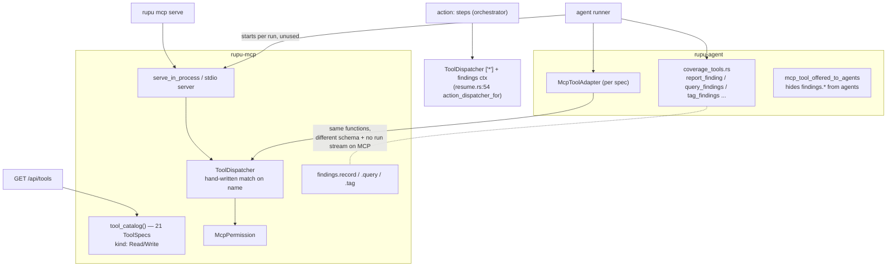
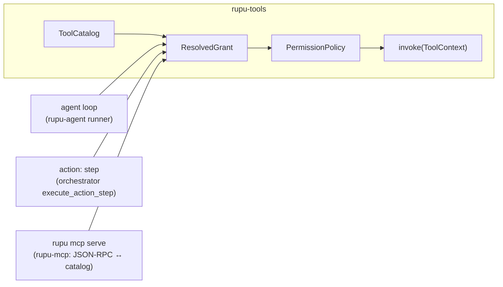

# W4: MCP is a transport, findings are implemented once

- **Card:** W4 · **Depends on:** W1, W2, W3 · **Blocks:** W5
- **Principles:** P1, P2 · **Decisions:** D2, D12
- **Fixes:** T1 (MCP + coverage homes), T11, T12, T13, T14

## 1. Goal

`rupu-mcp` stops owning tools. The SCM/issues/extras tool bodies and the coverage/findings tool bodies move into the `rupu-tools` catalog. The agent loop, `action:` workflow steps and `rupu mcp serve` all call the same `Tool` instances through the same grant and permission path. Findings (report, query, tag) end up with one implementation and one schema.

## 2. Today

## 3. Design

### 3.1 Tool bodies move into `rupu-tools`

| From | To |
|---|---|
| `rupu-mcp/src/tools/{scm_repos,scm_branches,scm_files,scm_prs}.rs` | `rupu-tools/src/scm/*.rs` |
| `rupu-mcp/src/tools/issues.rs` | `rupu-tools/src/issues/*.rs` |
| `rupu-mcp/src/tools/{github,gitlab}_extras.rs` | `rupu-tools/src/{github,gitlab}/*.rs` |
| `rupu-agent/src/coverage_tools.rs` (coverage half) | `rupu-tools/src/coverage/*.rs` |
| `rupu-agent/src/coverage_tools.rs` (findings half) + `rupu-mcp/src/tools/findings.rs` | `rupu-tools/src/findings/{report,verify,query,tag}.rs`, plus `rupu-tools/src/assets/mark.rs` |

Each becomes a `Tool` with its W1 descriptor. SCM tools take `Arc<rupu_scm::Registry>` from `ToolServices.scm` (D2: the registry already is the port). That adds the edge `rupu-tools → rupu-scm`, which creates no cycle (`rupu-scm` depends on netflow/auth/config/providers only).

The `CoverageBundle` / `CoverageWriter` pieces that the coverage tools need move from `rupu-agent` to `rupu-coverage`, which is a pure data crate. `rupu-agent` keeps only the system-prompt guidance assembly.

### 3.2 One findings implementation

- **`findings.report`.** The descriptor's `input_schema` is the *widest* schema (the full profile), used by `/api/tools` and the MCP listing. The **instance** narrows it to the run's `FindingProfile`, so a `summary`-profile run shows the summary schema exactly as today. For that, `Tool::input_schema(&self)` is overridable per instance (W1's provided method). The merged MCP schema in `rupu-mcp/src/tools/findings.rs:48–91` is deleted.
- **`findings.tag`.** Uses `TagLog::for_workspace(..).with_run_stream(stream)` whenever `ToolServices.findings.run_stream` is set. Agents get the stream exactly as today. `rupu mcp serve` has no run, so it has no stream (same behaviour as now, but from one code path).
- **`findings.query`.** One wrapper over `read_workspace_findings` + `query_response`.
- `mcp_tool_offered_to_agents` (`runner.rs:3442`), which hid `findings.*` from agents because they duplicated the native tools, is **deleted**: there is no duplicate anymore.

### 3.3 Three transports, one call path

- **Agent loop:** calls `Tool::invoke` directly (W2's registry loop). `serve_in_process` on the agent path is **deleted** (T12), and with it `McpToolAdapter` and `rupu-agent`'s dependency on `rupu-mcp`.
- **`action:` steps.** `RunWorkflowOpts.action_dispatcher: Option<Arc<rupu_mcp::ToolDispatcher>>` (`rupu-orchestrator/src/runner.rs:590`) becomes `action_services: Option<ToolServices>`. `execute_action_step` resolves the step's tool with `ToolCatalog::resolve_name`, builds a grant `= [the one tool]` narrowed by `actions:` as today, and runs `PermissionPolicy` at the run's mode. It then invokes and writes the `ToolAudit` line it writes today. **Which tools an action step may call:** catalog tools that are not `core.*`, have an effect other than `Spawn`, and whose `needs ⊆ {Scm, Findings, Coverage}`. That is exactly today's set (connector + findings), stated as a rule. `validate_step_actions` enforces it at parse.
- **`rupu mcp serve`.** `rupu-mcp` becomes ~300 lines: the JSON-RPC framing (`server.rs`, `transport.rs`, `schema.rs`) plus a `CatalogServer` that lists the grant's descriptors as MCP tools and forwards `tools/call` to `invoke` through the policy.
  - Flags: `--tools <grant>` (W2 grammar) and `--mode`.
  - Default grant: `MCP_DEFAULT_GRANT = [scm.*, issues.*, github.*, gitlab.*, findings.*]`, today's exposed set.
  - Services: the SCM registry, plus findings for the cwd's workspace.
  - Tools whose service it can't provide (launcher, message bus, run status) are not listed. With `--tools` naming them explicitly, startup prints a `tool_unavailable` line to stderr.

### 3.4 `GET /api/tools` lists the whole catalog (T14)

The DTO per tool is `{ name, aliases, namespace, effect, needs, description, input_schema, action_eligible }`, built from `ToolCatalog::all()`. The workflow editor's action `with:` editor filters by `action_eligible`. The Library agent detail can show each granted tool's effect (a later UI nicety, not this card).

### 3.5 Dead code removed in passing

`ToolContext.tool_mappings` and `load_tool_mappings` (never set in production; this is the coverage path in `McpToolAdapter`), if W3 didn't already remove them.

## 4. Files

| File | Change |
|---|---|
| `rupu-tools/src/{scm,issues,github,gitlab,coverage,findings,assets}/` | **new** (moved bodies) |
| `rupu-tools/Cargo.toml` | `rupu-scm` dependency (workspace dep) |
| `rupu-coverage/src/` | receives `CoverageBundle`/writer pieces from `rupu-agent` |
| `rupu-mcp/src/` | `dispatcher.rs`, `permission.rs`, `tools/` **deleted**. `server.rs` → `CatalogServer`. `serve_in_process` **deleted** |
| `rupu-agent/src/{coverage_tools,mcp_tool}.rs` | **deleted**. `runner.rs` loses the MCP block; `Cargo.toml` loses `rupu-mcp` |
| `rupu-orchestrator/src/runner.rs`, `workflow.rs` | `action_services`; eligibility rule |
| `rupu-cli/src/resume.rs` (`action_dispatcher_for`), `cmd/mcp.rs`, `cmd/workflow.rs` | build `ToolServices` for action steps; `mcp serve` flags |
| `rupu-cp/src/api/tools.rs` | whole-catalog DTO |
| `crates/rupu-cp/web/src/...` workflow editor | read `action_eligible` |
| CLAUDE.md | the `rupu-mcp` entry becomes "MCP transport over the rupu-tools catalog" |

## 5. Deleted

`ToolDispatcher` · `McpPermission` · `rupu-mcp/src/tools/*` · `serve_in_process` · `McpToolAdapter` · `coverage_tools.rs` · `mcp_tool_offered_to_agents` · the merged MCP findings schema · `rupu-agent → rupu-mcp` dependency · `tool_mappings`.

## 6. Tests

1. **`findings_single_impl`** (`rupu-tools`): `findings.report` through the agent loop, through an action step and through `CatalogServer` writes byte-identical ledger lines for the same input. With a run stream, `findings.tag` mirrors to the stream in the agent path.
2. **`action_step_parity`** (`rupu-orchestrator` it): every existing action-step test passes unchanged (behaviour parity), including the `ToolAudit` lines.
3. **`mcp_serve_lists_grant`** (`rupu-mcp` it): with default flags, `tools/list` returns exactly `MCP_DEFAULT_GRANT`'s expansion. `--tools read_file` serves `read_file` against the cwd. `--tools dispatch` prints `tool_unavailable` and doesn't list it.
4. **`summary_profile_schema`**: a summary-profile run's model-facing `findings.report` schema equals today's summary schema (snapshot).
5. **`api_tools_lists_catalog`** (`rupu-cp` it): it includes `bash`, `findings.report`, `board.post` (after W5) and `scm.prs.create`, with effects.
6. Extend W1's **`descriptors_complete`**: no `impl Tool for` exists outside `rupu-tools` except in `#[cfg(test)]` code. This is a source scan, like W3's guard.

## 7. Acceptance

- `grep -rn "impl.*Tool for" crates/ --include=*.rs` outside `rupu-tools` hits only test code.
- `cargo tree -p rupu-agent` no longer shows `rupu-mcp`.
- The CP workflow editor's action picker still offers the same tools as before.
