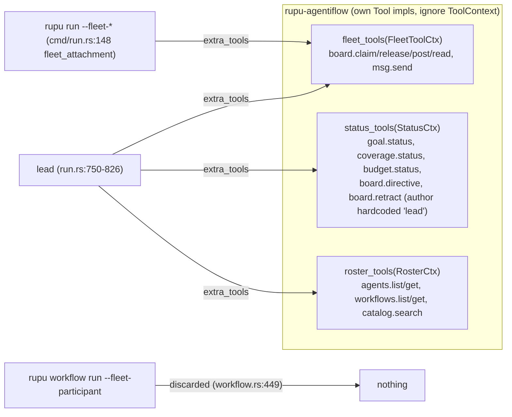

# W5: Flow tools join the catalog; "lead tools" stop being a category

- **Card:** W5 · **Depends on:** W3, W4 · **Blocks:** W7, F1
- **Principles:** P1, P7 · **Decisions:** D1, D2, D10
- **Fixes:** T1 (the agentiflow home), and removes `extra_tools`

## 1. Goal

Every tool that is currently injected into agentiflow agents through `AgentRunOpts.extra_tools` becomes an ordinary catalog tool. The affected tools are the coordination (board/mailbox), roster and status tools. Each declares the service it needs, and any agent can be granted it through `tools:`. An agentiflow lead or unit simply runs with those services present, plus an origin grant that reproduces today's toolset. A "lead" is an agent with grants, and a lead-shaped agent can run anywhere the services exist (matt, 2026-10-07: "a lead is also an agent").

**Not moved here:** the four launch tools `dispatch`, `join`, `run_workflow`, `generate_workflow`. W7 replaces them with the unified `dispatch`/`join`, so moving them twice would be wasted work.

## 2. Today



## 3. Design

### 3.1 Moves

| Tools | From | To | Service (W1 `Service`) | Backing |
|---|---|---|---|---|
| `board.claim`, `board.release`, `board.post`, `board.read`, `msg.send` | `rupu-agentiflow/src/tools.rs` | `rupu-tools/src/board/`, `rupu-tools/src/msg/` | `MessageBus` | `rupu_fleet::{Board, Mailbox}` directly (D2) |
| `board.directive`, `board.retract` | `status_tools.rs` | `rupu-tools/src/board/` | `MessageBus` | same. **Author = the caller's participant id**, no longer hardcoded `"lead"` |
| `agents.list`, `agents.get`, `workflows.list`, `workflows.get`, `catalog.search` | `roster.rs` | `rupu-tools/src/catalog/` | `Catalog` | port `CatalogPort` (agent/workflow loading lives above `rupu-tools`). Adapter in `rupu-runtime/src/services/catalog.rs` over `load_agents` / `list_workflow_summaries` |
| `goal.status`, `goal.coverage` (was `coverage.status`), `budget.status` | `status_tools.rs` | `rupu-tools/src/goal/`, `rupu-tools/src/budget/` | `RunStatus` | port `RunStatus`, implemented by `rupu-agentiflow` over its envelope (goals, `ActiveSet`, `BudgetProbe`) |

### 3.2 The `MessageBus` service value

```rust
// rupu-fleet (store crate, still zero rupu deps)
pub struct Bus {
    pub board: Board,
    pub mailbox: Mailbox,
    pub participant: String,        // this run's address (lead / recon#1 today; codename in F1)
    pub claims: ClaimTable,         // per-run held guards, was FleetToolCtx.claims
    pub caps: BusCaps,              // msg_cap = 256 etc.
}
```

`ToolServices.message_bus: Option<Arc<rupu_fleet::Bus>>`. The bus is per run, because `participant` and `claims` are per run. It is built by the run's owner and passed through `LaunchSpec.extra_services` (W3).

### 3.3 The `RunStatus` port

```rust
// rupu-tools/src/ports.rs
pub trait RunStatus: Send + Sync {
    fn goals(&self) -> Result<GoalReport, PortError>;          // goal.status
    fn coverage(&self) -> Result<GoalCoverageReport, PortError>;// goal.coverage
    fn budget(&self) -> Result<BudgetReport, PortError>;       // budget.status
}
```

The report types are the JSON shapes the tools return today, moved verbatim, so the model sees the same output. `rupu-agentiflow` implements the port as `FlowStatus` over `StatusCtx`'s contents. A future workflow `budget.status` would be a second implementation; it is not part of this card.

### 3.4 Origin grants (via W2's `AmbientGrant`)

These reproduce today's toolsets exactly, now with a recorded reason:

| Origin | Origin grant (reason `origin:…`) | Services provided |
|---|---|---|
| `FlowLead` | `board.*`, `msg.send`, `goal.*`, `budget.status`, `agents.*`, `workflows.list`, `workflows.get`, `catalog.search`, `findings.report` (today's lead auto-append, `run.rs:736`), plus the launch tools (agentiflow-owned until W7) | MessageBus (participant `lead`), RunStatus, Catalog, Launcher (W7) |
| `FlowUnit` | `board.claim`, `board.release`, `board.post`, `board.read`, `msg.send` | MessageBus (participant `<agent>#<n>`) |
| any other origin | — | Catalog (reading agent/workflow files is always possible) |

Because grants are now just names, an agent outside a flow can list `agents.list` (Catalog is always available) and get it. If it lists `board.post` outside a flow, it gets W2's `tool_unavailable` notice, until F1 gives every run a message bus.

### 3.5 Wiring after W5

- **Lead** (`rupu-agentiflow/src/run.rs`): builds `Bus` + `FlowStatus` + the collectors and passes them as `LaunchSpec { origin: FlowLead, extra_services, collectors }`. The `fleet_tools` / `status_tools` / `roster_tools` / `fleet_unit_tools` calls are deleted. The launch tools stay injected through a **temporary** `extra_tools` path until W7.
- **Units** (`rupu run --fleet-run-dir --fleet-participant`): W3 already moved `fleet_attachment` into `rupu-agentiflow` as `FlowUnitServices::for_participant`. It now returns `extra_services` (a Bus) + `collectors` instead of tools.
- **Workflow units under a flow** (`workflow.rs:449`, `fleet_participant: _`): **unchanged in W5**. Giving workflow steps a bus is F1's job, which covers all run kinds.

### 3.6 Bash reserved names

Once the flow tools live in `rupu-tools`, replace W1's static `RESERVED_NATIVE_TOOLS` list in `bash.rs` with `ToolCatalog::non_shell_names()`, derived from the descriptors (every non-core canonical name plus its aliases), and delete W1's lockstep tests. If W7's `dispatch`/`join` are not in the catalog yet, keep their names in a small static remainder until W7.

## 4. Files

| File | Change |
|---|---|
| `rupu-tools/src/{board,msg,catalog,goal,budget}/` | **new** (moved bodies, W1 descriptors) |
| `rupu-tools/src/ports.rs` | `CatalogPort`, `RunStatus` |
| `rupu-tools/Cargo.toml` | `rupu-fleet` dependency |
| `rupu-fleet/src/bus.rs` | **new**: `Bus`, `ClaimTable`, `BusCaps` |
| `rupu-runtime/src/services/catalog.rs` | `CatalogPort` adapter |
| `rupu-agentiflow/src/{tools,status_tools,roster}.rs` | **deleted** (except the `FlowStatus` impl, which moves to `status.rs`) |
| `rupu-agentiflow/src/run.rs`, `cmd/run.rs` (`--fleet-*` path) | services + origin, not tools |
| `rupu-agent/src/runner.rs` | `extra_tools` survives only for the launch tools (W7 deletes it) |

## 5. Deleted

`FleetToolCtx`, `StatusCtx`, `RosterCtx` as tool contexts · `fleet_tools`, `status_tools`, `roster_tools`, the superseded `fleet_dispatch_tools*` (`dispatch_tools.rs:83,99`) · the hardcoded `LEAD_AUTHOR` · the per-file `done`/`failed` helpers (if W1 left any).

## 6. Tests

1. **`flow_toolset_parity`** (`rupu-agentiflow` it): the lead's and a unit's model-facing tool list (names + schemas) is identical before and after, apart from the `coverage.status` → `goal.coverage` canonical rename, whose old name still resolves for the lead.
2. **`directive_author_is_caller`**: a non-lead agent granted `board.directive` in a flow writes a directive with `author = its participant`.
3. **`catalog_tools_anywhere`**: plain `rupu run` with `tools: [agents.list]` gets the tool and lists agents.
4. **`board_outside_flow_notice`**: plain `rupu run` with `tools: [board.post]` gets a `tool_unavailable` notice and no tool.
5. All existing agentiflow tests pass unchanged.

## 7. Acceptance

- `rupu-agentiflow` has no `impl Tool for` left except the launch tools, which W7 removes.
- A lead-shaped agent's capabilities are fully described by its grant plus the services it runs with: no hidden tool injection beyond the launch tools until W7.
