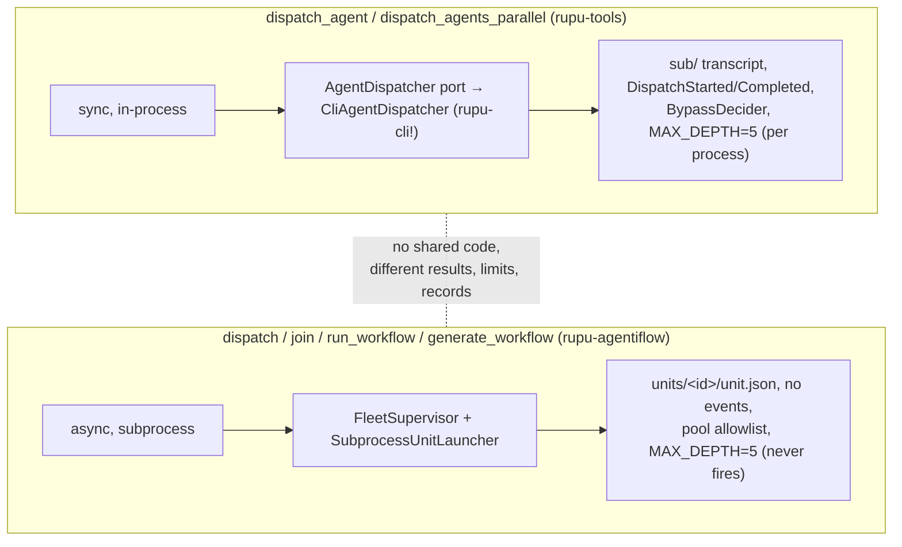
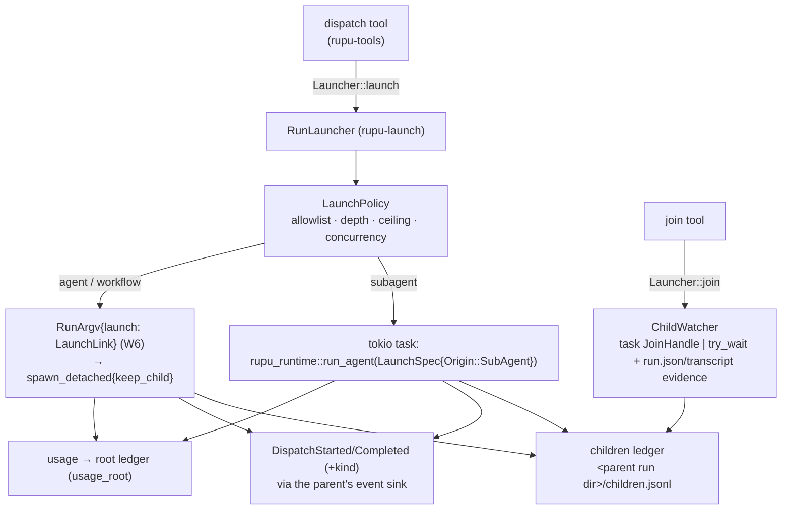

# W7: One `dispatch`, one `join`, one `Launcher`

- **Card:** W7 · **Depends on:** W3, W5, W6 · **Blocks:** F1
- **Principles:** P8, P9, P10 · **Decisions:** D7, D15, D16, D17, D18, D20
- **Fixes:** L1, L2, L3, L4, L5, L9, L10, L11 (children), L13 (findability), L14; removes `extra_tools`

## 1. Goal

Any agent that is granted `dispatch` can start a child, and it chooses **what kind**:

| `kind` | Runs as | Record | Lives | Typical use |
|---|---|---|---|---|
| `subagent` | a tokio task **in the parent's process** | transcript under the parent run (`<runs>/<parent>/sub/<sub_id>/`) | dies with the parent | quick delegation: review this file, search that |
| `agent` | its **own `rupu run` process** | its own run (`run.json`, `transcripts/<id>.jsonl`) | survives a parent crash until reaped | long or heavy work, isolation, its own budget line |
| `workflow` | its **own `rupu workflow run` process** | its own workflow run | same | a whole pipeline |

All three are **asynchronous**: `dispatch` returns a handle immediately and `join` collects results (matt: "all sub-agents should have always been async"). `wait: true` is shorthand for dispatch + join in one call. All three share one allowlist, one depth limit, one permission ceiling, one codename scheme, one usage rollup, one children ledger and one event pair.

## 2. Today



## 3. Design

### 3.1 The tools

```jsonc
// dispatch — Effect::Spawn, needs Launcher
{
  "kind":   "subagent" | "agent" | "workflow",   // default "subagent"
  "name":   "security-reviewer",                 // agent or workflow name
  "file":   "generated/x.yaml",                  // workflow only, instead of name (from workflows.generate)
  "prompt": "Review crates/foo for …",           // agents; workflows take inputs
  "inputs": { "k": "v" },                        // workflow inputs, or structured agent inputs (folded into the prompt as today)
  "wait":   false,                               // true → dispatch + join(handle) in one call
  "timeout_secs": 300                            // only with wait
}
// → { "handle": "ch_01J…", "kind": "agent", "run_id": "run_01J…", "codename": "cobalt-harbor/heron#4>lynx#1", "address": "lynx#1" }
//   with wait: true, the same plus "result": <join entry>

// join — Effect::Read, needs Launcher
{ "handles": ["ch_…", …] /* omit = all of this run's children */, "timeout_secs": 300 /* 0 = poll, max 3600 */, "until": "all" | "any" }
// → { "children": [ { "handle", "kind", "name", "codename",
//       "status": "pending" | "running" | "done" | "failed" | "abandoned",
//       "success"?, "output"?, "error"?, "cause"?, "tokens"?, "duration_ms"? } ] }
```

`workflows.generate` (`Effect::Spawn`, needs `WorkflowGenerator`) only *generates and saves* a workflow definition, returning `{ file, name, steps }`. Running it is a separate `dispatch { kind: "workflow", file }`, so each tool does one thing. `generate_definition_with_provider` moves to `rupu-runtime/src/services/generate.rs` so any run can be granted it.

### 3.2 Aliases (D16): old names keep their exact old behaviour

| Old tool | Maps to | Output shape |
|---|---|---|
| `dispatch_agent {agent, prompt, inputs}` | `dispatch {kind: subagent, wait: true}` | the old `DispatchOutcome` JSON, byte-compatible, so the web `ToolCard` sub-run callout keeps parsing |
| `dispatch_agents_parallel {agents: [...], max_parallel}` | N × `dispatch {kind: subagent}` + `join {until: all}` | the old aggregated array, in request order |
| agentiflow `dispatch {agent, prompt}` | `dispatch {kind: agent}`. **Rule: when the legacy field `agent` is used and `kind` is absent, kind defaults to `agent`** (the old flow semantics) | `{handle, participant}` |
| `run_workflow {workflow, inputs}` | `dispatch {kind: workflow}` | `{handle, participant}` |
| `generate_workflow {...}` | `workflows.generate` + `dispatch {kind: workflow, file}` | the old shape |
| agentiflow `join {handle, timeout}` | `join {handles: [handle]}` | the old single-status shape when called with `handle` (singular) |

### 3.3 The `Launcher` port (`rupu-tools/src/ports.rs`) and its one implementation (`rupu-launch`, new crate)

```rust
#[async_trait]
pub trait Launcher: Send + Sync {
    async fn launch(&self, req: ChildRequest, from: &RunIdentity) -> Result<ChildHandle, LaunchError>;
    async fn join(&self, from: &RunIdentity, which: JoinSet, timeout: Duration, until: Until)
        -> Result<Vec<ChildStatus>, LaunchError>;
    /// Called by the agent loop when the parent run ends (§3.6).
    async fn finish(&self, from: &RunIdentity, how: ParentEnd);
}

pub struct ChildRequest { pub kind: ChildKind, pub target: ChildTarget, pub prompt: Option<String>,
                          pub inputs: BTreeMap<String, Value> }
pub enum ChildKind { Subagent, Agent, Workflow }
```



`rupu-launch` depends on `rupu-runtime` (assembler, argv, spawn), `rupu-orchestrator` (`RunStore::create_sub_run`, `run.json` reading) and `rupu-transcript`. It is what the CLI, the CP and agentiflow wire into `ToolServices.launcher`. The `InProcessDispatcher` that W3 moved into `rupu-runtime` folds into it, and the `AgentDispatcher` trait is deleted.

### 3.4 Policy: one set of rules for every kind

- **Allowlist (D17).**
  - Agents: the caller's `dispatchableAgents`. Workflows: a new `dispatchableWorkflows` frontmatter key.
  - Inside an agentiflow (`Origin::FlowLead` / `FlowUnit`), the flow's `pool` applies. If the agent also declares the key, the two are intersected.
  - **A child inherits its parent's allowed set as a cap** (fixes L3). A child's own `dispatchableAgents` is intersected with it, so a workflow unit can't `dispatch` outside the pool. For a `workflow` child, every agent the workflow names must be inside the cap, as `run_workflow` checks today.
- **Depth.** `MAX_LAUNCH_DEPTH = 5`, one constant in `rupu-tools`. The child's depth is the parent's + 1, carried in-process on `RunIdentity` and across processes as `--launch-depth` (D18, fixes L2).
- **Permission ceiling (D7).** The child mode is min(parent's effective mode, the child's own `permissionMode`), from W1's `Decision::Spawn { ceiling }`, and is carried as `--launch-ceiling`. The child's **connector grant** is also capped by the parent's effective connector set, i.e. the step's `actions:` narrowing (fixes L4): in-process it is the child's `step_actions`, across processes `--launch-actions`.
- **Concurrency.** `[dispatch].max_concurrent_children` (default 8) per parent run. Every in-process child also takes a `rupu_runtime::admission` slot through the assembler.
- **Codenames (L11).** Children get `<parent>><role>#n` from the parent run's shared namer (`<run_dir>/codenames.json`), for every kind. The process kinds pass it as `--codename` (W6). The flow participant address is the codename's role tail (`lynx#1`); F1 makes addresses codename-based everywhere.
- **Usage (L5).** Every child's ledger hook writes to the **root** run's ledger (`--usage-root` across processes), tagged with `parent_run_id`. A sub-agent of an agentiflow unit is then counted in the flow's budget.

### 3.5 The children ledger (D20)

`<parent run dir>/children.jsonl` is append-only and locked, with one line per transition:

```jsonc
{"t":"started","handle":"ch_…","kind":"agent","name":"recon","run_id":"run_…","codename":"…","transcript":"…","pid":123,"pgid":123,"depth":2,"at":"…"}
{"t":"finished","handle":"ch_…","status":"done","success":true,"tokens":{…},"duration_ms":81234,"at":"…"}
```

- **The single index of what a run launched.** `join` reads it (together with live task handles), as do the CP run detail (children section, all kinds), the agentiflow units view (new runs; `units/*.json` stays readable for old ones), the budget rollup and the orphan reaper (`pgid`).
- **Sub-runs become findable (L13).** `rupu run --continue <sub_…>` resolves a sub-run's transcript through `RunStore::find_instance`. Continuing interrupted children automatically on parent resume is a follow-up (see 00-index §8).
- **The final answer is read in one place (L9).** `rupu_transcript::final_answer(path)` replaces the four `read_final_assistant_text` copies.

### 3.6 Async lifecycle

```mermaid
sequenceDiagram
  participant P as Parent agent
  participant D as dispatch
  participant L as RunLauncher
  participant C as Child
  participant J as join
  P->>D: dispatch {kind: agent, name: recon, prompt}
  D->>L: launch
  L->>C: spawn (RunArgv + LaunchLink)
  L-->>P: {handle: ch_1, codename}
  Note over P: keeps working; each turn a ChildrenCollector<br/>injects "children: ch_1 running (recon, 2m)"
  P->>J: join {handles: [ch_1], timeout: 300}
  J->>L: join
  L-->>P: {status: done, output: "…"}
  Note over P,L: parent ends with unjoined children →<br/>Launcher::finish: subagent tasks cancelled (abandoned),<br/>process children SIGTERM'd by pgid, recorded "abandoned"
```

- **ChildrenCollector.** Every turn while the run has unfinished children, an `EveryTurn` collector injects one compact status line per child. An async agent therefore always knows what is still out without polling `join`. It is wired by the assembler whenever `Launcher` is in the services.
- **The parent ends.** `Launcher::finish` runs from the agent loop's teardown. Unjoined children are not left orphaned: in-process tasks are cancelled at a safe boundary (the W1 pause-token mechanism), and process children get SIGTERM to their pgid with SIGKILL after a grace period, the same as `FleetSupervisor::terminate_all`. Each is recorded `abandoned`. The model is told before its final turn by the collector line "N children not joined".
- **The parent crashes.** Process children keep running until the orphan reaper (`rupu-agentiflow/src/reaper.rs`, generalized to read `children.jsonl`) sees the dead parent pid and kills them. In-process children die with the process; resume reports them `abandoned`.

### 3.7 What the agentiflow keeps

The flow keeps its envelope, rounds, goals and roster semantics. It *uses* the launcher: the lead's `dispatch`/`join` are the catalog tools, with `Launcher` + the pool policy in its services. `FleetSupervisor`'s launch/join/poll code and `SubprocessUnitLauncher` are deleted; wind-down calls `Launcher::finish`.

## 4. Files

| File | Change |
|---|---|
| `crates/rupu-launch/` | **new crate**: `RunLauncher`, `LaunchPolicy`, children ledger, watcher, `finish`. Workspace member + root `Cargo.toml` workspace dependency |
| `rupu-tools/src/launch/{dispatch,join}.rs`, `ports.rs` | the tools + `Launcher` port + alias shims |
| `rupu-tools/src/{dispatch_agent,dispatch_agents_parallel}.rs` | **deleted** (aliases live in `launch/`) |
| `rupu-tools/src/tool.rs` | `AgentDispatcher`, `DispatchOutcome`, `DispatchError` **deleted** |
| `rupu-runtime/src/dispatch.rs` (W3's `InProcessDispatcher`) | **deleted** (folded into `rupu-launch`) |
| `rupu-runtime/src/services/generate.rs` | `WorkflowGenerator` adapter (moved from agentiflow) |
| `rupu-runtime/src/argv.rs` | `LaunchLink` flags; hidden clap flags in `rupu-cli` `run` / `workflow run` |
| `rupu-agent/src/spec.rs` | `dispatchableWorkflows` |
| `rupu-agent/src/runner.rs` | teardown calls `Launcher::finish`; `extra_tools` **deleted** |
| `rupu-agentiflow/src/{dispatch_tools,subprocess,supervisor}.rs` | **deleted** / reduced to policy glue; `reaper.rs` reads `children.jsonl` |
| `rupu-orchestrator/src/executor/event.rs` | `DispatchStarted/Completed` gain `kind` (`#[serde(default = "subagent")]`) |
| `rupu-transcript/src/` | `final_answer(path)` |
| `rupu-cp/src/api/{runs,agentiflows}.rs`, web run detail | children from `children.jsonl`, legacy readers kept |
| `rupu-cli/src/cmd/run.rs` | `--continue` resolves `sub_` ids |
| CLAUDE.md | new `rupu-launch` entry; `rupu-agentiflow` entry updated |

## 5. Deleted

The `AgentDispatcher` port and everything behind it · agentiflow `dispatch_tools.rs`, `SubprocessUnitLauncher`, the launch half of `FleetSupervisor`, its `MAX_DEPTH` · four `read_final_assistant_text` copies · four completion-polling loops · `AgentRunOpts.extra_tools` · the stale error text (L14).

## 6. Tests

1. **`dispatch_kinds_matrix`** (`rupu-launch` it, mock provider): for each kind, `dispatch` → `join` returns `done` with the child's final text; the ledger has `started` + `finished`; `DispatchStarted/Completed` carry the kind; usage lands in the root ledger.
2. **`subagent_is_async`**: `dispatch` returns before the child's first model call (a gated mock); `join` then waits.
3. **`depth_across_processes`**: an `agent` child at depth 4 that dispatches again is refused at 5 (L2).
4. **`ceiling_across_processes`**: a readonly parent's `agent` child (whose own mode is bypass) has `write_file` denied (D7 across the boundary).
5. **`allowlist_inherited`**: a `workflow` child whose agent declares `dispatchableAgents: [outsider]` cannot dispatch `outsider` when the parent's cap excludes it (L3).
6. **`actions_cap_inherited`**: a step with `actions: [issues.get]` whose agent dispatches a subagent; the child can't call `issues.create` (L4).
7. **`parent_end_abandons`**: an unjoined subagent and an unjoined process child are recorded `abandoned` and the process is gone.
8. **`aliases_byte_compatible`**: `dispatch_agent` and `dispatch_agents_parallel` outputs equal the pre-W7 golden JSON. The web `ToolCard` test fixtures parse unchanged.
9. **`flow_parity`**: the existing agentiflow `dispatch`/`run_workflow`/`join` tests pass via the aliases.
10. **`collector_reports_children`**: with one running child, the next turn's injection names it.

## 7. Acceptance

- One `dispatch` + `join` pair exists in the catalog. Every old name is an alias, and the alias tests prove compatibility.
- `grep -rn "MAX_DEPTH" crates/` hits one definition.
- matt runs one flow and one workflow that dispatches a `subagent` and an `agent` on the Mac, and checks the CP run detail shows both children (UI-affecting: [[feedback-show-crux-visual-early]]).
