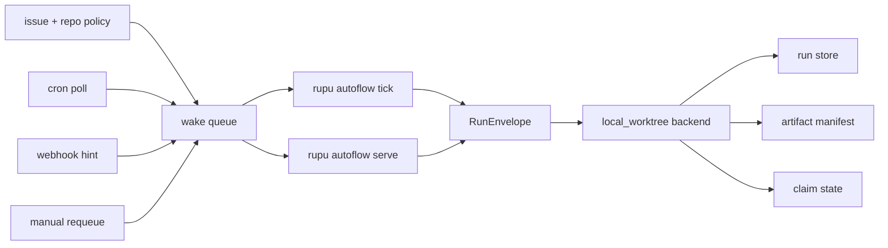

# Using rupu

> See also: [agent-format.md](agent-format.md) · [workflow-format.md](workflow-format.md) · [development-flows.md](development-flows.md) · [examples/README.md](../examples/README.md)

---

## What rupu is for

`rupu` is a local-first CLI for running coding agents and orchestrating them as workflows.

Use it when you want:

- checked-in agent prompts under version control
- repeatable multi-step engineering flows
- SCM / issue integration through one tool surface
- transcripts and run history for auditability
- human approval gates at meaningful boundaries

---

## Project layout

Inside a repo, `rupu` looks for:

```text
<repo>/.rupu/
  agents/
  contracts/
  workflows/
  config.toml
```

Global state lives under:

```text
~/.rupu/
  agents/
  contracts/
  workflows/
  config.toml
  auth.json
  repos/
  autoflows/
  transcripts/
  runs/
```

Project-local agents and workflows shadow global ones with the same `name:`.

---

## First-time setup

### 1. Bootstrap a repo

```sh
rupu init --with-samples --git
```

This creates `.rupu/agents/`, `.rupu/workflows/`, `.rupu/config.toml`, and the sample set also seeds `.rupu/contracts/`.

### 2. Authenticate at least one model provider

```sh
rupu auth login --provider anthropic --mode sso
```

Other common variants:

```sh
rupu auth login --provider openai --mode api-key --key sk-...
rupu auth login --provider gemini --mode api-key --key ...
rupu auth login --provider copilot --mode sso
```

Check status:

```sh
rupu auth status
```

### 3. Configure SCM defaults if you will use PR or issue tools

Add this to `~/.rupu/config.toml` or `<repo>/.rupu/config.toml`:

```toml
[scm.default]
platform = "github"
owner = "your-org"
repo = "your-repo"

[issues.default]
tracker = "github"
project = "your-org/your-repo"
```

### 4. Attach the repo if you want autonomous issue ownership

Autoflows need a repo-to-local-checkout binding:

```sh
rupu repos attach github:your-org/your-repo .
```

Manual local-checkout commands also auto-track the current repo when `origin` is parseable:

- `rupu run ...`
- `rupu workflow run ...`
- `rupu issues ...`

Use `rupu repos attach` or `rupu repos prefer` when you want to seed the binding explicitly or switch the preferred checkout.

Optional autonomous defaults:

```toml
[autoflow]
enabled = true
repo = "github:your-org/your-repo"
permission_mode = "bypass"
strict_templates = true

[triggers]
poll_sources = [
  { source = "github:your-org/your-repo", poll_interval = "2m" }
]
```

`rupu autoflow ...` accepts only `permission_mode = "bypass"` or `permission_mode = "readonly"`. `ask` and any other value are rejected.

Use `[triggers].poll_sources` when you want `autoflow.wake_on` to react before the next `reconcile_every` deadline. If you run `rupu webhook serve`, mapped webhook deliveries are also recorded as wake hints for tracked repos and picked up by the next `rupu autoflow tick`.

Use a bare string source when every event tick should poll that repo:

```toml
[triggers]
poll_sources = ["github:your-org/your-repo"]
```

Use an inline table when one repo should poll more slowly:

```toml
[triggers]
poll_sources = [
  { source = "github:hot-org/hot-repo", poll_interval = "1m" },
  { source = "github:slow-org/archive", poll_interval = "30m" },
]
```

`poll_interval` affects only source cadence. Workflow matching stays the same.

---

## Day-to-day commands

### Run a single agent

```sh
rupu run review-diff "check staged changes for bugs and missing tests"
```

### Run an agent against a PR target

```sh
rupu run scm-pr-review github:your-org/your-repo#42
```

### Run a workflow with inputs

```sh
rupu workflow run review-changed-files --input files=$'src/lib.rs\nsrc/main.rs'
```

### Run an issue-target workflow

```sh
rupu workflow run issue-to-spec-and-plan github:your-org/your-repo/issues/42
```

### Run an issue-target workflow that also needs inputs

```sh
rupu workflow run phase-delivery-cycle github:your-org/your-repo/issues/42 --input phase=phase-1
```

Important:

- `rupu issues run` is a convenience wrapper for issue-target workflows
- it does not expose extra `--input` flags
- when you need both an issue target and additional inputs, use `rupu workflow run`

### Re-attach to a run

```sh
rupu watch run_01J...
```

Replay a finished run:

```sh
rupu watch run_01J... --replay --pace=20
```

### Inspect workflow run history

```sh
rupu workflow runs
rupu workflow show-run run_01J...
```

### Approve or reject a paused workflow

```sh
rupu workflow approve run_01J...
rupu workflow reject run_01J... --reason "not ready"
```

### Browse issues

```sh
rupu issues list --repo github:your-org/your-repo
rupu issues show github:your-org/your-repo/issues/42
```

### Inspect and run autoflows

```sh
rupu autoflow list
rupu autoflow list --repo github:your-org/your-repo
rupu autoflow show issue-supervisor-dispatch
rupu autoflow show issue-supervisor-dispatch --repo github:your-org/your-repo
rupu autoflow run issue-supervisor-dispatch github:your-org/your-repo/issues/42
rupu autoflow run tracker-controller jira:ENG/issues/42 --repo github:your-org/your-repo
rupu autoflow tick
rupu autoflow serve --repo github:your-org/your-repo
rupu autoflow serve --repo github:your-org/your-repo --worker team-mini-01
rupu autoflow serve --repo github:your-org/your-repo --quiet
rupu autoflow monitor --repo github:your-org/your-repo
rupu --format json autoflow monitor --repo github:your-org/your-repo
rupu autoflow history --repo github:your-org/your-repo
rupu --format csv autoflow history --repo github:your-org/your-repo --event run_launched
rupu autoflow wakes --repo github:your-org/your-repo
rupu autoflow explain github:your-org/your-repo/issues/42
rupu autoflow explain linear:eng-team/issues/42 --repo github:your-org/your-repo
rupu autoflow doctor --repo github:your-org/your-repo
rupu autoflow repair github:your-org/your-repo/issues/42
rupu autoflow requeue github:your-org/your-repo/issues/42 --event github.issue.reopened --not-before 10m
rupu autoflow status
rupu autoflow status --repo github:your-org/your-repo
rupu autoflow claims
rupu autoflow claims --repo github:your-org/your-repo
rupu --format json autoflow claims --repo github:your-org/your-repo
rupu --format csv autoflow wakes --repo github:your-org/your-repo
```

`rupu autoflow list`, `show`, `status`, and `claims` inspect tracked repos, not just the current working directory. Use `rupu repos attach` first if you want to inspect autoflows from outside a checkout, and pass `--repo` when you want to narrow output to one tracked repo. `rupu autoflow show` now renders a compact summary first and then the raw workflow YAML, so it reads like the other `show` commands instead of a metadata dump.

`rupu autoflow run ...` does not steal a live or blocked claim from another autoflow cycle. If the issue is already owned, let `rupu autoflow tick` reconcile it or release the claim first.

For tracker-native issues such as Linear or Jira, `rupu autoflow run` and `rupu autoflow explain` resolve the bound repo from visible autoflows. Pass `--repo` when more than one repo is bound to the same tracker source.

`rupu autoflow claims` now surfaces the tracker source, tracker state, bound repo, and active branch for each claim. `rupu autoflow status` includes the same tracker-native context for contested issues so you can see why a claim is attached before dropping into `explain`.

`rupu autoflow serve` now streams a live issue timeline by default when attached to a terminal, so one interactive terminal is enough for most users. It shows claim pickup, dispatch, run launch, waiting states, retries, wake pressure, plus per-run summaries for agent/model selection, message/tool counts, token and cost usage, workspace diff stats, and merge target / PR routing in the same general visual language as `rupu run` and `rupu workflow run`. Use `--quiet` when you want the old daemon-style behavior with no live stream. `rupu autoflow monitor` remains useful as a read-only summary view or when you want the same state without starting a worker. Use `rupu --format json autoflow monitor` when you want structured output for automation.

`rupu autoflow history` is the durable event stream over the same cycle records. Use it when you need to answer what happened recently, export recent run launches or retries, or isolate one issue / worker / source over time.

`rupu autoflow explain` now includes the most recent cycle events for one issue, a direct `rupu watch <run_id>` handoff when a last run exists, and the same execution summary data surfaced in the live timeline: routing, branch/PR, agents/models, message/tool counts, tokens/cost, workspace diff, and merge target. `rupu autoflow claims` and `rupu autoflow status` also surface recent change context so operators can see the last event without leaving the summary views.

### Inspect usage and structured reports

```sh
rupu usage
rupu usage --group-by workflow
rupu usage --repo github:your-org/your-repo
rupu usage --issue github:your-org/your-repo/issues/42
rupu usage --provider anthropic --model claude-sonnet-4-6
rupu usage runs --worker worker_local_cli --backend local_checkout --trigger run_cli
rupu usage backfill
rupu usage runs --failed
rupu usage runs --top-cost 20
rupu --format json usage
rupu --format csv usage --group-by repo
rupu --format json repos tracked
```

Default `rupu usage` shows the last 30 days, total input/output/cached tokens, total cost, and top providers/models/agents, then a breakdown table grouped by `provider + model + agent`.

Breakdowns support:

- `--group-by provider`
- `--group-by model`
- `--group-by agent`
- `--group-by workflow`
- `--group-by repo`
- `--group-by day`

Run-level views support:

- `rupu usage runs --failed`
- `rupu usage runs --status completed`
- `rupu usage runs --top-cost 20`

Metadata-backed filters support:

- `--repo github:your-org/your-repo`
- `--issue github:your-org/your-repo/issues/42`
- `--worker worker_local_cli`
- `--backend local_checkout`
- `--trigger run_cli`

If older standalone `rupu run` transcripts predate sidecars, backfill them with:

- `rupu usage backfill`
- `rupu --format json usage backfill`

Structured output now follows one shared contract:

- `table` — default human view
- `json` — structured detail or collection report
- `csv` — collection/report views with stable row shapes

Collection views that support `--format json|csv`:

- `rupu agent list`
- `rupu auth status`
- `rupu cleanup`
- `rupu cron list`
- `rupu cron events`
- `rupu issues list`
- `rupu models list`
- `rupu repos list`
- `rupu repos tracked`
- `rupu session list`
- `rupu transcript list`
- `rupu usage`
- `rupu workflow list`
- `rupu workflow runs`
- `rupu autoflow list`
- `rupu autoflow wakes`
- `rupu autoflow status`
- `rupu autoflow claims`
- `rupu autoflow history`
- `rupu autoflow doctor`
- `rupu ui themes`

Detail views that support `--format json`:

- `rupu agent show`
- `rupu auth backend`
- `rupu issues show`
- `rupu session show`
- `rupu workflow show`
- `rupu workflow show-run`
- `rupu transcript show`
- `rupu autoflow show`
- `rupu autoflow explain`
- `rupu ui theme show`
- `rupu ui theme validate`
- `rupu ui theme import`

Event/timeline views use a separate contract:

- `rupu transcript show`
  - `pretty` (default human timeline)
  - `json`
  - `jsonl`
- `rupu workflow show-run`
  - `pretty` (default human timeline)
  - `json`

Snapshot views with a custom structured surface:

- `rupu autoflow monitor` (`table` and `json`)

Persistent agent sessions:

- `rupu session start <agent> [target] [prompt]`
- `rupu session list [--all|--archived]`
- `rupu session show <session-id>`
- `rupu session send <session-id> <prompt>`
- `rupu session attach <session-id>`
- `rupu session stop <session-id>`
- `rupu session archive <session-id>`
- `rupu session restore <session-id>`
- `rupu session delete <session-id> --force`
- `rupu session prune [--older-than 30d] [--dry-run]`

Sessions keep agent conversation state across multiple turns. A session turn runs in a
child `rupu` worker process, so `attach` can be interrupted without killing the active
turn. Re-attach later with `rupu session attach <session-id>`.

While attached:

- press `p` or `Enter` to submit the next prompt once the session is idle
- press `Esc` to cancel local prompt composition without sending
- press `x` to cancel the active turn and return the session to idle
- press `q` to leave the viewer while keeping the session alive
- press `d` or `Ctrl-]` to detach without stopping the worker
- press `?` for attach help
- prompt input also accepts slash commands:
  - `/help`
  - `/status`
  - `/history`
  - `/runs`
  - `/transcript`
  - `/cancel`
  - `/stop`
  - `/detach`
  - `/quit`

Lifecycle notes:

- `archive` hides the session from the default `session list` view and moves its owned
  transcripts out of the active transcript set
- `restore` brings an archived session and its owned transcripts back into the active set
- `delete --force` permanently removes the session and its owned transcripts
- a running session must be stopped before it can be archived or deleted

Standalone transcript lifecycle:

- `rupu transcript list [--all|--archived]`
- `rupu transcript archive <run-id>`
- `rupu transcript delete <run-id> --force`
- `rupu transcript prune [--older-than 30d] [--dry-run]`
- `rupu cleanup [--older-than 30d] [--dry-run] [--sessions|--transcripts]`
- `rupu cleanup --stats [--sessions|--transcripts]`

Install shell completion with `rupu completions install` to get dynamic
tab-completion for session ids and transcript run ids.

Transcript archive/delete is only available for standalone runs. If a transcript is owned
by a session, manage it through `rupu session archive|delete` instead.

Retention defaults:

- if `--older-than` is omitted, archived session prune uses `[storage].archived_session_retention`
- if `--older-than` is omitted, archived transcript prune uses `[storage].archived_transcript_retention`
- both fall back to `30d` when unset

`rupu cleanup` is the operator shortcut over both archived resource types:

- default: clean archived sessions and archived standalone transcripts together
- `--sessions`: only archived sessions
- `--transcripts`: only archived standalone transcripts
- `--stats`: show resource counts and byte totals instead of deleting
- `--dry-run`: preview deletions without removing files

Example global config:

```toml
[storage]
archived_session_retention = "30d"
archived_transcript_retention = "14d"
```

UI themes:

- `rupu ui themes`
- `rupu ui theme show <name>`
- `rupu ui theme validate path/to/theme.toml`
- `rupu ui theme import path/or/url --from auto|rupu|base16`

Theme configuration is split between syntax highlighting and palette chrome:

```toml
[ui]
theme = "catppuccin-mocha"
```

That is the simple shared selector. It applies the same named theme across syntax and
palette when both exist. If the shared name only maps directly to one side, `rupu`
falls back to the palette theme's syntax hint.

```toml
[ui]
color = "always"
pager = "never"
live_view = "focused"

[ui.syntax]
theme = "Solarized (dark)"

[ui.palette]
theme = "tokyo-night"
```

Notes:

- Built-in parity names include `catppuccin-mocha`, `tokyo-night`, `dracula`,
  `gruvbox-dark`, `github-dark`, `github-light`, `solarized-dark`, and
  `solarized-light`.
- `[ui].theme` is the simple shared selector; `[ui.syntax]` and `[ui.palette]` are the
  advanced override knobs.
- `[ui].live_view` sets the default live event density for:
  - `rupu run`
  - `rupu transcript show`
  - `rupu session attach`
  - `rupu workflow run`
  - `rupu autoflow serve`
- `--view focused|full` overrides the config per command.
- Global custom themes live in `~/.rupu/themes/`.
- Project-local themes live in `<repo>/.rupu/themes/`.
- Phase 1 import supports native rupu theme files and Base16 themes.

---

## Targets and execution context

`rupu run` and `rupu workflow run` accept an optional target positional.

Common forms:

- `github:owner/repo`
- `github:owner/repo#42`
- `github:owner/repo/issues/123`
- `gitlab:group/project`
- `gitlab:group/project!7`
- `gitlab:group/project/issues/9`

Behavior:

- repo and PR / MR targets clone to a temp workspace for the run
- issue targets do not clone; the workflow runs in the current checkout and receives `{{ issue.* }}` metadata
- autoflow issue cycles prefer persistent worktrees under `~/.rupu/autoflows/worktrees/`

Practical implication:

- if an issue-target workflow needs to read or modify repo files, run it from the correct local checkout

---

## Recommended usage patterns

### Local coding assistant mode

Use checked-in project agents such as:

- `fix-bug`
- `add-tests`
- `review-diff`
- `scaffold`

Examples:

```sh
rupu run fix-bug "cargo test parser::tests::rejects_bad_token fails"
rupu run add-tests "cover parser::parse_config edge cases"
rupu run scaffold "add an IssueSummary struct in crates/rupu-scm/src/types.rs"
```

### Workflow mode

Use workflows when work crosses boundaries:

- multiple specialists
- approvals
- phase planning
- issue intake
- PR review loops

Examples are in [development-flows.md](development-flows.md) and [examples/README.md](../examples/README.md).

### Autoflow mode

Use autoflows when the same workflow should keep owning an issue over time.

Typical pattern:

- attach the repo once with `rupu repos attach`
- declare `autoflow:` and `contracts:` in the workflow YAML
- store schemas under `.rupu/contracts/`
- choose an operator mode:
  - `rupu autoflow tick` from an OS scheduler
  - `rupu autoflow serve` as one always-on local worker
- set `[autoflow].cleanup_after` if you want completed claims and their worktrees pruned automatically

Operational cleanup:

- `rupu autoflow release <issue-ref>` now removes the persisted claim and its managed worktree immediately
- terminal `complete` and `released` claims are pruned on later `rupu autoflow tick` runs once `cleanup_after` has elapsed

Examples:

```sh
rupu autoflow show issue-supervisor-dispatch
rupu autoflow show issue-supervisor-dispatch --repo github:your-org/your-repo
rupu autoflow run issue-supervisor-dispatch github:your-org/your-repo/issues/42
rupu autoflow tick
rupu autoflow serve --repo github:your-org/your-repo --worker laptop-01
```

Autoflow runtime model:



Operational visibility:

- `rupu autoflow status` shows contested issues when more than one autoflow matches the same issue
- `rupu autoflow claims` shows the selected workflow priority and the losing contenders, for example `*issue-supervisor-dispatch[100], phase-ready-autoflow[50]`
- tracker-native claims include source and state context such as `linear:eng-team` / `In Review`, plus the bound repo and branch that will execute the work
- if a higher-priority autoflow starts matching later, `rupu autoflow tick` can hand ownership to it once the old claim is idle; active or approval-paused claims stay put until they finish or are released

Two useful shapes:

- controller autoflow: selects the next workflow and emits `dispatch`
- direct autoflow: owns one issue phase directly and returns `await_human` or `complete`

See [workflow-format.md](workflow-format.md) for the `autoflow:` and `contracts:` schema and [examples/README.md](../examples/README.md) for copyable controller and direct examples.

Operator recovery loop:

- `rupu autoflow serve --repo ...` shows the live issue lifecycle directly in one terminal when interactive
- `rupu autoflow monitor --repo ...` shows the same current workers, active claims, recent cycle activity, wake pressure, and compact per-run execution metrics as a read-only operator view
- `rupu autoflow history --repo ...` shows the recent durable event stream, with filters for issue, source, worker, and event kind
- `rupu autoflow wakes --repo ...` shows queued vs recently processed wakes
- `rupu autoflow explain <issue-ref>` shows the claim, last run, selected workflow, execution metrics, branch/PR routing, queued wakes, and pending dispatch for one issue
- `rupu autoflow doctor --repo ...` scans for mismatched claim/run state, missing worktrees, missing repo bindings, stale locks, and invalid queued wake payloads
- `rupu autoflow repair <issue-ref>` applies safe repairs such as rebuilding a missing worktree or dropping invalid queued wakes
- `rupu autoflow requeue <issue-ref>` injects one manual wake when an operator wants another reconciliation pass without waiting for the next external event

Typical operator session:

```sh
rupu autoflow monitor --repo github:your-org/your-repo
rupu autoflow history --repo github:your-org/your-repo --event run_launched
rupu autoflow status --repo github:your-org/your-repo
rupu autoflow wakes --repo github:your-org/your-repo
rupu autoflow explain github:your-org/your-repo/issues/42
rupu autoflow doctor --repo github:your-org/your-repo
rupu autoflow repair github:your-org/your-repo/issues/42
rupu autoflow requeue github:your-org/your-repo/issues/42 --event github.issue.reopened --not-before 5m
```

Deployment modes:

- **Laptop, no inbound internet**: use `[triggers].poll_sources` plus `rupu cron tick --only-events`, then run `rupu autoflow tick` on a schedule or keep `rupu autoflow serve` running locally for lower-latency claim execution.
- **Dedicated always-on machine**: run `rupu autoflow serve` continuously and optionally pair it with `rupu webhook serve` for faster wake hints.
- **Tunneled workstation**: advanced users can expose `rupu webhook serve` behind Tailscale, Cloudflare Tunnel, or ngrok, but this is optional and not the default local setup.
- **Future cloud relay**: long term, `rupu.cloud` can receive webhooks and dispatch the same workflow envelopes back to local or cloud workers. The workflow files do not change for that transition.

Typical commands by mode:

- **Solo laptop**

```sh
rupu repos attach github:your-org/your-repo .
rupu cron tick --only-events
rupu autoflow serve --repo github:your-org/your-repo --worker laptop-01
```

- **Dedicated worker machine**

```sh
rupu repos attach github:your-org/your-repo /srv/rupu/your-repo
RUPU_GITHUB_WEBHOOK_SECRET=... rupu webhook serve --addr 0.0.0.0:8080
RUPU_LINEAR_WEBHOOK_SECRET=... rupu webhook serve --addr 0.0.0.0:8080
rupu autoflow serve --repo github:your-org/your-repo --worker build-box-01
```

- **Tunneled workstation**

```sh
rupu repos attach github:your-org/your-repo .
rupu webhook serve --addr 127.0.0.1:8080
# expose the local port with your tunnel of choice
rupu autoflow serve --repo github:your-org/your-repo --worker tunnel-laptop-01
```

- **Future hybrid cloud / local dispatch**

```sh
# webhook ingress and scheduling happen in rupu.cloud
# a registered local worker still runs the same workflow files
rupu autoflow serve --repo github:your-org/your-repo --worker local-worker-01
```

---

## Portable runtime records

Plan 2 makes the local CLI the reference implementation of four portable records. Future Slice E / `rupu.cloud` services should consume these shapes rather than inventing a second runtime protocol.

### `RunEnvelope`

Stored per run as `run_envelope.json`.

```json
{
  "version": 1,
  "run_id": "run_01JXYZ",
  "kind": "workflow_run",
  "workflow": {
    "name": "phase-delivery-cycle",
    "source_path": ".rupu/workflows/phase-delivery-cycle.yaml",
    "fingerprint": "sha256:abc123"
  },
  "repo": {
    "repo_ref": "github:Section9Labs/rupu",
    "project_root": "/tmp/repo",
    "workspace_id": "ws_01",
    "workspace_path": "/tmp/repo"
  },
  "trigger": {
    "source": "autoflow",
    "wake_id": "wake_01",
    "event_id": "github.pull_request.merged"
  },
  "inputs": {
    "phase": "phase-2"
  },
  "context": {
    "issue_ref": "github:Section9Labs/rupu/issues/42",
    "target": "github:Section9Labs/rupu/issues/42",
    "event_present": true,
    "issue_present": true
  },
  "execution": {
    "backend": "local_worktree",
    "permission_mode": "bypass",
    "workspace_strategy": "managed_worktree",
    "strict_templates": true
  },
  "autoflow": {
    "name": "issue-supervisor-dispatch",
    "claim_id": "github:Section9Labs/rupu/issues/42",
    "priority": 100
  },
  "correlation": {
    "parent_run_id": "run_parent",
    "dispatch_group_id": "dispatch_01"
  },
  "worker": {
    "requested_worker": "local",
    "assigned_worker_id": "worker_local_cli"
  }
}
```

### `WakeRecord`

Stored under `~/.rupu/autoflows/wakes/queue/` or `processed/`.

```json
{
  "version": 1,
  "wake_id": "wake_01JXYZ",
  "source": "webhook",
  "repo_ref": "github:Section9Labs/rupu",
  "entity": {
    "kind": "issue",
    "ref": "github:Section9Labs/rupu/issues/42"
  },
  "event": {
    "id": "github.issue.labeled",
    "delivery_id": "delivery-123",
    "dedupe_key": "github:issue:labeled:42:delivery-123"
  },
  "payload_ref": "/Users/matt/.rupu/autoflows/wakes/payloads/wake_01JXYZ.json",
  "received_at": "2026-05-10T03:00:00Z",
  "not_before": "2026-05-10T03:00:00Z"
}
```

### `ArtifactManifest`

Stored per run as `artifact_manifest.json`.

```json
{
  "version": 1,
  "run_id": "run_01JXYZ",
  "backend_id": "local_worktree",
  "worker_id": "worker_local_cli",
  "generated_at": "2026-05-10T03:05:00Z",
  "artifacts": [
    {
      "id": "art_run",
      "kind": "run_record",
      "name": "run-record",
      "producer": "run",
      "local_path": "/tmp/runs/run_01/run.json"
    },
    {
      "id": "art_outcome",
      "kind": "summary",
      "name": "autoflow-outcome",
      "producer": "step.finalize",
      "inline_json": {
        "status": "await_human",
        "summary": "draft PR opened"
      }
    }
  ]
}
```

### `WorkerRecord`

Stored under `~/.rupu/autoflows/workers/`.

```json
{
  "version": 1,
  "worker_id": "worker_local_team-mini_cli",
  "kind": "cli",
  "name": "team-mini",
  "host": "team-mini.local",
  "capabilities": {
    "backends": ["local_worktree"],
    "scm_hosts": ["github"],
    "permission_modes": ["bypass", "readonly"]
  },
  "registered_at": "2026-05-10T03:00:00Z",
  "last_seen_at": "2026-05-10T03:22:00Z"
}
```

These records are the contract boundary for future cloud or hybrid execution. The local CLI already writes them, so any later control plane should treat them as the source of truth.

---

## Working with SCM and issues

### Review a PR

```sh
rupu run scm-pr-review github:your-org/your-repo#42
```

### Use the unified SCM / issue tool surface inside your own agents

Add tools such as:

```yaml
tools:
  - scm.prs.get
  - scm.prs.diff
  - scm.prs.create
  - issues.get
  - issues.comment
```

Or allow whole namespaces:

```yaml
tools: [scm.*, issues.*]
```

Keep reviewer agents read-only even if their `tools:` list names writable SCM tools; `permissionMode: readonly` will block writes.

---

## Triggers and long-running automation

### Cron-driven workflows

List what would be eligible:

```sh
rupu cron list
```

Tick cron and event pollers:

```sh
rupu cron tick
```

Typical crontab split:

```text
* * * * *   rupu cron tick --skip-events
*/5 * * * * rupu cron tick --only-events
```

Linear can also participate in the polled tier without a public webhook endpoint:

```toml
[triggers]
poll_sources = ["linear:72b2a2dc-6f4f-4423-9d34-24b5bd10634a"]
```

Authenticate once with:

```sh
rupu auth login --provider linear --mode api-key
```

The first poll warms a local snapshot for that team and emits zero events. Later polls diff the snapshot and emit `linear.issue.opened` plus normalized `linear.issue.updated` state-transition events.

Jira can participate in the same polled tier. Use the explicit source form when you want the config to be self-contained:

```toml
[triggers]
poll_sources = ["jira:acme.atlassian.net/ENG"]
```

Or set the site once and use short project keys:

```toml
[scm.jira]
base_url = "https://acme.atlassian.net"

[triggers]
poll_sources = ["jira:ENG"]
```

Authenticate with a Jira Cloud email and API token stored as one API-key credential:

```sh
printf '%s' 'matt@example.com:atlassian_api_token' | \
  rupu auth login --provider jira --mode api-key
```

The first poll warms a local snapshot for that project and emits zero events. Later polls emit `jira.issue.opened` and normalized `jira.issue.updated` events with workflow-state, priority, project, and sprint transitions.

### Webhook-driven workflows

```sh
RUPU_GITHUB_WEBHOOK_SECRET=... rupu webhook serve --addr 0.0.0.0:8080
RUPU_LINEAR_WEBHOOK_SECRET=... rupu webhook serve --addr 0.0.0.0:8080
RUPU_JIRA_WEBHOOK_SECRET=... rupu webhook serve --addr 0.0.0.0:8080
```

Use webhook mode when you want lower latency or event types that polling does not expose. Laptop users usually should not expose a local webhook receiver directly; start with polling and `rupu autoflow tick` or `rupu autoflow serve` instead.

`rupu webhook serve` now looks beyond the current checkout: it can load project workflows from tracked repos under `rupu repos ...`, and it dispatches the exact matched workflow file rather than resolving by bare workflow name from the server's cwd.

Linear issue webhooks are normalized before dispatch. Workflows can therefore target portable native tracker aliases such as `issue.state_changed` and `issue.entered_workflow_state` instead of manually unpacking Linear's raw `updatedFrom` structure in every `filter:`.

Jira Cloud issue webhooks are normalized too. `jira:issue_updated` changelog transitions become portable aliases such as `issue.entered_workflow_state.ready_for_review`, `issue.sprint_changed`, and `issue.priority_changed`.

GitHub Projects v2 item webhooks are normalized too. When an organization-level `projects_v2_item` event changes an issue item's `Status` field, workflows can target the same portable aliases such as `issue.entered_workflow_state.ready_for_review` and `issue.state_changed.todo.to.in_progress`.

If the webhook delivery is sparse, `rupu webhook serve` can enrich the payload through the configured GitHub credential. That restores project titles, issue numbers, repository names, and select/iteration field names before alias matching, so the same workflow filters keep working even when GitHub omits those names from the delivery body.

Current boundary:

- Linear supports both webhook and `poll_sources = ["linear:<team-id>"]`.
- Jira supports both webhook and `poll_sources = ["jira:<site>/<project>"]` or `poll_sources = ["jira:<project>"]` when `[scm.jira].base_url` is configured.
- GitHub Projects v2 native state mapping is webhook-only for now, through the standard GitHub webhook receiver and the `projects_v2_item` organization webhook event. GitHub still marks Projects webhooks as public preview, but `rupu webhook serve` now hydrates sparse deliveries when a GitHub auth token is configured.
- Both trackers now support tracker-native autoflow claim ownership while still executing repo-bound workflows and worktrees.

When the repo is tracked under `rupu repos ...`, `rupu webhook serve` also queues `autoflow.wake_on` hints. The webhook receiver does not run the autoflow itself; it records the hint and the next `rupu autoflow tick` or active `rupu autoflow serve` cycle consumes it.

---

## MCP mode

Expose `rupu`'s SCM / issue tool surface to another MCP client:

```sh
rupu mcp serve --transport stdio
```

Use this when you want Claude Desktop, Cursor, or another MCP host to operate on the same unified repo / issue abstraction.

---

## Practical safety rules

- treat checked-in agents like code
- keep reviewer agents read-only
- keep implementers narrow and scoped
- use `ask` mode when editing locally
- add approval gates before risky side effects
- prefer one phase per PR for larger efforts

---

## A good adoption path for a team

1. check in a few narrow project agents
2. use them manually with `rupu run`
3. promote repeated multi-step work into workflows
4. add issue-target workflows
5. add panel review and approval gates
6. attach the repo and add autoflows only after manual workflows are solid
7. add cron or webhook wakeups only after the autonomous loop is stable

That path keeps the system observable and avoids automating a weak process.
